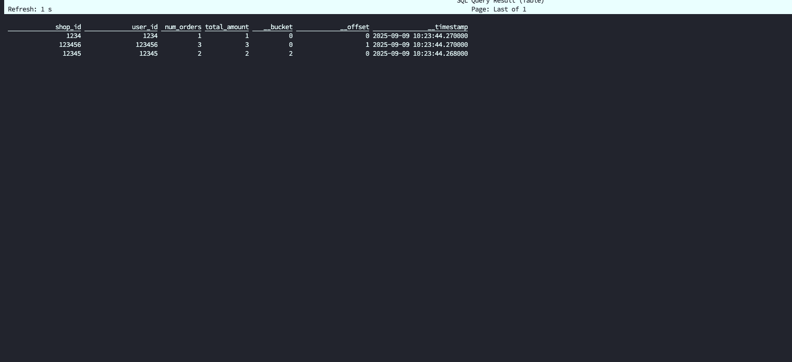

# 1. 启动 fluss 服务

## 1.1 修改 server 服务

```yaml
#==============================================================================
# DataLake  添加数据湖相关配置
#==============================================================================
datalake.format: paimon
datalake.paimon.metastore: hive
datalake.paimon.uri: thrift://bigdata01:9083
datalake.paimon.warehouse: hdfs://bigdata01:9000/paimon/
```


## 1.2 local 服务启动

```shell
tar -xzf fluss-0.7.0-bin.tgz
cd fluss-0.7.0/

./bin/local-cluster.sh start


jps -lm

139538 com.alibaba.fluss.shaded.zookeeper3.org.apache.zookeeper.server.quorum.QuorumPeerMain /opt/software/fluss-0.8-SNAPSHOT/conf/zookeeper.properties
22307 org.apache.hadoop.hdfs.server.namenode.SecondaryNameNode
139942 com.alibaba.fluss.server.tablet.TabletServer --configDir /opt/software/fluss-0.8-SNAPSHOT/conf -Dbind.listeners=FLUSS://localhost:0
140452 sun.tools.jps.Jps -lm
22024 org.apache.hadoop.hdfs.server.namenode.NameNode
139739 com.alibaba.fluss.server.coordinator.CoordinatorServer --configDir /opt/software/fluss-0.8-SNAPSHOT/conf
22543 org.apache.hadoop.yarn.server.resourcemanager.ResourceManager

```


# 2. 建表

## 1.1 创建Fluss表

在Flink里创建一个Fluss表，并加上'table.datalake.enabled' = 'true'这个配置，就可以实现数据湖模式。例如：

```sql
CREATE TABLE pk_table16 (
  shop_id BIGINT,
  user_id BIGINT,
  num_orders INT,
  total_amount INT,
  PRIMARY KEY (shop_id, user_id) NOT ENFORCED
) WITH (
  'bucket.num' = '3',
  'table.datalake.enabled' = 'true',
  'table.datalake.freshness' = '30s'
);


INSERT INTO pk_table16 VALUES
  (1234, 1234, 1, 1),
  (12345, 12345, 2, 2),
  (123456, 123456, 3, 3);
```

# 3. 启动分层服务

```shell
## 注意Paimon的地址要和之前 server config 中配置的一样
./bin/flink run ./lib/fluss-flink-tiering-0.8-SNAPSHOT.jar \
    --fluss.bootstrap.servers bigdata01:9123 \
    --datalake.format paimon \
    --datalake.paimon.metastore hive \
    --datalake.paimon.uri thrift://bigdata01:9083 \
    --datalake.paimon.warehouse hdfs://bigdata01:9000/paimon/
```

# 4. 查询

```sql
-- 只查询 数据湖中的数据，如果能查出来说明已经同步到数据湖中了
select * from pk_table16$lake;
```




# 5. 异常

## 5.1 server 添加 hive hiveConf 类找不到

```shell
java.lang.NoClassDefFoundError: org/apache/hadoop/hive/conf/HiveConf
        at org.apache.paimon.hive.HiveCatalogFactory.create(HiveCatalogFactory.java:37) ~[?:?]
        at org.apache.paimon.catalog.CatalogFactory.createUnwrappedCatalog(CatalogFactory.java:84) ~[?:?]
        at org.apache.paimon.catalog.CatalogFactory.createCatalog(CatalogFactory.java:71) ~[?:?]
        at org.apache.paimon.catalog.CatalogFactory.createCatalog(CatalogFactory.java:67) ~[?:?]
        at com.alibaba.fluss.lake.paimon.PaimonLakeCatalog.<init>(PaimonLakeCatalog.java:71) ~[?:?]
        at com.alibaba.fluss.lake.paimon.PaimonLakeStorage.createLakeCatalog(PaimonLakeStorage.java:43) ~[?:?]
        at com.alibaba.fluss.lake.paimon.PaimonLakeStorage.createLakeCatalog(PaimonLakeStorage.java:28) ~[?:?]
        at com.alibaba.fluss.lake.lakestorage.PluginLakeStorageWrapper$ClassLoaderFixingLakeStorage.createLakeCatalog(PluginLakeStorageWrapper.java:116) ~[fluss-server-0.8-SNAPSHOT.jar:0.8-SNAPSHOT]
        at com.alibaba.fluss.server.coordinator.CoordinatorServer.createLakeCatalog(CoordinatorServer.java:262) ~[fluss-server-0.8-SNAPSHOT.jar:0.8-SNAPSHOT]
        at com.alibaba.fluss.server.coordinator.CoordinatorServer.startServices(CoordinatorServer.java:196) ~[fluss-server-0.8-SNAPSHOT.jar:0.8-SNAPSHOT]
        at com.alibaba.fluss.server.ServerBase.start(ServerBase.java:126) [fluss-server-0.8-SNAPSHOT.jar:0.8-SNAPSHOT]
        at com.alibaba.fluss.server.ServerBase.startServer(ServerBase.java:96) [fluss-server-0.8-SNAPSHOT.jar:0.8-SNAPSHOT]
        at com.alibaba.fluss.server.coordinator.CoordinatorServer.main(CoordinatorServer.java:155) [fluss-server-0.8-SNAPSHOT.jar:0.8-SNAPSHOT]
Caused by: java.lang.ClassNotFoundException: org.apache.hadoop.hive.conf.HiveConf
        at java.net.URLClassLoader.findClass(URLClassLoader.java:445) ~[?:?]
        at java.lang.ClassLoader.loadClass(ClassLoader.java:592) ~[?:?]
        at com.alibaba.fluss.classloading.ComponentClassLoader.loadClassFromComponentOnly(ComponentClassLoader.java:153) ~[fluss-server-0.8-SNAPSHOT.jar:0.8-SNAPSHOT]
        at com.alibaba.fluss.classloading.ComponentClassLoader.loadClass(ComponentClassLoader.java:116) ~[fluss-server-0.8-SNAPSHOT.jar:0.8-SNAPSHOT]
        at java.lang.ClassLoader.loadClass(ClassLoader.java:525) ~[?:?]
        ... 13 more
2025-09-05 16:24:50,507 ERROR com.alibaba.fluss.server.ServerBase                          [] - Could not start CoordinatorServer.
com.alibaba.fluss.exception.FlussException: Failed to start the CoordinatorServer.
        at com.alibaba.fluss.server.ServerBase.start(ServerBase.java:139) ~[fluss-server-0.8-SNAPSHOT.jar:0.8-SNAPSHOT]
        at com.alibaba.fluss.server.ServerBase.startServer(ServerBase.java:96) [fluss-server-0.8-SNAPSHOT.jar:0.8-SNAPSHOT]
        at com.alibaba.fluss.server.coordinator.CoordinatorServer.main(CoordinatorServer.java:155) [fluss-server-0.8-SNAPSHOT.jar:0.8-SNAPSHOT]
Caused by: java.lang.NoClassDefFoundError: org/apache/hadoop/hive/conf/HiveConf
        at org.apache.paimon.hive.HiveCatalogFactory.create(HiveCatalogFactory.java:37) ~[?:?]
        at org.apache.paimon.catalog.CatalogFactory.createUnwrappedCatalog(CatalogFactory.java:84) ~[?:?]
        at org.apache.paimon.catalog.CatalogFactory.createCatalog(CatalogFactory.java:71) ~[?:?]
        at org.apache.paimon.catalog.CatalogFactory.createCatalog(CatalogFactory.java:67) ~[?:?]
        at com.alibaba.fluss.lake.paimon.PaimonLakeCatalog.<init>(PaimonLakeCatalog.java:71) ~[?:?]
        at com.alibaba.fluss.lake.paimon.PaimonLakeStorage.createLakeCatalog(PaimonLakeStorage.java:43) ~[?:?]
        at com.alibaba.fluss.lake.paimon.PaimonLakeStorage.createLakeCatalog(PaimonLakeStorage.java:28) ~[?:?]
        at com.alibaba.fluss.lake.lakestorage.PluginLakeStorageWrapper$ClassLoaderFixingLakeStorage.createLakeCatalog(PluginLakeStorageWrapper.java:116) ~[fluss-server-0.8-SNAPSHOT.jar:0.8-SNAPSHOT]
        at com.alibaba.fluss.server.coordinator.CoordinatorServer.createLakeCatalog(CoordinatorServer.java:262) ~[fluss-server-0.8-SNAPSHOT.jar:0.8-SNAPSHOT]
        at com.alibaba.fluss.server.coordinator.CoordinatorServer.startServices(CoordinatorServer.java:196) ~[fluss-server-0.8-SNAPSHOT.jar:0.8-SNAPSHOT]
        at com.alibaba.fluss.server.ServerBase.start(ServerBase.java:126) ~[fluss-server-0.8-SNAPSHOT.jar:0.8-SNAPSHOT]
        ... 2 more
Caused by: java.lang.ClassNotFoundException: org.apache.hadoop.hive.conf.HiveConf
        at java.net.URLClassLoader.findClass(URLClassLoader.java:445) ~[?:?]
        at java.lang.ClassLoader.loadClass(ClassLoader.java:592) ~[?:?]
        at com.alibaba.fluss.classloading.ComponentClassLoader.loadClassFromComponentOnly(ComponentClassLoader.java:153) ~[fluss-server-0.8-SNAPSHOT.jar:0.8-SNAPSHOT]
        at com.alibaba.fluss.classloading.ComponentClassLoader.loadClass(ComponentClassLoader.java:116) ~[fluss-server-0.8-SNAPSHOT.jar:0.8-SNAPSHOT]
        at java.lang.ClassLoader.loadClass(ClassLoader.java:525) ~[?:?]
        at org.apache.paimon.hive.HiveCatalogFactory.create(HiveCatalogFactory.java:37) ~[?:?]
        at org.apache.paimon.catalog.CatalogFactory.createUnwrappedCatalog(CatalogFactory.java:84) ~[?:?]
        at org.apache.paimon.catalog.CatalogFactory.createCatalog(CatalogFactory.java:71) ~[?:?]
        at org.apache.paimon.catalog.CatalogFactory.createCatalog(CatalogFactory.java:67) ~[?:?]
        at com.alibaba.fluss.lake.paimon.PaimonLakeCatalog.<init>(PaimonLakeCatalog.java:71) ~[?:?]
        at com.alibaba.fluss.lake.paimon.PaimonLakeStorage.createLakeCatalog(PaimonLakeStorage.java:43) ~[?:?]
        at com.alibaba.fluss.lake.paimon.PaimonLakeStorage.createLakeCatalog(PaimonLakeStorage.java:28) ~[?:?]
        at com.alibaba.fluss.lake.lakestorage.PluginLakeStorageWrapper$ClassLoaderFixingLakeStorage.createLakeCatalog(PluginLakeStorageWrapper.java:116) ~[fluss-server-0.8-SNAPSHOT.jar:0.8-SNAPSHOT]
        at com.alibaba.fluss.server.coordinator.CoordinatorServer.createLakeCatalog(CoordinatorServer.java:262) ~[fluss-server-0.8-SNAPSHOT.jar:0.8-SNAPSHOT]
        at com.alibaba.fluss.server.coordinator.CoordinatorServer.startServices(CoordinatorServer.java:196) ~[fluss-server-0.8-SNAPSHOT.jar:0.8-SNAPSHOT]
        at com.alibaba.fluss.server.ServerBase.start(ServerBase.java:126) ~[fluss-server-0.8-SNAPSHOT.jar:0.8-SNAPSHOT]
```

添加 `hive-exec`的包到`${FLUSS_HOME}/plugins/paimon/`目录下


## 5.2 fb303类找不到

```shell
Caused by: java.lang.ClassNotFoundException: com.facebook.fb303.FacebookService$Iface
        at java.net.URLClassLoader.findClass(URLClassLoader.java:445) ~[?:?]
        at java.lang.ClassLoader.loadClass(ClassLoader.java:592) ~[?:?]
        at com.alibaba.fluss.classloading.ComponentClassLoader.loadClassFromComponentOnly(ComponentClassLoader.java:153) ~[fluss-server-0.8-SNAPSHOT.jar:0.8-SNAPSHOT]
        at com.alibaba.fluss.classloading.ComponentClassLoader.loadClass(ComponentClassLoader.java:116) ~[fluss-server-0.8-SNAPSHOT.jar:0.8-SNAPSHOT]
        at java.lang.ClassLoader.loadClass(ClassLoader.java:525) ~[?:?]
        at java.lang.ClassLoader.defineClass1(Native Method) ~[?:?]
        at java.lang.ClassLoader.defineClass(ClassLoader.java:1017) ~[?:?]
        at java.security.SecureClassLoader.defineClass(SecureClassLoader.java:150) ~[?:?]
        at java.net.URLClassLoader.defineClass(URLClassLoader.java:524) ~[?:?]
        at java.net.URLClassLoader$1.run(URLClassLoader.java:427) ~[?:?]
        at java.net.URLClassLoader$1.run(URLClassLoader.java:421) ~[?:?]
        at java.security.AccessController.doPrivileged(AccessController.java:712) ~[?:?]
        at java.net.URLClassLoader.findClass(URLClassLoader.java:420) ~[?:?]
        at java.lang.ClassLoader.loadClass(ClassLoader.java:592) ~[?:?]
        at com.alibaba.fluss.classloading.ComponentClassLoader.loadClassFromComponentOnly(ComponentClassLoader.java:153) ~[fluss-server-0.8-SNAPSHOT.jar:0.8-SNAPSHOT]
        at com.alibaba.fluss.classloading.ComponentClassLoader.loadClass(ComponentClassLoader.java:116) ~[fluss-server-0.8-SNAPSHOT.jar:0.8-SNAPSHOT]
        at java.lang.ClassLoader.loadClass(ClassLoader.java:525) ~[?:?]
        at java.lang.Class.getDeclaredConstructors0(Native Method) ~[?:?]
        at java.lang.Class.privateGetDeclaredConstructors(Class.java:3373) ~[?:?]
        at java.lang.Class.getConstructor0(Class.java:3578) ~[?:?]
        at java.lang.Class.getConstructor(Class.java:2271) ~[?:?]
        at org.apache.paimon.hive.RetryingMetaStoreClientFactory.constructorDetectedHiveMetastoreProxySupplier(RetryingMetaStoreClientFactory.java:199) ~[?:?]
        at org.apache.paimon.hive.RetryingMetaStoreClientFactory.createClient(RetryingMetaStoreClientFactory.java:160) ~[?:?]
        at org.apache.paimon.hive.pool.HiveClientPool.lambda$clientSupplier$0(HiveClientPool.java:46) ~[?:?]
        at org.apache.paimon.client.ClientPool$ClientPoolImpl.<init>(ClientPool.java:52) ~[?:?]
        at org.apache.paimon.hive.pool.HiveClientPool.<init>(HiveClientPool.java:39) ~[?:?]
        at org.apache.paimon.hive.pool.CachedClientPool.lambda$clientPool$1(CachedClientPool.java:98) ~[?:?]
        at org.apache.paimon.shade.caffeine2.com.github.benmanes.caffeine.cache.BoundedLocalCache.lambda$doComputeIfAbsent$14(BoundedLocalCache.java:2406) ~[?:?]
        at java.util.concurrent.ConcurrentHashMap.compute(ConcurrentHashMap.java:1916) ~[?:?]
        at org.apache.paimon.shade.caffeine2.com.github.benmanes.caffeine.cache.BoundedLocalCache.doComputeIfAbsent(BoundedLocalCache.java:2404) ~[?:?]
        at org.apache.paimon.shade.caffeine2.com.github.benmanes.caffeine.cache.BoundedLocalCache.computeIfAbsent(BoundedLocalCache.java:2387) ~[?:?]
        at org.apache.paimon.shade.caffeine2.com.github.benmanes.caffeine.cache.LocalCache.computeIfAbsent(LocalCache.java:108) ~[?:?]
        at org.apache.paimon.shade.caffeine2.com.github.benmanes.caffeine.cache.LocalManualCache.get(LocalManualCache.java:62) ~[?:?]
        at org.apache.paimon.hive.pool.CachedClientPool.clientPool(CachedClientPool.java:97) ~[?:?]
        at org.apache.paimon.hive.pool.CachedClientPool.run(CachedClientPool.java:133) ~[?:?]
        at org.apache.paimon.hive.pool.CachedClientPool.<init>(CachedClientPool.java:86) ~[?:?]
        at org.apache.paimon.hive.HiveCatalog.<init>(HiveCatalog.java:191) ~[?:?]
        at org.apache.paimon.hive.HiveCatalog.createHiveCatalog(HiveCatalog.java:1696) ~[?:?]
        at org.apache.paimon.hive.HiveCatalogFactory.create(HiveCatalogFactory.java:37) ~[?:?]
        at org.apache.paimon.catalog.CatalogFactory.createUnwrappedCatalog(CatalogFactory.java:84) ~[?:?]
        at org.apache.paimon.catalog.CatalogFactory.createCatalog(CatalogFactory.java:71) ~[?:?]
        at org.apache.paimon.catalog.CatalogFactory.createCatalog(CatalogFactory.java:67) ~[?:?]
        at com.alibaba.fluss.lake.paimon.PaimonLakeCatalog.<init>(PaimonLakeCatalog.java:71) ~[?:?]
        at com.alibaba.fluss.lake.paimon.PaimonLakeStorage.createLakeCatalog(PaimonLakeStorage.java:43) ~[?:?]
        at com.alibaba.fluss.lake.paimon.PaimonLakeStorage.createLakeCatalog(PaimonLakeStorage.java:28) ~[?:?]
        at com.alibaba.fluss.lake.lakestorage.PluginLakeStorageWrapper$ClassLoaderFixingLakeStorage.createLakeCatalog(PluginLakeStorageWrapper.java:116) ~[fluss-server-0.8-SNAPSHOT.jar:0.8-SNAPSHOT]
        at com.alibaba.fluss.server.coordinator.CoordinatorServer.createLakeCatalog(CoordinatorServer.java:262) ~[fluss-server-0.8-SNAPSHOT.jar:0.8-SNAPSHOT]
        at com.alibaba.fluss.server.coordinator.CoordinatorServer.startServices(CoordinatorServer.java:196) ~[fluss-server-0.8-SNAPSHOT.jar:0.8-SNAPSHOT]
        at com.alibaba.fluss.server.ServerBase.start(ServerBase.java:126) ~[fluss-server-0.8-SNAPSHOT.jar:0.8-SNAPSHOT]
        ... 2 more
```

### 解决方法

Hive-exec 缺少 依赖 ,jar 拷贝到`${FLUSS_HOME}/plugins/paimon/`目录下

```xml
    
<dependency>
      <groupId>org.apache.thrift</groupId>
      <artifactId>libfb303</artifactId>
      <version>${thrift.version}</version>
      <scope>${flink.bundle.hive.scope}</scope>
    </dependency>

```


## 5.3 

```shell
java.lang.RuntimeException: One or more fetchers have encountered exception
	at org.apache.flink.connector.base.source.reader.fetcher.SplitFetcherManager.checkErrors(SplitFetcherManager.java:263) ~[flink-connector-files-1.18.1.jar:1.18.1]
	at org.apache.flink.connector.base.source.reader.SourceReaderBase.getNextFetch(SourceReaderBase.java:185) ~[flink-connector-files-1.18.1.jar:1.18.1]
	at org.apache.flink.connector.base.source.reader.SourceReaderBase.pollNext(SourceReaderBase.java:147) ~[flink-connector-files-1.18.1.jar:1.18.1]
	at org.apache.flink.streaming.api.operators.SourceOperator.emitNext(SourceOperator.java:419) ~[flink-dist-1.18.1.jar:1.18.1]
	at org.apache.flink.streaming.runtime.io.StreamTaskSourceInput.emitNext(StreamTaskSourceInput.java:68) ~[flink-dist-1.18.1.jar:1.18.1]
	at org.apache.flink.streaming.runtime.io.StreamOneInputProcessor.processInput(StreamOneInputProcessor.java:65) ~[flink-dist-1.18.1.jar:1.18.1]
	at org.apache.flink.streaming.runtime.tasks.StreamTask.processInput(StreamTask.java:562) ~[flink-dist-1.18.1.jar:1.18.1]
	at org.apache.flink.streaming.runtime.tasks.mailbox.MailboxProcessor.runMailboxLoop(MailboxProcessor.java:231) ~[flink-dist-1.18.1.jar:1.18.1]
	at org.apache.flink.streaming.runtime.tasks.StreamTask.runMailboxLoop(StreamTask.java:858) ~[flink-dist-1.18.1.jar:1.18.1]
	at org.apache.flink.streaming.runtime.tasks.StreamTask.invoke(StreamTask.java:807) ~[flink-dist-1.18.1.jar:1.18.1]
	at org.apache.flink.runtime.taskmanager.Task.runWithSystemExitMonitoring(Task.java:953) ~[flink-dist-1.18.1.jar:1.18.1]
	at org.apache.flink.runtime.taskmanager.Task.restoreAndInvoke(Task.java:932) ~[flink-dist-1.18.1.jar:1.18.1]
	at org.apache.flink.runtime.taskmanager.Task.doRun(Task.java:746) ~[flink-dist-1.18.1.jar:1.18.1]
	at org.apache.flink.runtime.taskmanager.Task.run(Task.java:562) ~[flink-dist-1.18.1.jar:1.18.1]
	at java.lang.Thread.run(Thread.java:840) ~[?:?]
Caused by: java.lang.RuntimeException: SplitFetcher thread 1 received unexpected exception while polling the records
	at org.apache.flink.connector.base.source.reader.fetcher.SplitFetcher.runOnce(SplitFetcher.java:168) ~[flink-connector-files-1.18.1.jar:1.18.1]
	at org.apache.flink.connector.base.source.reader.fetcher.SplitFetcher.run(SplitFetcher.java:117) ~[flink-connector-files-1.18.1.jar:1.18.1]
	at java.util.concurrent.Executors$RunnableAdapter.call(Executors.java:539) ~[?:?]
	at java.util.concurrent.FutureTask.run(FutureTask.java:264) ~[?:?]
	at java.util.concurrent.ThreadPoolExecutor.runWorker(ThreadPoolExecutor.java:1136) ~[?:?]
	at java.util.concurrent.ThreadPoolExecutor$Worker.run(ThreadPoolExecutor.java:635) ~[?:?]
	... 1 more
Caused by: java.lang.RuntimeException: Failed to create the desired metastore client (class name: org.apache.hadoop.hive.metastore.HiveMetaStoreClient)
	at org.apache.paimon.hive.RetryingMetaStoreClientFactory.createClient(RetryingMetaStoreClientFactory.java:150) ~[fluss-lake-paimon-0.8-SNAPSHOT.jar:0.8-SNAPSHOT]
	at org.apache.paimon.hive.pool.HiveClientPool.lambda$clientSupplier$0(HiveClientPool.java:46) ~[fluss-lake-paimon-0.8-SNAPSHOT.jar:0.8-SNAPSHOT]
	at org.apache.paimon.client.ClientPool$ClientPoolImpl.<init>(ClientPool.java:52) ~[fluss-lake-paimon-0.8-SNAPSHOT.jar:0.8-SNAPSHOT]
	at org.apache.paimon.hive.pool.HiveClientPool.<init>(HiveClientPool.java:39) ~[fluss-lake-paimon-0.8-SNAPSHOT.jar:0.8-SNAPSHOT]
	at org.apache.paimon.hive.pool.CachedClientPool.lambda$clientPool$1(CachedClientPool.java:98) ~[fluss-lake-paimon-0.8-SNAPSHOT.jar:0.8-SNAPSHOT]
	at org.apache.paimon.shade.caffeine2.com.github.benmanes.caffeine.cache.BoundedLocalCache.lambda$doComputeIfAbsent$14(BoundedLocalCache.java:2406) ~[fluss-lake-paimon-0.8-SNAPSHOT.jar:0.8-SNAPSHOT]
	at java.util.concurrent.ConcurrentHashMap.compute(ConcurrentHashMap.java:1916) ~[?:?]
	at org.apache.paimon.shade.caffeine2.com.github.benmanes.caffeine.cache.BoundedLocalCache.doComputeIfAbsent(BoundedLocalCache.java:2404) ~[fluss-lake-paimon-0.8-SNAPSHOT.jar:0.8-SNAPSHOT]
	at org.apache.paimon.shade.caffeine2.com.github.benmanes.caffeine.cache.BoundedLocalCache.computeIfAbsent(BoundedLocalCache.java:2387) ~[fluss-lake-paimon-0.8-SNAPSHOT.jar:0.8-SNAPSHOT]
	at org.apache.paimon.shade.caffeine2.com.github.benmanes.caffeine.cache.LocalCache.computeIfAbsent(LocalCache.java:108) ~[fluss-lake-paimon-0.8-SNAPSHOT.jar:0.8-SNAPSHOT]
	at org.apache.paimon.shade.caffeine2.com.github.benmanes.caffeine.cache.LocalManualCache.get(LocalManualCache.java:62) ~[fluss-lake-paimon-0.8-SNAPSHOT.jar:0.8-SNAPSHOT]
	at org.apache.paimon.hive.pool.CachedClientPool.clientPool(CachedClientPool.java:97) ~[fluss-lake-paimon-0.8-SNAPSHOT.jar:0.8-SNAPSHOT]
	at org.apache.paimon.hive.pool.CachedClientPool.run(CachedClientPool.java:133) ~[fluss-lake-paimon-0.8-SNAPSHOT.jar:0.8-SNAPSHOT]
	at org.apache.paimon.hive.pool.CachedClientPool.<init>(CachedClientPool.java:86) ~[fluss-lake-paimon-0.8-SNAPSHOT.jar:0.8-SNAPSHOT]
	at org.apache.paimon.hive.HiveCatalog.<init>(HiveCatalog.java:191) ~[fluss-lake-paimon-0.8-SNAPSHOT.jar:0.8-SNAPSHOT]
	at org.apache.paimon.hive.HiveCatalog.createHiveCatalog(HiveCatalog.java:1696) ~[fluss-lake-paimon-0.8-SNAPSHOT.jar:0.8-SNAPSHOT]
	at org.apache.paimon.hive.HiveCatalogFactory.create(HiveCatalogFactory.java:37) ~[fluss-lake-paimon-0.8-SNAPSHOT.jar:0.8-SNAPSHOT]
	at org.apache.paimon.catalog.CatalogFactory.createUnwrappedCatalog(CatalogFactory.java:84) ~[fluss-lake-paimon-0.8-SNAPSHOT.jar:0.8-SNAPSHOT]
	at org.apache.paimon.catalog.CatalogFactory.createCatalog(CatalogFactory.java:71) ~[fluss-lake-paimon-0.8-SNAPSHOT.jar:0.8-SNAPSHOT]
	at org.apache.paimon.catalog.CatalogFactory.createCatalog(CatalogFactory.java:67) ~[fluss-lake-paimon-0.8-SNAPSHOT.jar:0.8-SNAPSHOT]
	at com.alibaba.fluss.lake.paimon.tiering.PaimonCatalogProvider.get(PaimonCatalogProvider.java:41) ~[fluss-lake-paimon-0.8-SNAPSHOT.jar:0.8-SNAPSHOT]
	at com.alibaba.fluss.lake.paimon.tiering.PaimonLakeWriter.<init>(PaimonLakeWriter.java:45) ~[fluss-lake-paimon-0.8-SNAPSHOT.jar:0.8-SNAPSHOT]
	at com.alibaba.fluss.lake.paimon.tiering.PaimonLakeTieringFactory.createLakeWriter(PaimonLakeTieringFactory.java:47) ~[fluss-lake-paimon-0.8-SNAPSHOT.jar:0.8-SNAPSHOT]
	at com.alibaba.fluss.flink.tiering.source.TieringSplitReader.getOrCreateLakeWriter(TieringSplitReader.java:303) ~[fluss-flink-1.18-0.8-SNAPSHOT.jar:0.8-SNAPSHOT]
	at com.alibaba.fluss.flink.tiering.source.TieringSplitReader.forLogRecords(TieringSplitReader.java:264) ~[fluss-flink-1.18-0.8-SNAPSHOT.jar:0.8-SNAPSHOT]
	at com.alibaba.fluss.flink.tiering.source.TieringSplitReader.fetch(TieringSplitReader.java:136) ~[fluss-flink-1.18-0.8-SNAPSHOT.jar:0.8-SNAPSHOT]
	at org.apache.flink.connector.base.source.reader.fetcher.FetchTask.run(FetchTask.java:58) ~[flink-connector-files-1.18.1.jar:1.18.1]
	at org.apache.flink.connector.base.source.reader.fetcher.SplitFetcher.runOnce(SplitFetcher.java:165) ~[flink-connector-files-1.18.1.jar:1.18.1]
	at org.apache.flink.connector.base.source.reader.fetcher.SplitFetcher.run(SplitFetcher.java:117) ~[flink-connector-files-1.18.1.jar:1.18.1]
	at java.util.concurrent.Executors$RunnableAdapter.call(Executors.java:539) ~[?:?]
	at java.util.concurrent.FutureTask.run(FutureTask.java:264) ~[?:?]
	at java.util.concurrent.ThreadPoolExecutor.runWorker(ThreadPoolExecutor.java:1136) ~[?:?]
	at java.util.concurrent.ThreadPoolExecutor$Worker.run(ThreadPoolExecutor.java:635) ~[?:?]
	... 1 more
	Suppressed: java.lang.NoSuchMethodException: org.apache.hadoop.hive.metastore.RetryingMetaStoreClient.getProxy(org.apache.hadoop.hive.conf.HiveConf,org.apache.hadoop.hive.metastore.HiveMetaHookLoader,java.util.concurrent.ConcurrentHashMap,java.lang.String)
		at java.lang.Class.getMethod(Class.java:2227) ~[?:?]
		at org.apache.paimon.hive.RetryingMetaStoreClientFactory.createClient(RetryingMetaStoreClientFactory.java:158) ~[fluss-lake-paimon-0.8-SNAPSHOT.jar:0.8-SNAPSHOT]
		at org.apache.paimon.hive.pool.HiveClientPool.lambda$clientSupplier$0(HiveClientPool.java:46) ~[fluss-lake-paimon-0.8-SNAPSHOT.jar:0.8-SNAPSHOT]
		at org.apache.paimon.client.ClientPool$ClientPoolImpl.<init>(ClientPool.java:52) ~[fluss-lake-paimon-0.8-SNAPSHOT.jar:0.8-SNAPSHOT]
		at org.apache.paimon.hive.pool.HiveClientPool.<init>(HiveClientPool.java:39) ~[fluss-lake-paimon-0.8-SNAPSHOT.jar:0.8-SNAPSHOT]
		at org.apache.paimon.hive.pool.CachedClientPool.lambda$clientPool$1(CachedClientPool.java:98) ~[fluss-lake-paimon-0.8-SNAPSHOT.jar:0.8-SNAPSHOT]
		at org.apache.paimon.shade.caffeine2.com.github.benmanes.caffeine.cache.BoundedLocalCache.lambda$doComputeIfAbsent$14(BoundedLocalCache.java:2406) ~[fluss-lake-paimon-0.8-SNAPSHOT.jar:0.8-SNAPSHOT]
		at java.util.concurrent.ConcurrentHashMap.compute(ConcurrentHashMap.java:1916) ~[?:?]
		at org.apache.paimon.shade.caffeine2.com.github.benmanes.caffeine.cache.BoundedLocalCache.doComputeIfAbsent(BoundedLocalCache.java:2404) ~[fluss-lake-paimon-0.8-SNAPSHOT.jar:0.8-SNAPSHOT]
		at org.apache.paimon.shade.caffeine2.com.github.benmanes.caffeine.cache.BoundedLocalCache.computeIfAbsent(BoundedLocalCache.java:2387) ~[fluss-lake-paimon-0.8-SNAPSHOT.jar:0.8-SNAPSHOT]
		at org.apache.paimon.shade.caffeine2.com.github.benmanes.caffeine.cache.LocalCache.computeIfAbsent(LocalCache.java:108) ~[fluss-lake-paimon-0.8-SNAPSHOT.jar:0.8-SNAPSHOT]
		at org.apache.paimon.shade.caffeine2.com.github.benmanes.caffeine.cache.LocalManualCache.get(LocalManualCache.java:62) ~[fluss-lake-paimon-0.8-SNAPSHOT.jar:0.8-SNAPSHOT]
		at org.apache.paimon.hive.pool.CachedClientPool.clientPool(CachedClientPool.java:97) ~[fluss-lake-paimon-0.8-SNAPSHOT.jar:0.8-SNAPSHOT]
		at org.apache.paimon.hive.pool.CachedClientPool.run(CachedClientPool.java:133) ~[fluss-lake-paimon-0.8-SNAPSHOT.jar:0.8-SNAPSHOT]
		at org.apache.paimon.hive.pool.CachedClientPool.<init>(CachedClientPool.java:86) ~[fluss-lake-paimon-0.8-SNAPSHOT.jar:0.8-SNAPSHOT]
		at org.apache.paimon.hive.HiveCatalog.<init>(HiveCatalog.java:191) ~[fluss-lake-paimon-0.8-SNAPSHOT.jar:0.8-SNAPSHOT]
		at org.apache.paimon.hive.HiveCatalog.createHiveCatalog(HiveCatalog.java:1696) ~[fluss-lake-paimon-0.8-SNAPSHOT.jar:0.8-SNAPSHOT]
		at org.apache.paimon.hive.HiveCatalogFactory.create(HiveCatalogFactory.java:37) ~[fluss-lake-paimon-0.8-SNAPSHOT.jar:0.8-SNAPSHOT]
		at org.apache.paimon.catalog.CatalogFactory.createUnwrappedCatalog(CatalogFactory.java:84) ~[fluss-lake-paimon-0.8-SNAPSHOT.jar:0.8-SNAPSHOT]
		at org.apache.paimon.catalog.CatalogFactory.createCatalog(CatalogFactory.java:71) ~[fluss-lake-paimon-0.8-SNAPSHOT.jar:0.8-SNAPSHOT]
		at org.apache.paimon.catalog.CatalogFactory.createCatalog(CatalogFactory.java:67) ~[fluss-lake-paimon-0.8-SNAPSHOT.jar:0.8-SNAPSHOT]
		at com.alibaba.fluss.lake.paimon.tiering.PaimonCatalogProvider.get(PaimonCatalogProvider.java:41) ~[fluss-lake-paimon-0.8-SNAPSHOT.jar:0.8-SNAPSHOT]
		at com.alibaba.fluss.lake.paimon.tiering.PaimonLakeWriter.<init>(PaimonLakeWriter.java:45) ~[fluss-lake-paimon-0.8-SNAPSHOT.jar:0.8-SNAPSHOT]
		at com.alibaba.fluss.lake.paimon.tiering.PaimonLakeTieringFactory.createLakeWriter(PaimonLakeTieringFactory.java:47) ~[fluss-lake-paimon-0.8-SNAPSHOT.jar:0.8-SNAPSHOT]
		at com.alibaba.fluss.flink.tiering.source.TieringSplitReader.getOrCreateLakeWriter(TieringSplitReader.java:303) ~[fluss-flink-1.18-0.8-SNAPSHOT.jar:0.8-SNAPSHOT]
		at com.alibaba.fluss.flink.tiering.source.TieringSplitReader.forLogRecords(TieringSplitReader.java:264) ~[fluss-flink-1.18-0.8-SNAPSHOT.jar:0.8-SNAPSHOT]
		at com.alibaba.fluss.flink.tiering.source.TieringSplitReader.fetch(TieringSplitReader.java:136) ~[fluss-flink-1.18-0.8-SNAPSHOT.jar:0.8-SNAPSHOT]
		at org.apache.flink.connector.base.source.reader.fetcher.FetchTask.run(FetchTask.java:58) ~[flink-connector-files-1.18.1.jar:1.18.1]
		at org.apache.flink.connector.base.source.reader.fetcher.SplitFetcher.runOnce(SplitFetcher.java:165) ~[flink-connector-files-1.18.1.jar:1.18.1]
		at org.apache.flink.connector.base.source.reader.fetcher.SplitFetcher.run(SplitFetcher.java:117) ~[flink-connector-files-1.18.1.jar:1.18.1]
		at java.util.concurrent.Executors$RunnableAdapter.call(Executors.java:539) ~[?:?]
		at java.util.concurrent.FutureTask.run(FutureTask.java:264) ~[?:?]
		at java.util.concurrent.ThreadPoolExecutor.runWorker(ThreadPoolExecutor.java:1136) ~[?:?]
		at java.util.concurrent.ThreadPoolExecutor$Worker.run(ThreadPoolExecutor.java:635) ~[?:?]
		at java.lang.Thread.run(Thread.java:840) ~[?:?]
	Suppressed: java.lang.NoSuchMethodException: org.apache.hadoop.hive.metastore.RetryingMetaStoreClient.getProxy(org.apache.hadoop.hive.conf.HiveConf,org.apache.hadoop.hive.metastore.HiveMetaHookLoader,java.util.concurrent.ConcurrentHashMap,java.lang.String,boolean)
		at java.lang.Class.getMethod(Class.java:2227) ~[?:?]
		at org.apache.paimon.hive.RetryingMetaStoreClientFactory.createClient(RetryingMetaStoreClientFactory.java:158) ~[fluss-lake-paimon-0.8-SNAPSHOT.jar:0.8-SNAPSHOT]
		at org.apache.paimon.hive.pool.HiveClientPool.lambda$clientSupplier$0(HiveClientPool.java:46) ~[fluss-lake-paimon-0.8-SNAPSHOT.jar:0.8-SNAPSHOT]
		at org.apache.paimon.client.ClientPool$ClientPoolImpl.<init>(ClientPool.java:52) ~[fluss-lake-paimon-0.8-SNAPSHOT.jar:0.8-SNAPSHOT]
		at org.apache.paimon.hive.pool.HiveClientPool.<init>(HiveClientPool.java:39) ~[fluss-lake-paimon-0.8-SNAPSHOT.jar:0.8-SNAPSHOT]
		at org.apache.paimon.hive.pool.CachedClientPool.lambda$clientPool$1(CachedClientPool.java:98) ~[fluss-lake-paimon-0.8-SNAPSHOT.jar:0.8-SNAPSHOT]
		at org.apache.paimon.shade.caffeine2.com.github.benmanes.caffeine.cache.BoundedLocalCache.lambda$doComputeIfAbsent$14(BoundedLocalCache.java:2406) ~[fluss-lake-paimon-0.8-SNAPSHOT.jar:0.8-SNAPSHOT]
		at java.util.concurrent.ConcurrentHashMap.compute(ConcurrentHashMap.java:1916) ~[?:?]
		at org.apache.paimon.shade.caffeine2.com.github.benmanes.caffeine.cache.BoundedLocalCache.doComputeIfAbsent(BoundedLocalCache.java:2404) ~[fluss-lake-paimon-0.8-SNAPSHOT.jar:0.8-SNAPSHOT]
		at org.apache.paimon.shade.caffeine2.com.github.benmanes.caffeine.cache.BoundedLocalCache.computeIfAbsent(BoundedLocalCache.java:2387) ~[fluss-lake-paimon-0.8-SNAPSHOT.jar:0.8-SNAPSHOT]
		at org.apache.paimon.shade.caffeine2.com.github.benmanes.caffeine.cache.LocalCache.computeIfAbsent(LocalCache.java:108) ~[fluss-lake-paimon-0.8-SNAPSHOT.jar:0.8-SNAPSHOT]
		at org.apache.paimon.shade.caffeine2.com.github.benmanes.caffeine.cache.LocalManualCache.get(LocalManualCache.java:62) ~[fluss-lake-paimon-0.8-SNAPSHOT.jar:0.8-SNAPSHOT]
		at org.apache.paimon.hive.pool.CachedClientPool.clientPool(CachedClientPool.java:97) ~[fluss-lake-paimon-0.8-SNAPSHOT.jar:0.8-SNAPSHOT]
		at org.apache.paimon.hive.pool.CachedClientPool.run(CachedClientPool.java:133) ~[fluss-lake-paimon-0.8-SNAPSHOT.jar:0.8-SNAPSHOT]
		at org.apache.paimon.hive.pool.CachedClientPool.<init>(CachedClientPool.java:86) ~[fluss-lake-paimon-0.8-SNAPSHOT.jar:0.8-SNAPSHOT]
		at org.apache.paimon.hive.HiveCatalog.<init>(HiveCatalog.java:191) ~[fluss-lake-paimon-0.8-SNAPSHOT.jar:0.8-SNAPSHOT]
		at org.apache.paimon.hive.HiveCatalog.createHiveCatalog(HiveCatalog.java:1696) ~[fluss-lake-paimon-0.8-SNAPSHOT.jar:0.8-SNAPSHOT]
		at org.apache.paimon.hive.HiveCatalogFactory.create(HiveCatalogFactory.java:37) ~[fluss-lake-paimon-0.8-SNAPSHOT.jar:0.8-SNAPSHOT]
		at org.apache.paimon.catalog.CatalogFactory.createUnwrappedCatalog(CatalogFactory.java:84) ~[fluss-lake-paimon-0.8-SNAPSHOT.jar:0.8-SNAPSHOT]
		at org.apache.paimon.catalog.CatalogFactory.createCatalog(CatalogFactory.java:71) ~[fluss-lake-paimon-0.8-SNAPSHOT.jar:0.8-SNAPSHOT]
		at org.apache.paimon.catalog.CatalogFactory.createCatalog(CatalogFactory.java:67) ~[fluss-lake-paimon-0.8-SNAPSHOT.jar:0.8-SNAPSHOT]
		at com.alibaba.fluss.lake.paimon.tiering.PaimonCatalogProvider.get(PaimonCatalogProvider.java:41) ~[fluss-lake-paimon-0.8-SNAPSHOT.jar:0.8-SNAPSHOT]
		at com.alibaba.fluss.lake.paimon.tiering.PaimonLakeWriter.<init>(PaimonLakeWriter.java:45) ~[fluss-lake-paimon-0.8-SNAPSHOT.jar:0.8-SNAPSHOT]
		at com.alibaba.fluss.lake.paimon.tiering.PaimonLakeTieringFactory.createLakeWriter(PaimonLakeTieringFactory.java:47) ~[fluss-lake-paimon-0.8-SNAPSHOT.jar:0.8-SNAPSHOT]
		at com.alibaba.fluss.flink.tiering.source.TieringSplitReader.getOrCreateLakeWriter(TieringSplitReader.java:303) ~[fluss-flink-1.18-0.8-SNAPSHOT.jar:0.8-SNAPSHOT]
		at com.alibaba.fluss.flink.tiering.source.TieringSplitReader.forLogRecords(TieringSplitReader.java:264) ~[fluss-flink-1.18-0.8-SNAPSHOT.jar:0.8-SNAPSHOT]
		at com.alibaba.fluss.flink.tiering.source.TieringSplitReader.fetch(TieringSplitReader.java:136) ~[fluss-flink-1.18-0.8-SNAPSHOT.jar:0.8-SNAPSHOT]
		at org.apache.flink.connector.base.source.reader.fetcher.FetchTask.run(FetchTask.java:58) ~[flink-connector-files-1.18.1.jar:1.18.1]
		at org.apache.flink.connector.base.source.reader.fetcher.SplitFetcher.runOnce(SplitFetcher.java:165) ~[flink-connector-files-1.18.1.jar:1.18.1]
		at org.apache.flink.connector.base.source.reader.fetcher.SplitFetcher.run(SplitFetcher.java:117) ~[flink-connector-files-1.18.1.jar:1.18.1]
		at java.util.concurrent.Executors$RunnableAdapter.call(Executors.java:539) ~[?:?]
		at java.util.concurrent.FutureTask.run(FutureTask.java:264) ~[?:?]
		at java.util.concurrent.ThreadPoolExecutor.runWorker(ThreadPoolExecutor.java:1136) ~[?:?]
		at java.util.concurrent.ThreadPoolExecutor$Worker.run(ThreadPoolExecutor.java:635) ~[?:?]
		at java.lang.Thread.run(Thread.java:840) ~[?:?]
	Suppressed: java.lang.NoSuchMethodException: org.apache.hadoop.hive.metastore.RetryingMetaStoreClient.getProxy(org.apache.hadoop.hive.conf.HiveConf,[Ljava.lang.Class;,[Ljava.lang.Object;,java.util.concurrent.ConcurrentHashMap,java.lang.String)
		at java.lang.Class.getMethod(Class.java:2227) ~[?:?]
		at org.apache.paimon.hive.RetryingMetaStoreClientFactory.createClient(RetryingMetaStoreClientFactory.java:158) ~[fluss-lake-paimon-0.8-SNAPSHOT.jar:0.8-SNAPSHOT]
		at org.apache.paimon.hive.pool.HiveClientPool.lambda$clientSupplier$0(HiveClientPool.java:46) ~[fluss-lake-paimon-0.8-SNAPSHOT.jar:0.8-SNAPSHOT]
		at org.apache.paimon.client.ClientPool$ClientPoolImpl.<init>(ClientPool.java:52) ~[fluss-lake-paimon-0.8-SNAPSHOT.jar:0.8-SNAPSHOT]
		at org.apache.paimon.hive.pool.HiveClientPool.<init>(HiveClientPool.java:39) ~[fluss-lake-paimon-0.8-SNAPSHOT.jar:0.8-SNAPSHOT]
		at org.apache.paimon.hive.pool.CachedClientPool.lambda$clientPool$1(CachedClientPool.java:98) ~[fluss-lake-paimon-0.8-SNAPSHOT.jar:0.8-SNAPSHOT]
		at org.apache.paimon.shade.caffeine2.com.github.benmanes.caffeine.cache.BoundedLocalCache.lambda$doComputeIfAbsent$14(BoundedLocalCache.java:2406) ~[fluss-lake-paimon-0.8-SNAPSHOT.jar:0.8-SNAPSHOT]
		at java.util.concurrent.ConcurrentHashMap.compute(ConcurrentHashMap.java:1916) ~[?:?]
		at org.apache.paimon.shade.caffeine2.com.github.benmanes.caffeine.cache.BoundedLocalCache.doComputeIfAbsent(BoundedLocalCache.java:2404) ~[fluss-lake-paimon-0.8-SNAPSHOT.jar:0.8-SNAPSHOT]
		at org.apache.paimon.shade.caffeine2.com.github.benmanes.caffeine.cache.BoundedLocalCache.computeIfAbsent(BoundedLocalCache.java:2387) ~[fluss-lake-paimon-0.8-SNAPSHOT.jar:0.8-SNAPSHOT]
		at org.apache.paimon.shade.caffeine2.com.github.benmanes.caffeine.cache.LocalCache.computeIfAbsent(LocalCache.java:108) ~[fluss-lake-paimon-0.8-SNAPSHOT.jar:0.8-SNAPSHOT]
		at org.apache.paimon.shade.caffeine2.com.github.benmanes.caffeine.cache.LocalManualCache.get(LocalManualCache.java:62) ~[fluss-lake-paimon-0.8-SNAPSHOT.jar:0.8-SNAPSHOT]
		at org.apache.paimon.hive.pool.CachedClientPool.clientPool(CachedClientPool.java:97) ~[fluss-lake-paimon-0.8-SNAPSHOT.jar:0.8-SNAPSHOT]
		at org.apache.paimon.hive.pool.CachedClientPool.run(CachedClientPool.java:133) ~[fluss-lake-paimon-0.8-SNAPSHOT.jar:0.8-SNAPSHOT]
		at org.apache.paimon.hive.pool.CachedClientPool.<init>(CachedClientPool.java:86) ~[fluss-lake-paimon-0.8-SNAPSHOT.jar:0.8-SNAPSHOT]
		at org.apache.paimon.hive.HiveCatalog.<init>(HiveCatalog.java:191) ~[fluss-lake-paimon-0.8-SNAPSHOT.jar:0.8-SNAPSHOT]
		at org.apache.paimon.hive.HiveCatalog.createHiveCatalog(HiveCatalog.java:1696) ~[fluss-lake-paimon-0.8-SNAPSHOT.jar:0.8-SNAPSHOT]
		at org.apache.paimon.hive.HiveCatalogFactory.create(HiveCatalogFactory.java:37) ~[fluss-lake-paimon-0.8-SNAPSHOT.jar:0.8-SNAPSHOT]
		at org.apache.paimon.catalog.CatalogFactory.createUnwrappedCatalog(CatalogFactory.java:84) ~[fluss-lake-paimon-0.8-SNAPSHOT.jar:0.8-SNAPSHOT]
		at org.apache.paimon.catalog.CatalogFactory.createCatalog(CatalogFactory.java:71) ~[fluss-lake-paimon-0.8-SNAPSHOT.jar:0.8-SNAPSHOT]
		at org.apache.paimon.catalog.CatalogFactory.createCatalog(CatalogFactory.java:67) ~[fluss-lake-paimon-0.8-SNAPSHOT.jar:0.8-SNAPSHOT]
		at com.alibaba.fluss.lake.paimon.tiering.PaimonCatalogProvider.get(PaimonCatalogProvider.java:41) ~[fluss-lake-paimon-0.8-SNAPSHOT.jar:0.8-SNAPSHOT]
		at com.alibaba.fluss.lake.paimon.tiering.PaimonLakeWriter.<init>(PaimonLakeWriter.java:45) ~[fluss-lake-paimon-0.8-SNAPSHOT.jar:0.8-SNAPSHOT]
		at com.alibaba.fluss.lake.paimon.tiering.PaimonLakeTieringFactory.createLakeWriter(PaimonLakeTieringFactory.java:47) ~[fluss-lake-paimon-0.8-SNAPSHOT.jar:0.8-SNAPSHOT]
		at com.alibaba.fluss.flink.tiering.source.TieringSplitReader.getOrCreateLakeWriter(TieringSplitReader.java:303) ~[fluss-flink-1.18-0.8-SNAPSHOT.jar:0.8-SNAPSHOT]
		at com.alibaba.fluss.flink.tiering.source.TieringSplitReader.forLogRecords(TieringSplitReader.java:264) ~[fluss-flink-1.18-0.8-SNAPSHOT.jar:0.8-SNAPSHOT]
		at com.alibaba.fluss.flink.tiering.source.TieringSplitReader.fetch(TieringSplitReader.java:136) ~[fluss-flink-1.18-0.8-SNAPSHOT.jar:0.8-SNAPSHOT]
		at org.apache.flink.connector.base.source.reader.fetcher.FetchTask.run(FetchTask.java:58) ~[flink-connector-files-1.18.1.jar:1.18.1]
		at org.apache.flink.connector.base.source.reader.fetcher.SplitFetcher.runOnce(SplitFetcher.java:165) ~[flink-connector-files-1.18.1.jar:1.18.1]
		at org.apache.flink.connector.base.source.reader.fetcher.SplitFetcher.run(SplitFetcher.java:117) ~[flink-connector-files-1.18.1.jar:1.18.1]
		at java.util.concurrent.Executors$RunnableAdapter.call(Executors.java:539) ~[?:?]
		at java.util.concurrent.FutureTask.run(FutureTask.java:264) ~[?:?]
		at java.util.concurrent.ThreadPoolExecutor.runWorker(ThreadPoolExecutor.java:1136) ~[?:?]
		at java.util.concurrent.ThreadPoolExecutor$Worker.run(ThreadPoolExecutor.java:635) ~[?:?]
		at java.lang.Thread.run(Thread.java:840) ~[?:?]
	Suppressed: java.lang.reflect.InvocationTargetException
		at jdk.internal.reflect.NativeMethodAccessorImpl.invoke0(Native Method) ~[?:?]
		at jdk.internal.reflect.NativeMethodAccessorImpl.invoke(NativeMethodAccessorImpl.java:77) ~[?:?]
		at jdk.internal.reflect.DelegatingMethodAccessorImpl.invoke(DelegatingMethodAccessorImpl.java:43) ~[?:?]
		at java.lang.reflect.Method.invoke(Method.java:569) ~[?:?]
		at org.apache.paimon.hive.RetryingMetaStoreClientFactory.lambda$static$5(RetryingMetaStoreClientFactory.java:102) ~[fluss-lake-paimon-0.8-SNAPSHOT.jar:0.8-SNAPSHOT]
		at org.apache.paimon.hive.RetryingMetaStoreClientFactory.createClient(RetryingMetaStoreClientFactory.java:160) ~[fluss-lake-paimon-0.8-SNAPSHOT.jar:0.8-SNAPSHOT]
		at org.apache.paimon.hive.pool.HiveClientPool.lambda$clientSupplier$0(HiveClientPool.java:46) ~[fluss-lake-paimon-0.8-SNAPSHOT.jar:0.8-SNAPSHOT]
		at org.apache.paimon.client.ClientPool$ClientPoolImpl.<init>(ClientPool.java:52) ~[fluss-lake-paimon-0.8-SNAPSHOT.jar:0.8-SNAPSHOT]
		at org.apache.paimon.hive.pool.HiveClientPool.<init>(HiveClientPool.java:39) ~[fluss-lake-paimon-0.8-SNAPSHOT.jar:0.8-SNAPSHOT]
		at org.apache.paimon.hive.pool.CachedClientPool.lambda$clientPool$1(CachedClientPool.java:98) ~[fluss-lake-paimon-0.8-SNAPSHOT.jar:0.8-SNAPSHOT]
		at org.apache.paimon.shade.caffeine2.com.github.benmanes.caffeine.cache.BoundedLocalCache.lambda$doComputeIfAbsent$14(BoundedLocalCache.java:2406) ~[fluss-lake-paimon-0.8-SNAPSHOT.jar:0.8-SNAPSHOT]
		at java.util.concurrent.ConcurrentHashMap.compute(ConcurrentHashMap.java:1916) ~[?:?]
		at org.apache.paimon.shade.caffeine2.com.github.benmanes.caffeine.cache.BoundedLocalCache.doComputeIfAbsent(BoundedLocalCache.java:2404) ~[fluss-lake-paimon-0.8-SNAPSHOT.jar:0.8-SNAPSHOT]
		at org.apache.paimon.shade.caffeine2.com.github.benmanes.caffeine.cache.BoundedLocalCache.computeIfAbsent(BoundedLocalCache.java:2387) ~[fluss-lake-paimon-0.8-SNAPSHOT.jar:0.8-SNAPSHOT]
		at org.apache.paimon.shade.caffeine2.com.github.benmanes.caffeine.cache.LocalCache.computeIfAbsent(LocalCache.java:108) ~[fluss-lake-paimon-0.8-SNAPSHOT.jar:0.8-SNAPSHOT]
		at org.apache.paimon.shade.caffeine2.com.github.benmanes.caffeine.cache.LocalManualCache.get(LocalManualCache.java:62) ~[fluss-lake-paimon-0.8-SNAPSHOT.jar:0.8-SNAPSHOT]
		at org.apache.paimon.hive.pool.CachedClientPool.clientPool(CachedClientPool.java:97) ~[fluss-lake-paimon-0.8-SNAPSHOT.jar:0.8-SNAPSHOT]
		at org.apache.paimon.hive.pool.CachedClientPool.run(CachedClientPool.java:133) ~[fluss-lake-paimon-0.8-SNAPSHOT.jar:0.8-SNAPSHOT]
		at org.apache.paimon.hive.pool.CachedClientPool.<init>(CachedClientPool.java:86) ~[fluss-lake-paimon-0.8-SNAPSHOT.jar:0.8-SNAPSHOT]
		at org.apache.paimon.hive.HiveCatalog.<init>(HiveCatalog.java:191) ~[fluss-lake-paimon-0.8-SNAPSHOT.jar:0.8-SNAPSHOT]
		at org.apache.paimon.hive.HiveCatalog.createHiveCatalog(HiveCatalog.java:1696) ~[fluss-lake-paimon-0.8-SNAPSHOT.jar:0.8-SNAPSHOT]
		at org.apache.paimon.hive.HiveCatalogFactory.create(HiveCatalogFactory.java:37) ~[fluss-lake-paimon-0.8-SNAPSHOT.jar:0.8-SNAPSHOT]
		at org.apache.paimon.catalog.CatalogFactory.createUnwrappedCatalog(CatalogFactory.java:84) ~[fluss-lake-paimon-0.8-SNAPSHOT.jar:0.8-SNAPSHOT]
		at org.apache.paimon.catalog.CatalogFactory.createCatalog(CatalogFactory.java:71) ~[fluss-lake-paimon-0.8-SNAPSHOT.jar:0.8-SNAPSHOT]
		at org.apache.paimon.catalog.CatalogFactory.createCatalog(CatalogFactory.java:67) ~[fluss-lake-paimon-0.8-SNAPSHOT.jar:0.8-SNAPSHOT]
		at com.alibaba.fluss.lake.paimon.tiering.PaimonCatalogProvider.get(PaimonCatalogProvider.java:41) ~[fluss-lake-paimon-0.8-SNAPSHOT.jar:0.8-SNAPSHOT]
		at com.alibaba.fluss.lake.paimon.tiering.PaimonLakeWriter.<init>(PaimonLakeWriter.java:45) ~[fluss-lake-paimon-0.8-SNAPSHOT.jar:0.8-SNAPSHOT]
		at com.alibaba.fluss.lake.paimon.tiering.PaimonLakeTieringFactory.createLakeWriter(PaimonLakeTieringFactory.java:47) ~[fluss-lake-paimon-0.8-SNAPSHOT.jar:0.8-SNAPSHOT]
		at com.alibaba.fluss.flink.tiering.source.TieringSplitReader.getOrCreateLakeWriter(TieringSplitReader.java:303) ~[fluss-flink-1.18-0.8-SNAPSHOT.jar:0.8-SNAPSHOT]
		at com.alibaba.fluss.flink.tiering.source.TieringSplitReader.forLogRecords(TieringSplitReader.java:264) ~[fluss-flink-1.18-0.8-SNAPSHOT.jar:0.8-SNAPSHOT]
		at com.alibaba.fluss.flink.tiering.source.TieringSplitReader.fetch(TieringSplitReader.java:136) ~[fluss-flink-1.18-0.8-SNAPSHOT.jar:0.8-SNAPSHOT]
		at org.apache.flink.connector.base.source.reader.fetcher.FetchTask.run(FetchTask.java:58) ~[flink-connector-files-1.18.1.jar:1.18.1]
		at org.apache.flink.connector.base.source.reader.fetcher.SplitFetcher.runOnce(SplitFetcher.java:165) ~[flink-connector-files-1.18.1.jar:1.18.1]
		at org.apache.flink.connector.base.source.reader.fetcher.SplitFetcher.run(SplitFetcher.java:117) ~[flink-connector-files-1.18.1.jar:1.18.1]
		at java.util.concurrent.Executors$RunnableAdapter.call(Executors.java:539) ~[?:?]
		at java.util.concurrent.FutureTask.run(FutureTask.java:264) ~[?:?]
		at java.util.concurrent.ThreadPoolExecutor.runWorker(ThreadPoolExecutor.java:1136) ~[?:?]
		at java.util.concurrent.ThreadPoolExecutor$Worker.run(ThreadPoolExecutor.java:635) ~[?:?]
		at java.lang.Thread.run(Thread.java:840) ~[?:?]
	Caused by: java.lang.RuntimeException: Unable to instantiate org.apache.hadoop.hive.metastore.HiveMetaStoreClient
		at org.apache.hadoop.hive.metastore.utils.JavaUtils.newInstance(JavaUtils.java:86) ~[flink-sql-connector-hive-3.1.3_2.12-1.17.1.jar:1.17.1]
		at org.apache.hadoop.hive.metastore.RetryingMetaStoreClient.<init>(RetryingMetaStoreClient.java:95) ~[flink-sql-connector-hive-3.1.3_2.12-1.17.1.jar:1.17.1]
		at org.apache.hadoop.hive.metastore.RetryingMetaStoreClient.getProxy(RetryingMetaStoreClient.java:148) ~[flink-sql-connector-hive-3.1.3_2.12-1.17.1.jar:1.17.1]
		at org.apache.hadoop.hive.metastore.RetryingMetaStoreClient.getProxy(RetryingMetaStoreClient.java:119) ~[flink-sql-connector-hive-3.1.3_2.12-1.17.1.jar:1.17.1]
		... 39 more
	Caused by: java.lang.reflect.InvocationTargetException
		at jdk.internal.reflect.NativeConstructorAccessorImpl.newInstance0(Native Method) ~[?:?]
		at jdk.internal.reflect.NativeConstructorAccessorImpl.newInstance(NativeConstructorAccessorImpl.java:77) ~[?:?]
		at jdk.internal.reflect.DelegatingConstructorAccessorImpl.newInstance(DelegatingConstructorAccessorImpl.java:45) ~[?:?]
		at java.lang.reflect.Constructor.newInstanceWithCaller(Constructor.java:500) ~[?:?]
		at java.lang.reflect.Constructor.newInstance(Constructor.java:481) ~[?:?]
		at org.apache.hadoop.hive.metastore.utils.JavaUtils.newInstance(JavaUtils.java:84) ~[flink-sql-connector-hive-3.1.3_2.12-1.17.1.jar:1.17.1]
		at org.apache.hadoop.hive.metastore.RetryingMetaStoreClient.<init>(RetryingMetaStoreClient.java:95) ~[flink-sql-connector-hive-3.1.3_2.12-1.17.1.jar:1.17.1]
		at org.apache.hadoop.hive.metastore.RetryingMetaStoreClient.getProxy(RetryingMetaStoreClient.java:148) ~[flink-sql-connector-hive-3.1.3_2.12-1.17.1.jar:1.17.1]
		at org.apache.hadoop.hive.metastore.RetryingMetaStoreClient.getProxy(RetryingMetaStoreClient.java:119) ~[flink-sql-connector-hive-3.1.3_2.12-1.17.1.jar:1.17.1]
		... 39 more
	Caused by: org.apache.hadoop.hive.metastore.api.MetaException: Unexpected exception caught.
		at org.apache.hadoop.hive.metastore.RetryingHMSHandler.<init>(RetryingHMSHandler.java:84) ~[flink-sql-connector-hive-3.1.3_2.12-1.17.1.jar:1.17.1]
		at org.apache.hadoop.hive.metastore.RetryingHMSHandler.getProxy(RetryingHMSHandler.java:93) ~[flink-sql-connector-hive-3.1.3_2.12-1.17.1.jar:1.17.1]
		at org.apache.hadoop.hive.metastore.HiveMetaStore.newRetryingHMSHandler(HiveMetaStore.java:8678) ~[flink-sql-connector-hive-3.1.3_2.12-1.17.1.jar:1.17.1]
		at org.apache.hadoop.hive.metastore.HiveMetaStoreClient.<init>(HiveMetaStoreClient.java:171) ~[flink-sql-connector-hive-3.1.3_2.12-1.17.1.jar:1.17.1]
		at jdk.internal.reflect.NativeConstructorAccessorImpl.newInstance0(Native Method) ~[?:?]
		at jdk.internal.reflect.NativeConstructorAccessorImpl.newInstance(NativeConstructorAccessorImpl.java:77) ~[?:?]
		at jdk.internal.reflect.DelegatingConstructorAccessorImpl.newInstance(DelegatingConstructorAccessorImpl.java:45) ~[?:?]
		at java.lang.reflect.Constructor.newInstanceWithCaller(Constructor.java:500) ~[?:?]
		at java.lang.reflect.Constructor.newInstance(Constructor.java:481) ~[?:?]
		at org.apache.hadoop.hive.metastore.utils.JavaUtils.newInstance(JavaUtils.java:84) ~[flink-sql-connector-hive-3.1.3_2.12-1.17.1.jar:1.17.1]
		at org.apache.hadoop.hive.metastore.RetryingMetaStoreClient.<init>(RetryingMetaStoreClient.java:95) ~[flink-sql-connector-hive-3.1.3_2.12-1.17.1.jar:1.17.1]
		at org.apache.hadoop.hive.metastore.RetryingMetaStoreClient.getProxy(RetryingMetaStoreClient.java:148) ~[flink-sql-connector-hive-3.1.3_2.12-1.17.1.jar:1.17.1]
		at org.apache.hadoop.hive.metastore.RetryingMetaStoreClient.getProxy(RetryingMetaStoreClient.java:119) ~[flink-sql-connector-hive-3.1.3_2.12-1.17.1.jar:1.17.1]
		... 39 more
	Suppressed: java.lang.reflect.InvocationTargetException
		at jdk.internal.reflect.NativeMethodAccessorImpl.invoke0(Native Method) ~[?:?]
		at jdk.internal.reflect.NativeMethodAccessorImpl.invoke(NativeMethodAccessorImpl.java:77) ~[?:?]
		at jdk.internal.reflect.DelegatingMethodAccessorImpl.invoke(DelegatingMethodAccessorImpl.java:43) ~[?:?]
		at java.lang.reflect.Method.invoke(Method.java:569) ~[?:?]
		at org.apache.paimon.hive.RetryingMetaStoreClientFactory.constructorDetectedHiveMetastoreProxySupplier(RetryingMetaStoreClientFactory.java:201) ~[fluss-lake-paimon-0.8-SNAPSHOT.jar:0.8-SNAPSHOT]
		at org.apache.paimon.hive.RetryingMetaStoreClientFactory.createClient(RetryingMetaStoreClientFactory.java:160) ~[fluss-lake-paimon-0.8-SNAPSHOT.jar:0.8-SNAPSHOT]
		at org.apache.paimon.hive.pool.HiveClientPool.lambda$clientSupplier$0(HiveClientPool.java:46) ~[fluss-lake-paimon-0.8-SNAPSHOT.jar:0.8-SNAPSHOT]
		at org.apache.paimon.client.ClientPool$ClientPoolImpl.<init>(ClientPool.java:52) ~[fluss-lake-paimon-0.8-SNAPSHOT.jar:0.8-SNAPSHOT]
		at org.apache.paimon.hive.pool.HiveClientPool.<init>(HiveClientPool.java:39) ~[fluss-lake-paimon-0.8-SNAPSHOT.jar:0.8-SNAPSHOT]
		at org.apache.paimon.hive.pool.CachedClientPool.lambda$clientPool$1(CachedClientPool.java:98) ~[fluss-lake-paimon-0.8-SNAPSHOT.jar:0.8-SNAPSHOT]
		at org.apache.paimon.shade.caffeine2.com.github.benmanes.caffeine.cache.BoundedLocalCache.lambda$doComputeIfAbsent$14(BoundedLocalCache.java:2406) ~[fluss-lake-paimon-0.8-SNAPSHOT.jar:0.8-SNAPSHOT]
		at java.util.concurrent.ConcurrentHashMap.compute(ConcurrentHashMap.java:1916) ~[?:?]
		at org.apache.paimon.shade.caffeine2.com.github.benmanes.caffeine.cache.BoundedLocalCache.doComputeIfAbsent(BoundedLocalCache.java:2404) ~[fluss-lake-paimon-0.8-SNAPSHOT.jar:0.8-SNAPSHOT]
		at org.apache.paimon.shade.caffeine2.com.github.benmanes.caffeine.cache.BoundedLocalCache.computeIfAbsent(BoundedLocalCache.java:2387) ~[fluss-lake-paimon-0.8-SNAPSHOT.jar:0.8-SNAPSHOT]
		at org.apache.paimon.shade.caffeine2.com.github.benmanes.caffeine.cache.LocalCache.computeIfAbsent(LocalCache.java:108) ~[fluss-lake-paimon-0.8-SNAPSHOT.jar:0.8-SNAPSHOT]
		at org.apache.paimon.shade.caffeine2.com.github.benmanes.caffeine.cache.LocalManualCache.get(LocalManualCache.java:62) ~[fluss-lake-paimon-0.8-SNAPSHOT.jar:0.8-SNAPSHOT]
		at org.apache.paimon.hive.pool.CachedClientPool.clientPool(CachedClientPool.java:97) ~[fluss-lake-paimon-0.8-SNAPSHOT.jar:0.8-SNAPSHOT]
		at org.apache.paimon.hive.pool.CachedClientPool.run(CachedClientPool.java:133) ~[fluss-lake-paimon-0.8-SNAPSHOT.jar:0.8-SNAPSHOT]
		at org.apache.paimon.hive.pool.CachedClientPool.<init>(CachedClientPool.java:86) ~[fluss-lake-paimon-0.8-SNAPSHOT.jar:0.8-SNAPSHOT]
		at org.apache.paimon.hive.HiveCatalog.<init>(HiveCatalog.java:191) ~[fluss-lake-paimon-0.8-SNAPSHOT.jar:0.8-SNAPSHOT]
		at org.apache.paimon.hive.HiveCatalog.createHiveCatalog(HiveCatalog.java:1696) ~[fluss-lake-paimon-0.8-SNAPSHOT.jar:0.8-SNAPSHOT]
		at org.apache.paimon.hive.HiveCatalogFactory.create(HiveCatalogFactory.java:37) ~[fluss-lake-paimon-0.8-SNAPSHOT.jar:0.8-SNAPSHOT]
		at org.apache.paimon.catalog.CatalogFactory.createUnwrappedCatalog(CatalogFactory.java:84) ~[fluss-lake-paimon-0.8-SNAPSHOT.jar:0.8-SNAPSHOT]
		at org.apache.paimon.catalog.CatalogFactory.createCatalog(CatalogFactory.java:71) ~[fluss-lake-paimon-0.8-SNAPSHOT.jar:0.8-SNAPSHOT]
		at org.apache.paimon.catalog.CatalogFactory.createCatalog(CatalogFactory.java:67) ~[fluss-lake-paimon-0.8-SNAPSHOT.jar:0.8-SNAPSHOT]
		at com.alibaba.fluss.lake.paimon.tiering.PaimonCatalogProvider.get(PaimonCatalogProvider.java:41) ~[fluss-lake-paimon-0.8-SNAPSHOT.jar:0.8-SNAPSHOT]
		at com.alibaba.fluss.lake.paimon.tiering.PaimonLakeWriter.<init>(PaimonLakeWriter.java:45) ~[fluss-lake-paimon-0.8-SNAPSHOT.jar:0.8-SNAPSHOT]
		at com.alibaba.fluss.lake.paimon.tiering.PaimonLakeTieringFactory.createLakeWriter(PaimonLakeTieringFactory.java:47) ~[fluss-lake-paimon-0.8-SNAPSHOT.jar:0.8-SNAPSHOT]
		at com.alibaba.fluss.flink.tiering.source.TieringSplitReader.getOrCreateLakeWriter(TieringSplitReader.java:303) ~[fluss-flink-1.18-0.8-SNAPSHOT.jar:0.8-SNAPSHOT]
		at com.alibaba.fluss.flink.tiering.source.TieringSplitReader.forLogRecords(TieringSplitReader.java:264) ~[fluss-flink-1.18-0.8-SNAPSHOT.jar:0.8-SNAPSHOT]
		at com.alibaba.fluss.flink.tiering.source.TieringSplitReader.fetch(TieringSplitReader.java:136) ~[fluss-flink-1.18-0.8-SNAPSHOT.jar:0.8-SNAPSHOT]
		at org.apache.flink.connector.base.source.reader.fetcher.FetchTask.run(FetchTask.java:58) ~[flink-connector-files-1.18.1.jar:1.18.1]
		at org.apache.flink.connector.base.source.reader.fetcher.SplitFetcher.runOnce(SplitFetcher.java:165) ~[flink-connector-files-1.18.1.jar:1.18.1]
		at org.apache.flink.connector.base.source.reader.fetcher.SplitFetcher.run(SplitFetcher.java:117) ~[flink-connector-files-1.18.1.jar:1.18.1]
		at java.util.concurrent.Executors$RunnableAdapter.call(Executors.java:539) ~[?:?]
		at java.util.concurrent.FutureTask.run(FutureTask.java:264) ~[?:?]
		at java.util.concurrent.ThreadPoolExecutor.runWorker(ThreadPoolExecutor.java:1136) ~[?:?]
		at java.util.concurrent.ThreadPoolExecutor$Worker.run(ThreadPoolExecutor.java:635) ~[?:?]
		at java.lang.Thread.run(Thread.java:840) ~[?:?]
	Caused by: java.lang.RuntimeException: Unable to instantiate org.apache.hadoop.hive.metastore.HiveMetaStoreClient
		at org.apache.hadoop.hive.metastore.utils.JavaUtils.newInstance(JavaUtils.java:86) ~[flink-sql-connector-hive-3.1.3_2.12-1.17.1.jar:1.17.1]
		at org.apache.hadoop.hive.metastore.RetryingMetaStoreClient.<init>(RetryingMetaStoreClient.java:95) ~[flink-sql-connector-hive-3.1.3_2.12-1.17.1.jar:1.17.1]
		at org.apache.hadoop.hive.metastore.RetryingMetaStoreClient.getProxy(RetryingMetaStoreClient.java:148) ~[flink-sql-connector-hive-3.1.3_2.12-1.17.1.jar:1.17.1]
		... 39 more
	Caused by: java.lang.reflect.InvocationTargetException
		at jdk.internal.reflect.NativeConstructorAccessorImpl.newInstance0(Native Method) ~[?:?]
		at jdk.internal.reflect.NativeConstructorAccessorImpl.newInstance(NativeConstructorAccessorImpl.java:77) ~[?:?]
		at jdk.internal.reflect.DelegatingConstructorAccessorImpl.newInstance(DelegatingConstructorAccessorImpl.java:45) ~[?:?]
		at java.lang.reflect.Constructor.newInstanceWithCaller(Constructor.java:500) ~[?:?]
		at java.lang.reflect.Constructor.newInstance(Constructor.java:481) ~[?:?]
		at org.apache.hadoop.hive.metastore.utils.JavaUtils.newInstance(JavaUtils.java:84) ~[flink-sql-connector-hive-3.1.3_2.12-1.17.1.jar:1.17.1]
		at org.apache.hadoop.hive.metastore.RetryingMetaStoreClient.<init>(RetryingMetaStoreClient.java:95) ~[flink-sql-connector-hive-3.1.3_2.12-1.17.1.jar:1.17.1]
		at org.apache.hadoop.hive.metastore.RetryingMetaStoreClient.getProxy(RetryingMetaStoreClient.java:148) ~[flink-sql-connector-hive-3.1.3_2.12-1.17.1.jar:1.17.1]
		... 39 more
	Caused by: org.apache.hadoop.hive.metastore.api.MetaException: Unexpected exception caught.
		at org.apache.hadoop.hive.metastore.RetryingHMSHandler.<init>(RetryingHMSHandler.java:84) ~[flink-sql-connector-hive-3.1.3_2.12-1.17.1.jar:1.17.1]
		at org.apache.hadoop.hive.metastore.RetryingHMSHandler.getProxy(RetryingHMSHandler.java:93) ~[flink-sql-connector-hive-3.1.3_2.12-1.17.1.jar:1.17.1]
		at org.apache.hadoop.hive.metastore.HiveMetaStore.newRetryingHMSHandler(HiveMetaStore.java:8678) ~[flink-sql-connector-hive-3.1.3_2.12-1.17.1.jar:1.17.1]
		at org.apache.hadoop.hive.metastore.HiveMetaStoreClient.<init>(HiveMetaStoreClient.java:171) ~[flink-sql-connector-hive-3.1.3_2.12-1.17.1.jar:1.17.1]
		at org.apache.hadoop.hive.metastore.HiveMetaStoreClient.<init>(HiveMetaStoreClient.java:143) ~[flink-sql-connector-hive-3.1.3_2.12-1.17.1.jar:1.17.1]
		at jdk.internal.reflect.NativeConstructorAccessorImpl.newInstance0(Native Method) ~[?:?]
		at jdk.internal.reflect.NativeConstructorAccessorImpl.newInstance(NativeConstructorAccessorImpl.java:77) ~[?:?]
		at jdk.internal.reflect.DelegatingConstructorAccessorImpl.newInstance(DelegatingConstructorAccessorImpl.java:45) ~[?:?]
		at java.lang.reflect.Constructor.newInstanceWithCaller(Constructor.java:500) ~[?:?]
		at java.lang.reflect.Constructor.newInstance(Constructor.java:481) ~[?:?]
		at org.apache.hadoop.hive.metastore.utils.JavaUtils.newInstance(JavaUtils.java:84) ~[flink-sql-connector-hive-3.1.3_2.12-1.17.1.jar:1.17.1]
		at org.apache.hadoop.hive.metastore.RetryingMetaStoreClient.<init>(RetryingMetaStoreClient.java:95) ~[flink-sql-connector-hive-3.1.3_2.12-1.17.1.jar:1.17.1]
		at org.apache.hadoop.hive.metastore.RetryingMetaStoreClient.getProxy(RetryingMetaStoreClient.java:148) ~[flink-sql-connector-hive-3.1.3_2.12-1.17.1.jar:1.17.1]
		... 39 more
	Suppressed: java.lang.NoSuchMethodException: org.apache.hadoop.hive.metastore.RetryingMetaStoreClient.getProxy(org.apache.hadoop.hive.conf.HiveConf)
		at java.lang.Class.getMethod(Class.java:2227) ~[?:?]
		at org.apache.paimon.hive.RetryingMetaStoreClientFactory.createClient(RetryingMetaStoreClientFactory.java:158) ~[fluss-lake-paimon-0.8-SNAPSHOT.jar:0.8-SNAPSHOT]
		at org.apache.paimon.hive.pool.HiveClientPool.lambda$clientSupplier$0(HiveClientPool.java:46) ~[fluss-lake-paimon-0.8-SNAPSHOT.jar:0.8-SNAPSHOT]
		at org.apache.paimon.client.ClientPool$ClientPoolImpl.<init>(ClientPool.java:52) ~[fluss-lake-paimon-0.8-SNAPSHOT.jar:0.8-SNAPSHOT]
		at org.apache.paimon.hive.pool.HiveClientPool.<init>(HiveClientPool.java:39) ~[fluss-lake-paimon-0.8-SNAPSHOT.jar:0.8-SNAPSHOT]
		at org.apache.paimon.hive.pool.CachedClientPool.lambda$clientPool$1(CachedClientPool.java:98) ~[fluss-lake-paimon-0.8-SNAPSHOT.jar:0.8-SNAPSHOT]
		at org.apache.paimon.shade.caffeine2.com.github.benmanes.caffeine.cache.BoundedLocalCache.lambda$doComputeIfAbsent$14(BoundedLocalCache.java:2406) ~[fluss-lake-paimon-0.8-SNAPSHOT.jar:0.8-SNAPSHOT]
		at java.util.concurrent.ConcurrentHashMap.compute(ConcurrentHashMap.java:1916) ~[?:?]
		at org.apache.paimon.shade.caffeine2.com.github.benmanes.caffeine.cache.BoundedLocalCache.doComputeIfAbsent(BoundedLocalCache.java:2404) ~[fluss-lake-paimon-0.8-SNAPSHOT.jar:0.8-SNAPSHOT]
		at org.apache.paimon.shade.caffeine2.com.github.benmanes.caffeine.cache.BoundedLocalCache.computeIfAbsent(BoundedLocalCache.java:2387) ~[fluss-lake-paimon-0.8-SNAPSHOT.jar:0.8-SNAPSHOT]
		at org.apache.paimon.shade.caffeine2.com.github.benmanes.caffeine.cache.LocalCache.computeIfAbsent(LocalCache.java:108) ~[fluss-lake-paimon-0.8-SNAPSHOT.jar:0.8-SNAPSHOT]
		at org.apache.paimon.shade.caffeine2.com.github.benmanes.caffeine.cache.LocalManualCache.get(LocalManualCache.java:62) ~[fluss-lake-paimon-0.8-SNAPSHOT.jar:0.8-SNAPSHOT]
		at org.apache.paimon.hive.pool.CachedClientPool.clientPool(CachedClientPool.java:97) ~[fluss-lake-paimon-0.8-SNAPSHOT.jar:0.8-SNAPSHOT]
		at org.apache.paimon.hive.pool.CachedClientPool.run(CachedClientPool.java:133) ~[fluss-lake-paimon-0.8-SNAPSHOT.jar:0.8-SNAPSHOT]
		at org.apache.paimon.hive.pool.CachedClientPool.<init>(CachedClientPool.java:86) ~[fluss-lake-paimon-0.8-SNAPSHOT.jar:0.8-SNAPSHOT]
		at org.apache.paimon.hive.HiveCatalog.<init>(HiveCatalog.java:191) ~[fluss-lake-paimon-0.8-SNAPSHOT.jar:0.8-SNAPSHOT]
		at org.apache.paimon.hive.HiveCatalog.createHiveCatalog(HiveCatalog.java:1696) ~[fluss-lake-paimon-0.8-SNAPSHOT.jar:0.8-SNAPSHOT]
		at org.apache.paimon.hive.HiveCatalogFactory.create(HiveCatalogFactory.java:37) ~[fluss-lake-paimon-0.8-SNAPSHOT.jar:0.8-SNAPSHOT]
		at org.apache.paimon.catalog.CatalogFactory.createUnwrappedCatalog(CatalogFactory.java:84) ~[fluss-lake-paimon-0.8-SNAPSHOT.jar:0.8-SNAPSHOT]
		at org.apache.paimon.catalog.CatalogFactory.createCatalog(CatalogFactory.java:71) ~[fluss-lake-paimon-0.8-SNAPSHOT.jar:0.8-SNAPSHOT]
		at org.apache.paimon.catalog.CatalogFactory.createCatalog(CatalogFactory.java:67) ~[fluss-lake-paimon-0.8-SNAPSHOT.jar:0.8-SNAPSHOT]
		at com.alibaba.fluss.lake.paimon.tiering.PaimonCatalogProvider.get(PaimonCatalogProvider.java:41) ~[fluss-lake-paimon-0.8-SNAPSHOT.jar:0.8-SNAPSHOT]
		at com.alibaba.fluss.lake.paimon.tiering.PaimonLakeWriter.<init>(PaimonLakeWriter.java:45) ~[fluss-lake-paimon-0.8-SNAPSHOT.jar:0.8-SNAPSHOT]
		at com.alibaba.fluss.lake.paimon.tiering.PaimonLakeTieringFactory.createLakeWriter(PaimonLakeTieringFactory.java:47) ~[fluss-lake-paimon-0.8-SNAPSHOT.jar:0.8-SNAPSHOT]
		at com.alibaba.fluss.flink.tiering.source.TieringSplitReader.getOrCreateLakeWriter(TieringSplitReader.java:303) ~[fluss-flink-1.18-0.8-SNAPSHOT.jar:0.8-SNAPSHOT]
		at com.alibaba.fluss.flink.tiering.source.TieringSplitReader.forLogRecords(TieringSplitReader.java:264) ~[fluss-flink-1.18-0.8-SNAPSHOT.jar:0.8-SNAPSHOT]
		at com.alibaba.fluss.flink.tiering.source.TieringSplitReader.fetch(TieringSplitReader.java:136) ~[fluss-flink-1.18-0.8-SNAPSHOT.jar:0.8-SNAPSHOT]
		at org.apache.flink.connector.base.source.reader.fetcher.FetchTask.run(FetchTask.java:58) ~[flink-connector-files-1.18.1.jar:1.18.1]
		at org.apache.flink.connector.base.source.reader.fetcher.SplitFetcher.runOnce(SplitFetcher.java:165) ~[flink-connector-files-1.18.1.jar:1.18.1]
		at org.apache.flink.connector.base.source.reader.fetcher.SplitFetcher.run(SplitFetcher.java:117) ~[flink-connector-files-1.18.1.jar:1.18.1]
		at java.util.concurrent.Executors$RunnableAdapter.call(Executors.java:539) ~[?:?]
		at java.util.concurrent.FutureTask.run(FutureTask.java:264) ~[?:?]
		at java.util.concurrent.ThreadPoolExecutor.runWorker(ThreadPoolExecutor.java:1136) ~[?:?]
		at java.util.concurrent.ThreadPoolExecutor$Worker.run(ThreadPoolExecutor.java:635) ~[?:?]
		at java.lang.Thread.run(Thread.java:840) ~[?:?]
	Suppressed: java.lang.NoSuchMethodException: org.apache.hadoop.hive.metastore.RetryingMetaStoreClient.getProxy(org.apache.hadoop.hive.conf.HiveConf,boolean)
		at java.lang.Class.getMethod(Class.java:2227) ~[?:?]
		at org.apache.paimon.hive.RetryingMetaStoreClientFactory.createClient(RetryingMetaStoreClientFactory.java:158) ~[fluss-lake-paimon-0.8-SNAPSHOT.jar:0.8-SNAPSHOT]
		at org.apache.paimon.hive.pool.HiveClientPool.lambda$clientSupplier$0(HiveClientPool.java:46) ~[fluss-lake-paimon-0.8-SNAPSHOT.jar:0.8-SNAPSHOT]
		at org.apache.paimon.client.ClientPool$ClientPoolImpl.<init>(ClientPool.java:52) ~[fluss-lake-paimon-0.8-SNAPSHOT.jar:0.8-SNAPSHOT]
		at org.apache.paimon.hive.pool.HiveClientPool.<init>(HiveClientPool.java:39) ~[fluss-lake-paimon-0.8-SNAPSHOT.jar:0.8-SNAPSHOT]
		at org.apache.paimon.hive.pool.CachedClientPool.lambda$clientPool$1(CachedClientPool.java:98) ~[fluss-lake-paimon-0.8-SNAPSHOT.jar:0.8-SNAPSHOT]
		at org.apache.paimon.shade.caffeine2.com.github.benmanes.caffeine.cache.BoundedLocalCache.lambda$doComputeIfAbsent$14(BoundedLocalCache.java:2406) ~[fluss-lake-paimon-0.8-SNAPSHOT.jar:0.8-SNAPSHOT]
		at java.util.concurrent.ConcurrentHashMap.compute(ConcurrentHashMap.java:1916) ~[?:?]
		at org.apache.paimon.shade.caffeine2.com.github.benmanes.caffeine.cache.BoundedLocalCache.doComputeIfAbsent(BoundedLocalCache.java:2404) ~[fluss-lake-paimon-0.8-SNAPSHOT.jar:0.8-SNAPSHOT]
		at org.apache.paimon.shade.caffeine2.com.github.benmanes.caffeine.cache.BoundedLocalCache.computeIfAbsent(BoundedLocalCache.java:2387) ~[fluss-lake-paimon-0.8-SNAPSHOT.jar:0.8-SNAPSHOT]
		at org.apache.paimon.shade.caffeine2.com.github.benmanes.caffeine.cache.LocalCache.computeIfAbsent(LocalCache.java:108) ~[fluss-lake-paimon-0.8-SNAPSHOT.jar:0.8-SNAPSHOT]
		at org.apache.paimon.shade.caffeine2.com.github.benmanes.caffeine.cache.LocalManualCache.get(LocalManualCache.java:62) ~[fluss-lake-paimon-0.8-SNAPSHOT.jar:0.8-SNAPSHOT]
		at org.apache.paimon.hive.pool.CachedClientPool.clientPool(CachedClientPool.java:97) ~[fluss-lake-paimon-0.8-SNAPSHOT.jar:0.8-SNAPSHOT]
		at org.apache.paimon.hive.pool.CachedClientPool.run(CachedClientPool.java:133) ~[fluss-lake-paimon-0.8-SNAPSHOT.jar:0.8-SNAPSHOT]
		at org.apache.paimon.hive.pool.CachedClientPool.<init>(CachedClientPool.java:86) ~[fluss-lake-paimon-0.8-SNAPSHOT.jar:0.8-SNAPSHOT]
		at org.apache.paimon.hive.HiveCatalog.<init>(HiveCatalog.java:191) ~[fluss-lake-paimon-0.8-SNAPSHOT.jar:0.8-SNAPSHOT]
		at org.apache.paimon.hive.HiveCatalog.createHiveCatalog(HiveCatalog.java:1696) ~[fluss-lake-paimon-0.8-SNAPSHOT.jar:0.8-SNAPSHOT]
		at org.apache.paimon.hive.HiveCatalogFactory.create(HiveCatalogFactory.java:37) ~[fluss-lake-paimon-0.8-SNAPSHOT.jar:0.8-SNAPSHOT]
		at org.apache.paimon.catalog.CatalogFactory.createUnwrappedCatalog(CatalogFactory.java:84) ~[fluss-lake-paimon-0.8-SNAPSHOT.jar:0.8-SNAPSHOT]
		at org.apache.paimon.catalog.CatalogFactory.createCatalog(CatalogFactory.java:71) ~[fluss-lake-paimon-0.8-SNAPSHOT.jar:0.8-SNAPSHOT]
		at org.apache.paimon.catalog.CatalogFactory.createCatalog(CatalogFactory.java:67) ~[fluss-lake-paimon-0.8-SNAPSHOT.jar:0.8-SNAPSHOT]
		at com.alibaba.fluss.lake.paimon.tiering.PaimonCatalogProvider.get(PaimonCatalogProvider.java:41) ~[fluss-lake-paimon-0.8-SNAPSHOT.jar:0.8-SNAPSHOT]
		at com.alibaba.fluss.lake.paimon.tiering.PaimonLakeWriter.<init>(PaimonLakeWriter.java:45) ~[fluss-lake-paimon-0.8-SNAPSHOT.jar:0.8-SNAPSHOT]
		at com.alibaba.fluss.lake.paimon.tiering.PaimonLakeTieringFactory.createLakeWriter(PaimonLakeTieringFactory.java:47) ~[fluss-lake-paimon-0.8-SNAPSHOT.jar:0.8-SNAPSHOT]
		at com.alibaba.fluss.flink.tiering.source.TieringSplitReader.getOrCreateLakeWriter(TieringSplitReader.java:303) ~[fluss-flink-1.18-0.8-SNAPSHOT.jar:0.8-SNAPSHOT]
		at com.alibaba.fluss.flink.tiering.source.TieringSplitReader.forLogRecords(TieringSplitReader.java:264) ~[fluss-flink-1.18-0.8-SNAPSHOT.jar:0.8-SNAPSHOT]
		at com.alibaba.fluss.flink.tiering.source.TieringSplitReader.fetch(TieringSplitReader.java:136) ~[fluss-flink-1.18-0.8-SNAPSHOT.jar:0.8-SNAPSHOT]
		at org.apache.flink.connector.base.source.reader.fetcher.FetchTask.run(FetchTask.java:58) ~[flink-connector-files-1.18.1.jar:1.18.1]
		at org.apache.flink.connector.base.source.reader.fetcher.SplitFetcher.runOnce(SplitFetcher.java:165) ~[flink-connector-files-1.18.1.jar:1.18.1]
		at org.apache.flink.connector.base.source.reader.fetcher.SplitFetcher.run(SplitFetcher.java:117) ~[flink-connector-files-1.18.1.jar:1.18.1]
		at java.util.concurrent.Executors$RunnableAdapter.call(Executors.java:539) ~[?:?]
		at java.util.concurrent.FutureTask.run(FutureTask.java:264) ~[?:?]
		at java.util.concurrent.ThreadPoolExecutor.runWorker(ThreadPoolExecutor.java:1136) ~[?:?]
		at java.util.concurrent.ThreadPoolExecutor$Worker.run(ThreadPoolExecutor.java:635) ~[?:?]
		at java.lang.Thread.run(Thread.java:840) ~[?:?]
	Suppressed: java.lang.reflect.InvocationTargetException
		at jdk.internal.reflect.NativeMethodAccessorImpl.invoke0(Native Method) ~[?:?]
		at jdk.internal.reflect.NativeMethodAccessorImpl.invoke(NativeMethodAccessorImpl.java:77) ~[?:?]
		at jdk.internal.reflect.DelegatingMethodAccessorImpl.invoke(DelegatingMethodAccessorImpl.java:43) ~[?:?]
		at java.lang.reflect.Method.invoke(Method.java:569) ~[?:?]
		at org.apache.paimon.hive.RetryingMetaStoreClientFactory.lambda$static$8(RetryingMetaStoreClientFactory.java:140) ~[fluss-lake-paimon-0.8-SNAPSHOT.jar:0.8-SNAPSHOT]
		at org.apache.paimon.hive.RetryingMetaStoreClientFactory.createClient(RetryingMetaStoreClientFactory.java:160) ~[fluss-lake-paimon-0.8-SNAPSHOT.jar:0.8-SNAPSHOT]
		at org.apache.paimon.hive.pool.HiveClientPool.lambda$clientSupplier$0(HiveClientPool.java:46) ~[fluss-lake-paimon-0.8-SNAPSHOT.jar:0.8-SNAPSHOT]
		at org.apache.paimon.client.ClientPool$ClientPoolImpl.<init>(ClientPool.java:52) ~[fluss-lake-paimon-0.8-SNAPSHOT.jar:0.8-SNAPSHOT]
		at org.apache.paimon.hive.pool.HiveClientPool.<init>(HiveClientPool.java:39) ~[fluss-lake-paimon-0.8-SNAPSHOT.jar:0.8-SNAPSHOT]
		at org.apache.paimon.hive.pool.CachedClientPool.lambda$clientPool$1(CachedClientPool.java:98) ~[fluss-lake-paimon-0.8-SNAPSHOT.jar:0.8-SNAPSHOT]
		at org.apache.paimon.shade.caffeine2.com.github.benmanes.caffeine.cache.BoundedLocalCache.lambda$doComputeIfAbsent$14(BoundedLocalCache.java:2406) ~[fluss-lake-paimon-0.8-SNAPSHOT.jar:0.8-SNAPSHOT]
		at java.util.concurrent.ConcurrentHashMap.compute(ConcurrentHashMap.java:1916) ~[?:?]
		at org.apache.paimon.shade.caffeine2.com.github.benmanes.caffeine.cache.BoundedLocalCache.doComputeIfAbsent(BoundedLocalCache.java:2404) ~[fluss-lake-paimon-0.8-SNAPSHOT.jar:0.8-SNAPSHOT]
		at org.apache.paimon.shade.caffeine2.com.github.benmanes.caffeine.cache.BoundedLocalCache.computeIfAbsent(BoundedLocalCache.java:2387) ~[fluss-lake-paimon-0.8-SNAPSHOT.jar:0.8-SNAPSHOT]
		at org.apache.paimon.shade.caffeine2.com.github.benmanes.caffeine.cache.LocalCache.computeIfAbsent(LocalCache.java:108) ~[fluss-lake-paimon-0.8-SNAPSHOT.jar:0.8-SNAPSHOT]
		at org.apache.paimon.shade.caffeine2.com.github.benmanes.caffeine.cache.LocalManualCache.get(LocalManualCache.java:62) ~[fluss-lake-paimon-0.8-SNAPSHOT.jar:0.8-SNAPSHOT]
		at org.apache.paimon.hive.pool.CachedClientPool.clientPool(CachedClientPool.java:97) ~[fluss-lake-paimon-0.8-SNAPSHOT.jar:0.8-SNAPSHOT]
		at org.apache.paimon.hive.pool.CachedClientPool.run(CachedClientPool.java:133) ~[fluss-lake-paimon-0.8-SNAPSHOT.jar:0.8-SNAPSHOT]
		at org.apache.paimon.hive.pool.CachedClientPool.<init>(CachedClientPool.java:86) ~[fluss-lake-paimon-0.8-SNAPSHOT.jar:0.8-SNAPSHOT]
		at org.apache.paimon.hive.HiveCatalog.<init>(HiveCatalog.java:191) ~[fluss-lake-paimon-0.8-SNAPSHOT.jar:0.8-SNAPSHOT]
		at org.apache.paimon.hive.HiveCatalog.createHiveCatalog(HiveCatalog.java:1696) ~[fluss-lake-paimon-0.8-SNAPSHOT.jar:0.8-SNAPSHOT]
		at org.apache.paimon.hive.HiveCatalogFactory.create(HiveCatalogFactory.java:37) ~[fluss-lake-paimon-0.8-SNAPSHOT.jar:0.8-SNAPSHOT]
		at org.apache.paimon.catalog.CatalogFactory.createUnwrappedCatalog(CatalogFactory.java:84) ~[fluss-lake-paimon-0.8-SNAPSHOT.jar:0.8-SNAPSHOT]
		at org.apache.paimon.catalog.CatalogFactory.createCatalog(CatalogFactory.java:71) ~[fluss-lake-paimon-0.8-SNAPSHOT.jar:0.8-SNAPSHOT]
		at org.apache.paimon.catalog.CatalogFactory.createCatalog(CatalogFactory.java:67) ~[fluss-lake-paimon-0.8-SNAPSHOT.jar:0.8-SNAPSHOT]
		at com.alibaba.fluss.lake.paimon.tiering.PaimonCatalogProvider.get(PaimonCatalogProvider.java:41) ~[fluss-lake-paimon-0.8-SNAPSHOT.jar:0.8-SNAPSHOT]
		at com.alibaba.fluss.lake.paimon.tiering.PaimonLakeWriter.<init>(PaimonLakeWriter.java:45) ~[fluss-lake-paimon-0.8-SNAPSHOT.jar:0.8-SNAPSHOT]
		at com.alibaba.fluss.lake.paimon.tiering.PaimonLakeTieringFactory.createLakeWriter(PaimonLakeTieringFactory.java:47) ~[fluss-lake-paimon-0.8-SNAPSHOT.jar:0.8-SNAPSHOT]
		at com.alibaba.fluss.flink.tiering.source.TieringSplitReader.getOrCreateLakeWriter(TieringSplitReader.java:303) ~[fluss-flink-1.18-0.8-SNAPSHOT.jar:0.8-SNAPSHOT]
		at com.alibaba.fluss.flink.tiering.source.TieringSplitReader.forLogRecords(TieringSplitReader.java:264) ~[fluss-flink-1.18-0.8-SNAPSHOT.jar:0.8-SNAPSHOT]
		at com.alibaba.fluss.flink.tiering.source.TieringSplitReader.fetch(TieringSplitReader.java:136) ~[fluss-flink-1.18-0.8-SNAPSHOT.jar:0.8-SNAPSHOT]
		at org.apache.flink.connector.base.source.reader.fetcher.FetchTask.run(FetchTask.java:58) ~[flink-connector-files-1.18.1.jar:1.18.1]
		at org.apache.flink.connector.base.source.reader.fetcher.SplitFetcher.runOnce(SplitFetcher.java:165) ~[flink-connector-files-1.18.1.jar:1.18.1]
		at org.apache.flink.connector.base.source.reader.fetcher.SplitFetcher.run(SplitFetcher.java:117) ~[flink-connector-files-1.18.1.jar:1.18.1]
		at java.util.concurrent.Executors$RunnableAdapter.call(Executors.java:539) ~[?:?]
		at java.util.concurrent.FutureTask.run(FutureTask.java:264) ~[?:?]
		at java.util.concurrent.ThreadPoolExecutor.runWorker(ThreadPoolExecutor.java:1136) ~[?:?]
		at java.util.concurrent.ThreadPoolExecutor$Worker.run(ThreadPoolExecutor.java:635) ~[?:?]
		at java.lang.Thread.run(Thread.java:840) ~[?:?]
	Caused by: java.lang.RuntimeException: Unable to instantiate org.apache.hadoop.hive.metastore.HiveMetaStoreClient
		at org.apache.hadoop.hive.metastore.utils.JavaUtils.newInstance(JavaUtils.java:86) ~[flink-sql-connector-hive-3.1.3_2.12-1.17.1.jar:1.17.1]
		at org.apache.hadoop.hive.metastore.RetryingMetaStoreClient.<init>(RetryingMetaStoreClient.java:95) ~[flink-sql-connector-hive-3.1.3_2.12-1.17.1.jar:1.17.1]
		at org.apache.hadoop.hive.metastore.RetryingMetaStoreClient.getProxy(RetryingMetaStoreClient.java:148) ~[flink-sql-connector-hive-3.1.3_2.12-1.17.1.jar:1.17.1]
		at org.apache.hadoop.hive.metastore.RetryingMetaStoreClient.getProxy(RetryingMetaStoreClient.java:104) ~[flink-sql-connector-hive-3.1.3_2.12-1.17.1.jar:1.17.1]
		... 39 more
	Caused by: java.lang.reflect.InvocationTargetException
		at jdk.internal.reflect.NativeConstructorAccessorImpl.newInstance0(Native Method) ~[?:?]
		at jdk.internal.reflect.NativeConstructorAccessorImpl.newInstance(NativeConstructorAccessorImpl.java:77) ~[?:?]
		at jdk.internal.reflect.DelegatingConstructorAccessorImpl.newInstance(DelegatingConstructorAccessorImpl.java:45) ~[?:?]
		at java.lang.reflect.Constructor.newInstanceWithCaller(Constructor.java:500) ~[?:?]
		at java.lang.reflect.Constructor.newInstance(Constructor.java:481) ~[?:?]
		at org.apache.hadoop.hive.metastore.utils.JavaUtils.newInstance(JavaUtils.java:84) ~[flink-sql-connector-hive-3.1.3_2.12-1.17.1.jar:1.17.1]
		at org.apache.hadoop.hive.metastore.RetryingMetaStoreClient.<init>(RetryingMetaStoreClient.java:95) ~[flink-sql-connector-hive-3.1.3_2.12-1.17.1.jar:1.17.1]
		at org.apache.hadoop.hive.metastore.RetryingMetaStoreClient.getProxy(RetryingMetaStoreClient.java:148) ~[flink-sql-connector-hive-3.1.3_2.12-1.17.1.jar:1.17.1]
		at org.apache.hadoop.hive.metastore.RetryingMetaStoreClient.getProxy(RetryingMetaStoreClient.java:104) ~[flink-sql-connector-hive-3.1.3_2.12-1.17.1.jar:1.17.1]
		... 39 more
	Caused by: org.apache.hadoop.hive.metastore.api.MetaException: Unexpected exception caught.
		at org.apache.hadoop.hive.metastore.RetryingHMSHandler.<init>(RetryingHMSHandler.java:84) ~[flink-sql-connector-hive-3.1.3_2.12-1.17.1.jar:1.17.1]
		at org.apache.hadoop.hive.metastore.RetryingHMSHandler.getProxy(RetryingHMSHandler.java:93) ~[flink-sql-connector-hive-3.1.3_2.12-1.17.1.jar:1.17.1]
		at org.apache.hadoop.hive.metastore.HiveMetaStore.newRetryingHMSHandler(HiveMetaStore.java:8678) ~[flink-sql-connector-hive-3.1.3_2.12-1.17.1.jar:1.17.1]
		at org.apache.hadoop.hive.metastore.HiveMetaStoreClient.<init>(HiveMetaStoreClient.java:171) ~[flink-sql-connector-hive-3.1.3_2.12-1.17.1.jar:1.17.1]
		at jdk.internal.reflect.NativeConstructorAccessorImpl.newInstance0(Native Method) ~[?:?]
		at jdk.internal.reflect.NativeConstructorAccessorImpl.newInstance(NativeConstructorAccessorImpl.java:77) ~[?:?]
		at jdk.internal.reflect.DelegatingConstructorAccessorImpl.newInstance(DelegatingConstructorAccessorImpl.java:45) ~[?:?]
		at java.lang.reflect.Constructor.newInstanceWithCaller(Constructor.java:500) ~[?:?]
		at java.lang.reflect.Constructor.newInstance(Constructor.java:481) ~[?:?]
		at org.apache.hadoop.hive.metastore.utils.JavaUtils.newInstance(JavaUtils.java:84) ~[flink-sql-connector-hive-3.1.3_2.12-1.17.1.jar:1.17.1]
		at org.apache.hadoop.hive.metastore.RetryingMetaStoreClient.<init>(RetryingMetaStoreClient.java:95) ~[flink-sql-connector-hive-3.1.3_2.12-1.17.1.jar:1.17.1]
		at org.apache.hadoop.hive.metastore.RetryingMetaStoreClient.getProxy(RetryingMetaStoreClient.java:148) ~[flink-sql-connector-hive-3.1.3_2.12-1.17.1.jar:1.17.1]
		at org.apache.hadoop.hive.metastore.RetryingMetaStoreClient.getProxy(RetryingMetaStoreClient.java:104) ~[flink-sql-connector-hive-3.1.3_2.12-1.17.1.jar:1.17.1]
		... 39 more
```


## 5.4 datanucleusz not found

datanucleusz 三个依赖包放进去就行

```shell
2025-09-08 14:38:05,441 ERROR org.apache.hadoop.hive.metastore.RetryingHMSHandler          [] - HMSHandler Fatal error: java.lang.NoClassDefFoundError: org/datanucleus/NucleusContext
	at java.base/java.lang.Class.forName0(Native Method)
	at java.base/java.lang.Class.forName(Class.java:467)
	at org.apache.hadoop.hive.metastore.utils.JavaUtils.getClass(JavaUtils.java:52)
	at org.apache.hadoop.hive.metastore.RawStoreProxy.getProxy(RawStoreProxy.java:65)
	at org.apache.hadoop.hive.metastore.HiveMetaStore$HMSHandler.newRawStoreForConf(HiveMetaStore.java:720)
	at org.apache.hadoop.hive.metastore.HiveMetaStore$HMSHandler.getMSForConf(HiveMetaStore.java:698)
	at org.apache.hadoop.hive.metastore.HiveMetaStore$HMSHandler.getMS(HiveMetaStore.java:692)
	at org.apache.hadoop.hive.metastore.HiveMetaStore$HMSHandler.createDefaultDB(HiveMetaStore.java:769)
	at org.apache.hadoop.hive.metastore.HiveMetaStore$HMSHandler.init(HiveMetaStore.java:540)
	at java.base/jdk.internal.reflect.NativeMethodAccessorImpl.invoke0(Native Method)
	at java.base/jdk.internal.reflect.NativeMethodAccessorImpl.invoke(NativeMethodAccessorImpl.java:77)
	at java.base/jdk.internal.reflect.DelegatingMethodAccessorImpl.invoke(DelegatingMethodAccessorImpl.java:43)
	at java.base/java.lang.reflect.Method.invoke(Method.java:569)
	at org.apache.hadoop.hive.metastore.RetryingHMSHandler.invokeInternal(RetryingHMSHandler.java:147)
	at org.apache.hadoop.hive.metastore.RetryingHMSHandler.invoke(RetryingHMSHandler.java:108)
	at org.apache.hadoop.hive.metastore.RetryingHMSHandler.<init>(RetryingHMSHandler.java:80)
	at org.apache.hadoop.hive.metastore.RetryingHMSHandler.getProxy(RetryingHMSHandler.java:93)
	at org.apache.hadoop.hive.metastore.HiveMetaStore.newRetryingHMSHandler(HiveMetaStore.java:8678)
	at org.apache.hadoop.hive.metastore.HiveMetaStoreClient.<init>(HiveMetaStoreClient.java:171)
	at java.base/jdk.internal.reflect.NativeConstructorAccessorImpl.newInstance0(Native Method)
	at java.base/jdk.internal.reflect.NativeConstructorAccessorImpl.newInstance(NativeConstructorAccessorImpl.java:77)
	at java.base/jdk.internal.reflect.DelegatingConstructorAccessorImpl.newInstance(DelegatingConstructorAccessorImpl.java:45)
	at java.base/java.lang.reflect.Constructor.newInstanceWithCaller(Constructor.java:500)
	at java.base/java.lang.reflect.Constructor.newInstance(Constructor.java:481)
	at org.apache.hadoop.hive.metastore.utils.JavaUtils.newInstance(JavaUtils.java:84)
	at org.apache.hadoop.hive.metastore.RetryingMetaStoreClient.<init>(RetryingMetaStoreClient.java:95)
	at org.apache.hadoop.hive.metastore.RetryingMetaStoreClient.getProxy(RetryingMetaStoreClient.java:148)
	at org.apache.hadoop.hive.metastore.RetryingMetaStoreClient.getProxy(RetryingMetaStoreClient.java:104)
	at java.base/jdk.internal.reflect.NativeMethodAccessorImpl.invoke0(Native Method)
	at java.base/jdk.internal.reflect.NativeMethodAccessorImpl.invoke(NativeMethodAccessorImpl.java:77)
	at java.base/jdk.internal.reflect.DelegatingMethodAccessorImpl.invoke(DelegatingMethodAccessorImpl.java:43)
	at java.base/java.lang.reflect.Method.invoke(Method.java:569)
	at org.apache.paimon.hive.RetryingMetaStoreClientFactory.lambda$static$8(RetryingMetaStoreClientFactory.java:140)
	at org.apache.paimon.hive.RetryingMetaStoreClientFactory.createClient(RetryingMetaStoreClientFactory.java:160)
	at org.apache.paimon.hive.pool.HiveClientPool.lambda$clientSupplier$0(HiveClientPool.java:46)
	at org.apache.paimon.client.ClientPool$ClientPoolImpl.<init>(ClientPool.java:52)
	at org.apache.paimon.hive.pool.HiveClientPool.<init>(HiveClientPool.java:39)
	at org.apache.paimon.hive.pool.CachedClientPool.lambda$clientPool$1(CachedClientPool.java:98)
	at org.apache.paimon.shade.caffeine2.com.github.benmanes.caffeine.cache.BoundedLocalCache.lambda$doComputeIfAbsent$14(BoundedLocalCache.java:2406)
	at java.base/java.util.concurrent.ConcurrentHashMap.compute(ConcurrentHashMap.java:1916)
	at org.apache.paimon.shade.caffeine2.com.github.benmanes.caffeine.cache.BoundedLocalCache.doComputeIfAbsent(BoundedLocalCache.java:2404)
	at org.apache.paimon.shade.caffeine2.com.github.benmanes.caffeine.cache.BoundedLocalCache.computeIfAbsent(BoundedLocalCache.java:2387)
	at org.apache.paimon.shade.caffeine2.com.github.benmanes.caffeine.cache.LocalCache.computeIfAbsent(LocalCache.java:108)
	at org.apache.paimon.shade.caffeine2.com.github.benmanes.caffeine.cache.LocalManualCache.get(LocalManualCache.java:62)
	at org.apache.paimon.hive.pool.CachedClientPool.clientPool(CachedClientPool.java:97)
	at org.apache.paimon.hive.pool.CachedClientPool.run(CachedClientPool.java:133)
	at org.apache.paimon.hive.pool.CachedClientPool.<init>(CachedClientPool.java:86)
	at org.apache.paimon.hive.HiveCatalog.<init>(HiveCatalog.java:191)
	at org.apache.paimon.hive.HiveCatalog.createHiveCatalog(HiveCatalog.java:1696)
	at org.apache.paimon.hive.HiveCatalogFactory.create(HiveCatalogFactory.java:37)
	at org.apache.paimon.catalog.CatalogFactory.createUnwrappedCatalog(CatalogFactory.java:84)
	at org.apache.paimon.catalog.CatalogFactory.createCatalog(CatalogFactory.java:71)
	at org.apache.paimon.catalog.CatalogFactory.createCatalog(CatalogFactory.java:67)
	at com.alibaba.fluss.lake.paimon.tiering.PaimonCatalogProvider.get(PaimonCatalogProvider.java:41)
	at com.alibaba.fluss.lake.paimon.tiering.PaimonLakeWriter.<init>(PaimonLakeWriter.java:45)
	at com.alibaba.fluss.lake.paimon.tiering.PaimonLakeTieringFactory.createLakeWriter(PaimonLakeTieringFactory.java:47)
	at com.alibaba.fluss.flink.tiering.source.TieringSplitReader.getOrCreateLakeWriter(TieringSplitReader.java:303)
	at com.alibaba.fluss.flink.tiering.source.TieringSplitReader.forLogRecords(TieringSplitReader.java:264)
	at com.alibaba.fluss.flink.tiering.source.TieringSplitReader.fetch(TieringSplitReader.java:136)
	at org.apache.flink.connector.base.source.reader.fetcher.FetchTask.run(FetchTask.java:58)
	at org.apache.flink.connector.base.source.reader.fetcher.SplitFetcher.runOnce(SplitFetcher.java:165)
	at org.apache.flink.connector.base.source.reader.fetcher.SplitFetcher.run(SplitFetcher.java:117)
	at java.base/java.util.concurrent.Executors$RunnableAdapter.call(Executors.java:539)
	at java.base/java.util.concurrent.FutureTask.run(FutureTask.java:264)
	at java.base/java.util.concurrent.ThreadPoolExecutor.runWorker(ThreadPoolExecutor.java:1136)
	at java.base/java.util.concurrent.ThreadPoolExecutor$Worker.run(ThreadPoolExecutor.java:635)
	at java.base/java.lang.Thread.run(Thread.java:840)
Caused by: java.lang.ClassNotFoundException: org.datanucleus.NucleusContext
	at java.base/jdk.internal.loader.BuiltinClassLoader.loadClass(BuiltinClassLoader.java:641)
	at java.base/jdk.internal.loader.ClassLoaders$AppClassLoader.loadClass(ClassLoaders.java:188)
	at java.base/java.lang.ClassLoader.loadClass(ClassLoader.java:525)
	... 67 more
```


## 5.5 NoSuchMethodError paimon.fs.FileIO

```shell
Table options are:

'bucket'='3'
'bucket-key'='shop_id,user_id'
'changelog-producer'='input'
'fluss.bucket.num'='3'
'fluss.table.datalake.enabled'='true'
'fluss.table.datalake.format'='paimon'
'fluss.table.datalake.freshness'='30s'
'fluss.table.replication.factor'='1'
'path'='hdfs://bigdata01:9000/paimon/fluss.db/pk_table16'
        at org.apache.flink.table.factories.FactoryUtil.createDynamicTableSource(FactoryUtil.java:219)
        at org.apache.flink.table.factories.FactoryUtil.createDynamicTableSource(FactoryUtil.java:244)
        at org.apache.flink.table.planner.plan.schema.CatalogSourceTable.createDynamicTableSource(CatalogSourceTable.java:175)
        at org.apache.flink.table.planner.plan.schema.CatalogSourceTable.toRel(CatalogSourceTable.java:115)
        at org.apache.calcite.sql2rel.SqlToRelConverter.toRel(SqlToRelConverter.java:4002)
        at org.apache.calcite.sql2rel.SqlToRelConverter.convertIdentifier(SqlToRelConverter.java:2872)
        at org.apache.calcite.sql2rel.SqlToRelConverter.convertFrom(SqlToRelConverter.java:2432)
        at org.apache.calcite.sql2rel.SqlToRelConverter.convertFrom(SqlToRelConverter.java:2346)
        at org.apache.calcite.sql2rel.SqlToRelConverter.convertFrom(SqlToRelConverter.java:2291)
        at org.apache.calcite.sql2rel.SqlToRelConverter.convertSelectImpl(SqlToRelConverter.java:728)
        at org.apache.calcite.sql2rel.SqlToRelConverter.convertSelect(SqlToRelConverter.java:714)
        at org.apache.calcite.sql2rel.SqlToRelConverter.convertQueryRecursive(SqlToRelConverter.java:3848)
        at org.apache.calcite.sql2rel.SqlToRelConverter.convertQuery(SqlToRelConverter.java:618)
        at org.apache.flink.table.planner.calcite.FlinkPlannerImpl.org$apache$flink$table$planner$calcite$FlinkPlannerImpl$$rel(FlinkPlannerImpl.scala:229)
        at org.apache.flink.table.planner.calcite.FlinkPlannerImpl.rel(FlinkPlannerImpl.scala:205)
        at org.apache.flink.table.planner.operations.SqlNodeConvertContext.toRelRoot(SqlNodeConvertContext.java:69)
        at org.apache.flink.table.planner.operations.converters.SqlQueryConverter.convertSqlNode(SqlQueryConverter.java:48)
        at org.apache.flink.table.planner.operations.converters.SqlNodeConverters.convertSqlNode(SqlNodeConverters.java:73)
        at org.apache.flink.table.planner.operations.SqlNodeToOperationConversion.convertValidatedSqlNode(SqlNodeToOperationConversion.java:272)
        at org.apache.flink.table.planner.operations.SqlNodeToOperationConversion.convert(SqlNodeToOperationConversion.java:262)
        at org.apache.flink.table.planner.delegation.ParserImpl.parse(ParserImpl.java:106)
        at org.apache.flink.table.gateway.service.operation.OperationExecutor.executeStatement(OperationExecutor.java:187)
        at org.apache.flink.table.gateway.service.SqlGatewayServiceImpl.lambda$executeStatement$1(SqlGatewayServiceImpl.java:212)
        at org.apache.flink.table.gateway.service.operation.OperationManager.lambda$submitOperation$1(OperationManager.java:119)
        at org.apache.flink.table.gateway.service.operation.OperationManager$Operation.lambda$run$0(OperationManager.java:258)
        ... 7 more
Caused by: java.lang.NoSuchMethodError: 'void org.apache.paimon.fs.FileIO.setRuntimeContext(java.util.Map)'
        at org.apache.paimon.flink.AbstractFlinkTableFactory.buildPaimonTable(AbstractFlinkTableFactory.java:232)
        at org.apache.paimon.flink.AbstractFlinkTableFactory.createDynamicTableSource(AbstractFlinkTableFactory.java:102)
        at org.apache.paimon.flink.FlinkTableFactory.createDynamicTableSource(FlinkTableFactory.java:60)
        at org.apache.fluss.flink.lake.LakeTableFactory.createDynamicTableSource(LakeTableFactory.java:54)
        at org.apache.fluss.flink.catalog.FlinkTableFactory.createDynamicTableSource(FlinkTableFactory.java:81)
        at org.apache.flink.table.factories.FactoryUtil.createDynamicTableSource(FactoryUtil.java:216)
        ... 31 more

End of exception on server side>]
        at org.apache.flink.runtime.rest.RestClient.parseResponse(RestClient.java:646) ~[flink-dist-1.18.1.jar:1.18.1]
        at org.apache.flink.runtime.rest.RestClient.lambda$submitRequest$6(RestClient.java:626) ~[flink-dist-1.18.1.jar:1.18.1]
        at java.util.concurrent.CompletableFuture$UniCompose.tryFire(CompletableFuture.java:1150) ~[?:?]
        at java.util.concurrent.CompletableFuture$Completion.run(CompletableFuture.java:482) ~[?:?]
        at java.util.concurrent.ThreadPoolExecutor.runWorker(ThreadPoolExecutor.java:1136) ~[?:?]
        at java.util.concurrent.ThreadPoolExecutor$Worker.run(ThreadPoolExecutor.java:635) ~[?:?]
        at java.lang.Thread.run(Thread.java:840) ~[?:?]
```

自己打包使用的是 Paimon-1.3，fluss 使用的是 1.2 版本，导致接口有变动冲突，paimon-flink 改为 1.2 版本就行

