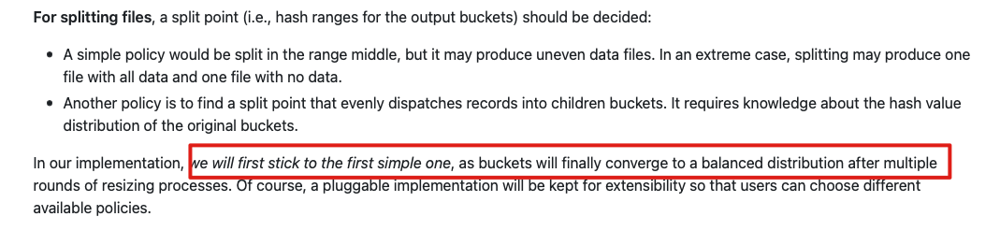

# 问题


Consistent Hashing Index(https://hudi.apache.org/releases/release-0.13.0#consistent-hashing-index)


了解以下 几个问题:

1. 为啥要出这个功能
2. 如何实现
   1. 是否影响当前功能,是的话,怎么兼容当前的功能
   2. 实现思路
3. 性能
4. 当前局限

# 背景

## 之前 BucketIndex限制

1. bucket Index 静态
2. 扩缩节点成本很高，需要全部重新rehashing


# 相关 RFC

https://github.com/apache/hudi/blob/master/rfc/rfc-42/rfc-42.md

[JIRA ISSUE ](https://issues.apache.org/jira/browse/HUDI-3000)

[一致性Hash算法](https://developer.huawei.com/consumer/cn/forum/topic/0203810951415790238)


一致性Hash算法，会将index认为是一个环，他会将metadata的Node，放到这个环上，然后计算Hash的时候，会顺时针找他下一个节点。实现方式TreeMap，所以能看到他查找的时间是LogN，扩充时间是O(1)


We introduce the Consistent Hashing Index as yet another indexing option for your writes with Hudi. This is an enhancement to [Bucket Index](https://hudi.apache.org/releases/older-releases#bucket-index) which is added in the 0.11.0 release. With Bucket Index, buckets/file groups per partition are statically allocated, whereas with Consistent Hashing Index, buckets can grow dynamically and so users don't need to sweat about data skews. Buckets will expand and shrink depending on the load factor for each partition. You can find the [RFC](https://github.com/apache/hudi/blob/master/rfc/rfc-42/rfc-42.md) for the design of this feature.


# 参数

```properties
hoodie.index.type=bucket
hoodie.index.bucket.engine=CONSISTENT_HASHING
hoodie.bucket.index.max.num.buckets=128
hoodie.bucket.index.min.num.buckets=32
hoodie.bucket.index.num.buckets=4
## do split if the bucket size reach 1.5 * max_file_size
hoodie.bucket.index.split.threshold=1.5
## do merge if the bucket size smaller than 0.2 * max_file_size
hoodie.bucket.index.merge.threshold=0.1 
```

To enforce shrinking or scaling up of buckets, you need to enable clustering using the following configs

要强制缩小或扩展存储桶，您需要使用以下配置启用集群

```properties
## check resize for every 4 commit
hoodie.clustering.inline=true
hoodie.clustering.inline.max.commits=4
hoodie.clustering.plan.strategy.class=org.apache.hudi.client.clustering.plan.strategy.SparkConsistentBucketClusteringPlanStrategy
hoodie.clustering.execution.strategy.class=org.apache.hudi.client.clustering.run.strategy.SparkConsistentBucketClusteringExecutionStrategy
## for supporting concurrent write & resizing
hoodie.clustering.updates.strategy=org.apache.hudi.client.clustering.update.strategy.SparkConsistentBucketDuplicateUpdateStrategy
```


# 限制

- 此索引仅支持使用MOR表的Spark引擎。(This index is supported only for Spark engine using a MOR table.)
- 它不能在启用元数据表的情况下工作。(It does not work with metadata table enabled.)
- 要放大或缩小存储桶，用户必须使用上述配置（以一定的节奏）手动触发集群，但他们不能同时运行 Compation。(To scale up or shrink the buckets, users have to manually trigger clustering using above configs (at some cadence), but they cannot have compaction concurrently running.)
- 因此，如果您的常规写入管道(regular write pipeline) 启用了Compation，请遵循以下建议：您可以选择每12小时触发一次伸缩。在这种情况下，每12小时一次，您可能需要禁用Compation，停止写入管道并启用 clustering。您应该格外小心，不要同时运行两者，因为这可能会导致冲突和管道失败。clustering 完成后，您可以恢复常规写入管道(regular write pipeline)，该管道将启用Compation。


# 性能


# 代码实现原理


## 当成Clustring子任务

使用clustering服务的功能，把Split/Merge 功能当成 Clustering 的子任务进行，所以才有之前的限制，必须开启clustring的功能


## 解决并发写

拆分的时候，如果并发写入会怎么样。如果采用 BucketIndex的话，就可以避免并发写入的问题，原因如下：


并发写的时候方案有两种，双写和设置虚拟文件，现在好像只采用了双写的方案


## 双写方案


```java
/**
 * Update strategy for (consistent hashing) bucket index
 * If updates to file groups that are under clustering are identified, then generate
 * two same records for each update, routing to both old and new file groups
 */
public class SparkConsistentBucketDuplicateUpdateStrategy<T extends HoodieRecordPayload<T>> extends UpdateStrategy<T, HoodieData<HoodieRecord<T>>> {

  private static final Logger LOG = LogManager.getLogger(SparkConsistentBucketDuplicateUpdateStrategy.class);

  public SparkConsistentBucketDuplicateUpdateStrategy(HoodieEngineContext engineContext, HoodieTable table, Set<HoodieFileGroupId> fileGroupsInPendingClustering) {
    super(engineContext, table, fileGroupsInPendingClustering);
  }
}
```

## Merge/Split

merge有两种方案，按照索引从中间拆分，按照实际数据量拆分。这里目前只实现了最简单的，从索引中间拆分。因为这样最终也会实现平衡




# 总结

了解以下 几个问题:

1. 为啥要出这个功能
   1. 静态桶索引无法拓展,拓展需整张表重新导入,成本高
2. 如何实现
   1. 桶索引如何变成动态-- 一致性 Hash
   2. 是否影响当前功能,是的话,怎么兼容当前的功能
      1. 影响当前功能
      2. 抽象更高的一层,将原先的桶索引当成一个子类实现
   3. 需要考虑的方面
      1. 动作放在哪 放在 clustering
      2. 元数据怎么存储 存储在`.hoodie/.hashing_meta/partition/<instant>.hashing_meta`
      3. 怎么拆分/合并 
         1. 拆分: 达成条件,从 hash 范围中间拆分,标记成 replace
         2. 合并: 相邻多个合并成一个,保留最后面的那个节点,其他标记成 DELETE
      4. 怎么实现并发写
         1. 双写
3. 性能
   1. 索引查找O(log 1) --->O(logN)
   2. Resize O(N) ---> O(1)
   3. 缩扩时 写入性能下降一半
4. 当前局限
   1. spark0.13, flink0.14
   2. 不能开启 metadata table
   3. 执行 clustering 的时候不能执行 compaction
