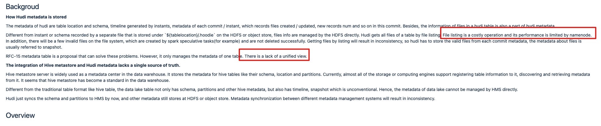

# 2. 缺省字段补全

[JIRA](https://issues.apache.org/jira/browse/HUDI-4781)

- [[HUDI-4781](https://issues.apache.org/jira/browse/HUDI-4781)] - Allow omit metadata fields for hive sync

# 3. MetaServer(EXPERIMENTAL)

## 参考资料

[相关RFC](https://cwiki.apache.org/confluence/display/HUDI/RFC-36%3A+HUDI+Metastore+Server)

## 背景

1. 缺乏统一的管理视图
2. 使用 File Listing 操作是一个开销非常昂贵的
3. Hive MetaStore 中缺少 Timeline属性，不满足 Hudi的要求

## Service

### Table

is for table related request. To client, it exposes API about database and table CRUD.

### Partition

is for partition related requests. To client, it exposes API about CRUD:

- support multiple ways of reading, like checking the partition's existence, getting partition info, getting partitions statisfys a specific condition(partition pruning).
- creating or updating API cannot be invoked directly, only a new commit completion can trigger it.
- dropping a partition not only deletes the partition and files at metadata level, but also triggers a clean action to do the physical clean that deletes the data on the file system.

### Timeline

is for timeline related request. The basic functions are the same as the `HoodieActiveTimeline`.

To client, it exposes API that

- the instant CRUD
- get the metadata of an instant

### Snapshot

适用于文件级相关请求。旧方法是，写入客户端通过文件列表获取路径下的所有文件，然后通过将文件组织为文件组中的文件切片来构建文件系统视图。之后，获取每个文件组中最新的文件切片进行读写。快照服务只是给客户端最后一步的结果。

is for file level related request. The old way is that a write client gets all files under the path by file listing, and then builds the file system view by organizing the files as file slices in file groups. After that, get the latest file slice in each file group to read and write. Snapshot service just gives the client the result of the last step.

To client, it exposes API that

- get the latest snapshot of a partition without multiple file version
- get the incremental files after a specified timestamp, for incremental reading
- get all files of a partition, the same as the files under the filesystem, which is used to clean
- update the snapshot when a new commit completes, it cannot be invoked by client directly.

## Storage

根据存储的元数据类型，存储分为四个部分：table、partition、timeline、snapshot。表由数据库、表、模式的元数据组成。分区只是分区元数据。时间线包含即时和每个即时的元数据。快照有文件状态。

Table consists of the metadata of database, table, schema.

Partition is just partition metadata.

Timeline contains instant and the metadata of each instant.

Snapshot has file statuses.

可更换存储引擎，目前为Mysql

## 4. 
