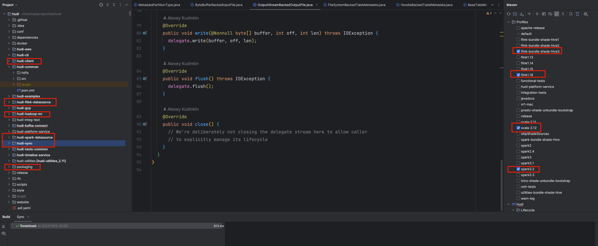
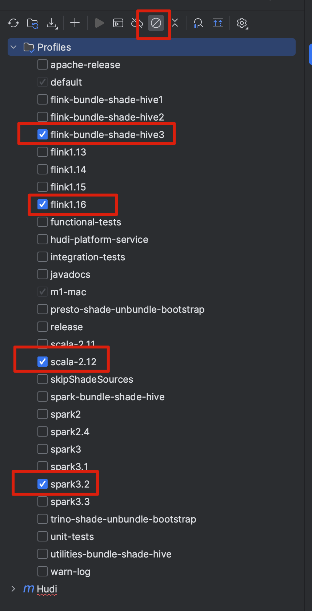
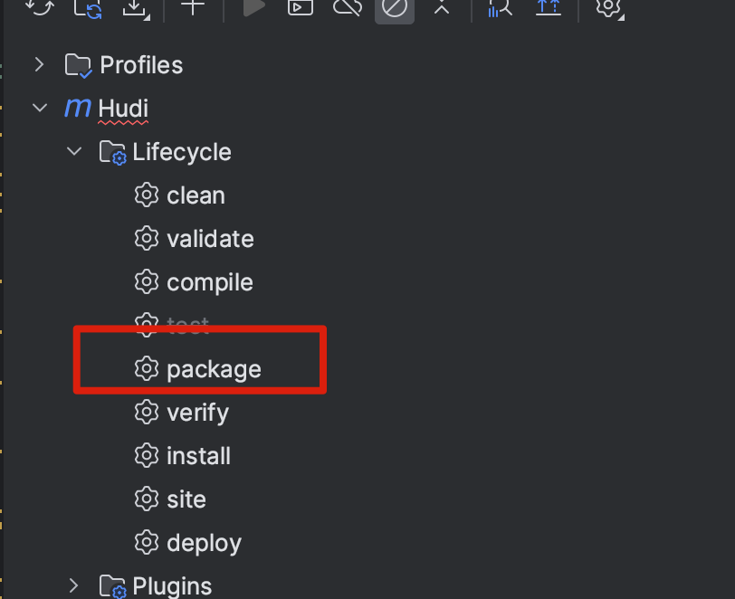
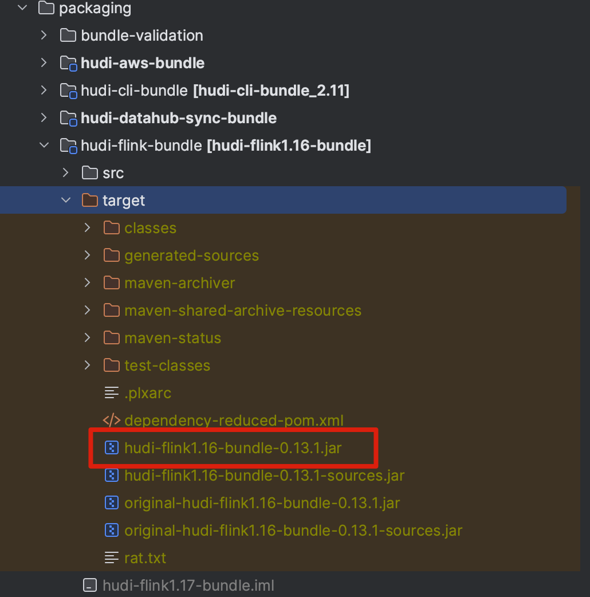

# 下载

从 Hudi Github 上下载项目到本地 https://github.com/apache/hudi

# 项目结构

## Module

左边会有 Hudi 的所有子模块, 重点关注的已经标出, 主要包括以下:

- Hudi-client: 主要包括操作 hudi 的时候创建的 client (Java/flink/spark等), 比如upsert 方法的入口就在这个里面
- hudi-flink-datasource: 所有 Flink与 Hudi 整合的主要方法都在这里,比如Flink算子的实现等等
- hudi-hadoop-mr: Hadoop 与 Hudi 的整合, 比如Hive 查询写到 HDFS 上的文件的时候,会调用这里的一些方法
- hudi-spark-datasource: Spark 与 Hudi 的整合方法
- hudi-sync: Hudi 表信息同步的相关方法,比如如何同步到 HMS 的逻辑
- packaging: 最后打包后的jar,都在这里找

右边会列出所有可选的 Profile,也就是我们打包的时候,整合的引擎版本,还有其他一些条件

# Maven打包

Maven 打包可以用命令行或者在 Idea 勾选之后,再执行 package

### Idea

选完之后再执行 package 才是我们想要的结果

点击 package 之后, 就等同于上面我们命令行执行的命令.

#### Flink-bundle-shade-hive

这个的意思是,打包 `Hudi-Flink-bundleXXX.jar` 的时候,会把 hive 相关的包 shade之后打包进去, 比如 `hive-exec`等

如果不勾选这个,打包的时候 再执行 Hive-sync 的时候,会报错.并且自己拷贝相关的包,很容易出现依赖冲突的问题

同理`spark-bundle-shade-hive` 其他也是一样

### 命令行

Maven 打包命令 `mvn clean install -DskipTests -Dscala-2.12 -Dspark3.2 -Dmaven.test.skip=true -Dcheckstyle.skip=true -Dflink1.16 -Drat.skip=true`

如果想像Idea 一样,多选择几个 Profile 参数, 命令行加上 `-Dxxx`就行

# jar

编译打包之后,就去 packaging 目录下找到自己想要的包

比如 Flink相关的是在这个目录下

