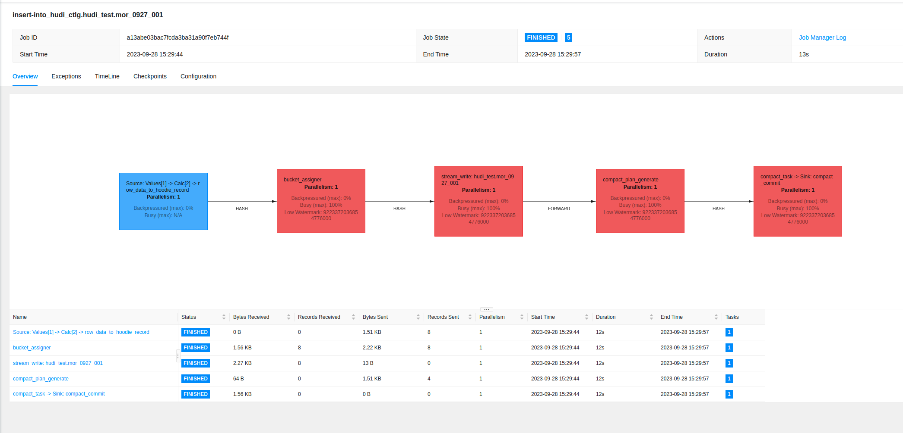
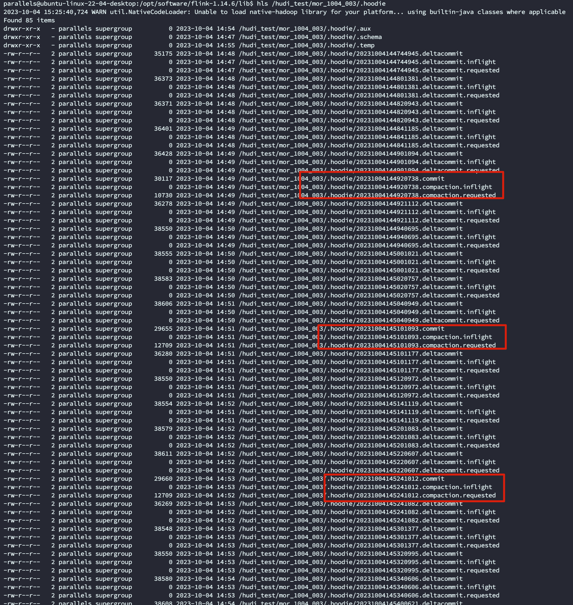
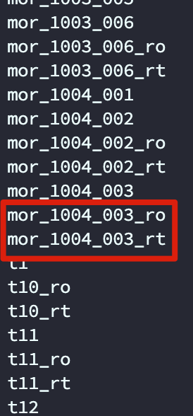

# 申请 YARN Session

```shell
export HADOOP_CLASSPATH=`hadoop classpath`

### 
./bin/yarn-session.sh -jm 4G -nm rt_test -s 4 -tm 4G -d
./bin/yarn-session.sh -yD env.java.opts="--add-opens java.base/java.lang=ALL-UNNAMED" -jm 4G -nm rt_test -s 4 -tm 4G -d

```


# 启动Flink client

```shell
./bin/sql-client.sh embedded -j ./lib/hudi-flink1.14-bundle-0.13.0.jar -s rt_test -i ./conf/sql-conf.sql 
./bin/sql-client.sh embedded -s rt_test

./bin/sql-client.sh embedded -s rt_test -i ./conf/sql-conf.sql 
```


## CreateTable

```sql
CREATE TABLE mor_0927_001(
  uuid VARCHAR(20),
  name VARCHAR(10),
  age INT,
  ts TIMESTAMP(3),
  `partition` VARCHAR(20)
)
PARTITIONED BY (`partition`)
WITH (
  'connector' = 'hudi',
  'path' = 'hdfs://bigdata01:9000/hudi_test/mor_0927_001',
  'table.type' = 'MERGE_ON_READ',  -- If MERGE_ON_READ, hive query will not have output until the parquet file is generated
  
  'hive_sync.enable' = 'true',     -- . To enable hive synchronization
  'hive_sync.mode' = 'hms',        -- Required. Setting hive sync mode to hms, default hms
  'hive_sync.db' = 'hudi_test',
  'hive_sync.table' = 'mor_0927_001',
  'hive_sync.metastore.uris' = 'thrift://bigdata01:9083' -- Required. The port need set on hive-site.xml
);

```

## InsertData

```sql
-- batch 
INSERT INTO mor_0927_001 VALUES
  ('id1','Danny',23,TIMESTAMP '1970-01-01 00:00:01','par1'),
  ('id2','Stephen',33,TIMESTAMP '1970-01-01 00:00:02','par1'),
  ('id3','Julian',53,TIMESTAMP '1970-01-01 00:00:03','par2'),
  ('id4','Fabian',31,TIMESTAMP '1970-01-01 00:00:04','par2'),
  ('id5','Sophia',18,TIMESTAMP '1970-01-01 00:00:05','par3'),
  ('id6','Emma',20,TIMESTAMP '1970-01-01 00:00:06','par3'),
  ('id7','Bob',44,TIMESTAMP '1970-01-01 00:00:07','par4'),
  ('id8','Han',56,TIMESTAMP '1970-01-01 00:00:08','par4');
  
-- stream
CREATE TABLE datagen_mor_0927_001 (
  uuid VARCHAR(20),
  name VARCHAR(10),
  age INT,
  ts TIMESTAMP(3),  
  `partition` VARCHAR(20)
) WITH (
  'connector' = 'datagen',
  'rows-per-second' = '10',
  'fields.uuid.kind' = 'random',
  'fields.name.kind' = 'random',
  'fields.name.length' = '5',
  'fields.age.kind' = 'random',
  'fields.age.min' = '0',
  'fields.age.max' = '100',
  'fields.ts.kind' = 'random',
  'fields.ts.max-past' = '5', 
  'fields.partition.kind' = 'random',
  'fields.partition.length' = '1'
);


INSERT INTO mor_0927_001
SELECT uuid, name, age, ts, `partition`
FROM datagen_mor_0927_001;

```


# JobGraph




```sql
CREATE TABLE my_rocketmq_table_001 (
    id STRING
) WITH (
    'connector' = 'rocketmq',
    'topic' = 'TopicTest',
    'nameServerAddress' = '10.211.55.5:9876',
    'consumerGroup' = 'please_rename_unique_group_name',
    'scanStartupMode' = 'earliest'
);


CREATE TABLE my_kafka_table_001 (
    id STRING
) WITH (
    'connector' = 'kafka',
		'topic' = 'json-output-test2',
		'properties.bootstrap.servers' = '10.211.55.5:9092',
    'scan.startup.mode' = 'earliest-offset',
    'format' = 'csv'
);

```


# 分析 hdfs 文件




我们可以看到上面的文件每生成 5 个 `deltacommit` 就会做一次 compaction,因为默认及时 5 次执行一次 compaction

## compaction.delta_commits

Max delta commits needed to trigger compaction, default 5 commits
`Default Value: 5 (Optional)`
`Config Param: COMPACTION_DELTA_COMMITS`

# Metastore

```shell
nohup hive --service metastore > /dev/null 2>&1 &
nohup hive --service hiveserver2 > /dev/null 2>&1 &

```


# Flink SQL client  使用 HMS

https://blog.csdn.net/qq_41908713/article/details/123629634

## 配置 catalog 及hms初始化表

1. 创建 sql-conf.sql 文件

   ```sql
   CREATE CATALOG hudi_ctlg WITH (
       'type' = 'hive',
       'default-database' = 'hudi_test',
       'hive-conf-dir' = '/opt/software/apache-hive-3.1.3-bin/conf',
       'hadoop-conf-dir' = '/opt/software/hadoop-3.2.4/etc/hadoop'
   );
   -- set the HiveCatalog as the current catalog of the session
   USE CATALOG hudi_ctlg;
   ```

2. 启动 sql client

   ```shell
   ./sql-client.sh embedded -i ../conf/sql-conf.sql 
   ```

# 查询

## Flink

#### Count

```sql
select count(1) from mor_1004_003; 
-- result 4360; 他是默认快照查询 即 Parquet+log 都会查询,可以看到跟 hive 的 RT 表查询条数一致
```


#### Select *

```sql
 select * from mor_1004_003 limit 3;
 													 uuid                           name         age                      ts                      partition
 e8dc5d2c4162d2cfcf6e759a01d19~                          0e1a8          80 2023-10-04 06:48:24.810                              f
 21dc262e87745845eb1513decbb00~                          6472a          14 2023-10-04 06:48:34.811                              f
 478d3c6d8d85cbc48c05db441b609~                          93df7           0 2023-10-04 06:48:51.811                              f
```


## Hive

将 `hudi-hadoop-mr-bundle-XXX.jar` 包放到 hive辅助目录 `${HIVE_HOME}/auxlib`

前面我们flink 写入 的时候, 配置了 HMS 同步,所以 我们能在 hive client 看到同步的 RO,RT 表

```sql 
show tables; -- hive cli 执行看下
```





### 查询 RO 表

```sql
select count(*) from mor_1004_003_ro;
-- result: 3960


select * from mor_1004_003_ro limit 1 ;
-- mor_1004_003_ro._hoodie_commit_time     mor_1004_003_ro._hoodie_commit_seqno    mor_1004_003_ro._hoodie_record_key      mor_1004_003_ro._hoodie_partition_path  mor_1004_003_ro._hoodie_file_name       mor_1004_003_ro.uuid    mor_1004_003_ro.name    mor_1004_003_ro.age  mor_1004_003_ro.ts      mor_1004_003_ro.partition

-- 20231004144820943       20231004144820943_0_498 fe9072287c5f80615edcd5b06f813c9c0f07a6c656e58f1eb96f19340e75ee82a24b34b8bd0e449c698a232ce469fba64efb    0       2817ed2d-ef94-4c01-b2e8-4e0b13ab3b98_0-2-0_20231004145421096.parquet    fe9072287c5f80615edcd5b06f813c9c0f07a6c656e58f1eb96f19340e75ee82a24b34b8bd0e449c698a232ce469fba64efb 083c6   49      1696402114804   0

```


### 查询 RT 表

```sql
select count(*) from mor_1004_003_rt;
-- rtsult: 4360

select * from mor_1004_003_rt limit 1 ;

mor_1004_003_rt._hoodie_commit_time     mor_1004_003_rt._hoodie_commit_seqno    mor_1004_003_rt._hoodie_record_key      mor_1004_003_rt._hoodie_partition_path  mor_1004_003_rt._hoodie_file_name       mor_1004_003_rt.uuid    mor_1004_003_rt.name    mor_1004_003_rt.age  mor_1004_003_rt.ts      mor_1004_003_rt.partition

20231004144744945       20231004144744945_0_129 9f4dc90aa85e212ae47ce177a12c3e351990286e39da74a8b5f2d64d23d1350db1295176239d4917b3c2aa05cfa0182bfe5c    0       2817ed2d-ef94-4c01-b2e8-4e0b13ab3b98_0-2-0_20231004145421096.parquet    9f4dc90aa85e212ae47ce177a12c3e351990286e39da74a8b5f2d64d23d1350db1295176239d4917b3c2aa05cfa0182bfe5c eae0e   56      1696402079811   0
```


# 报错

## 无法启动 hive catalog

```shell
org.apache.flink.table.client.gateway.SqlExecutionException: Could not execute SQL statement.
        at org.apache.flink.table.client.gateway.local.LocalExecutor.executeOperation(LocalExecutor.java:208) ~[flink-sql-client-1.16.2.jar:1.16.2]
        at org.apache.flink.table.client.cli.CliClient.executeOperation(CliClient.java:639) ~[flink-sql-client-1.16.2.jar:1.16.2]
        at org.apache.flink.table.client.cli.CliClient.callOperation(CliClient.java:473) [flink-sql-client-1.16.2.jar:1.16.2]
        at org.apache.flink.table.client.cli.CliClient.executeOperation(CliClient.java:372) [flink-sql-client-1.16.2.jar:1.16.2]
        at org.apache.flink.table.client.cli.CliClient.getAndExecuteStatements(CliClient.java:329) [flink-sql-client-1.16.2.jar:1.16.2]
        at org.apache.flink.table.client.cli.CliClient.executeFile(CliClient.java:353) [flink-sql-client-1.16.2.jar:1.16.2]
        at org.apache.flink.table.client.cli.CliClient.executeInitialization(CliClient.java:247) [flink-sql-client-1.16.2.jar:1.16.2]
        at org.apache.flink.table.client.SqlClient.openCli(SqlClient.java:135) [flink-sql-client-1.16.2.jar:1.16.2]
        at org.apache.flink.table.client.SqlClient.start(SqlClient.java:95) [flink-sql-client-1.16.2.jar:1.16.2]
        at org.apache.flink.table.client.SqlClient.startClient(SqlClient.java:187) [flink-sql-client-1.16.2.jar:1.16.2]
        at org.apache.flink.table.client.SqlClient.main(SqlClient.java:161) [flink-sql-client-1.16.2.jar:1.16.2]
Caused by: org.apache.flink.table.api.ValidationException: Unable to create catalog 'hudi_ctlg'.

Catalog options are:
'default-database'='hudi_test'
'hadoop-conf-dir'='/opt/software/hadoop-3.2.4/etc/hadoop'
'hive-conf-dir'='/opt/software/apache-hive-3.1.3-bin/conf'
'type'='hive'
        at org.apache.flink.table.factories.FactoryUtil.createCatalog(FactoryUtil.java:439) ~[flink-table-api-java-uber-1.16.2.jar:1.16.2]
        at org.apache.flink.table.api.internal.TableEnvironmentImpl.createCatalog(TableEnvironmentImpl.java:1426) ~[flink-table-api-java-uber-1.16.2.jar:1.16.2]
        at org.apache.flink.table.api.internal.TableEnvironmentImpl.executeInternal(TableEnvironmentImpl.java:1172) ~[flink-table-api-java-uber-1.16.2.jar:1.16.2]
        at org.apache.flink.table.client.gateway.local.LocalExecutor.executeOperation(LocalExecutor.java:206) ~[flink-sql-client-1.16.2.jar:1.16.2]
        ... 10 more
Caused by: org.apache.flink.table.catalog.exceptions.CatalogException: Unsupported Hive version 3.1.3
        at org.apache.flink.table.catalog.hive.client.HiveShimLoader.lambda$loadHiveShim$0(HiveShimLoader.java:136) ~[flink-connector-hive_2.12-1.14.6.jar:1.14.6]
        at java.util.concurrent.ConcurrentHashMap.computeIfAbsent(ConcurrentHashMap.java:1708) ~[?:?]
        at org.apache.flink.table.catalog.hive.client.HiveShimLoader.loadHiveShim(HiveShimLoader.java:64) ~[flink-connector-hive_2.12-1.14.6.jar:1.14.6]
        at org.apache.flink.table.catalog.hive.HiveCatalog.<init>(HiveCatalog.java:213) ~[flink-connector-hive_2.12-1.14.6.jar:1.14.6]
        at org.apache.flink.table.catalog.hive.HiveCatalog.<init>(HiveCatalog.java:187) ~[flink-connector-hive_2.12-1.14.6.jar:1.14.6]
        at org.apache.flink.table.catalog.hive.HiveCatalog.<init>(HiveCatalog.java:179) ~[flink-connector-hive_2.12-1.14.6.jar:1.14.6]
        at org.apache.flink.table.catalog.hive.factories.HiveCatalogFactory.createCatalog(HiveCatalogFactory.java:76) ~[flink-connector-hive_2.12-1.14.6.jar:1.14.6]
        at org.apache.flink.table.factories.FactoryUtil.createCatalog(FactoryUtil.java:436) ~[flink-table-api-java-uber-1.16.2.jar:1.16.2]
        at org.apache.flink.table.api.internal.TableEnvironmentImpl.createCatalog(TableEnvironmentImpl.java:1426) ~[flink-table-api-java-uber-1.16.2.jar:1.16.2]
        at org.apache.flink.table.api.internal.TableEnvironmentImpl.executeInternal(TableEnvironmentImpl.java:1172) ~[flink-table-api-java-uber-1.16.2.jar:1.16.2]
        at org.apache.flink.table.client.gateway.local.LocalExecutor.executeOperation(LocalExecutor.java:206) ~[flink-sql-client-1.16.2.jar:1.16.2]
        ... 10 more
2023-10-03 15:27:59,220 INFO  org.apache.flink.table.client.cli.CliClient                  [] - ESC[34;1m[INFO] Executing SQL from file.ESC[0m

Command history file path: /home/parallels/.flink-sql-history
Flink SQL> CREATE CATALOG hudi_ctlg WITH (
>     'type' = 'hive',
>     'default-database' = 'hudi_test',
>     'hive-conf-dir' = '/opt/software/apache-hive-3.1.3-bin/conf',
>     'hadoop-conf-dir' = '/opt/software/hadoop-3.2.4/etc/hadoop'
> )ESC[31;1m[ERROR] Could not execute SQL statement. Reason:
org.apache.flink.table.catalog.exceptions.CatalogException: Unsupported Hive version 3.1.3ESC[0m
```

### 解决方法

将`flink-sql-connector-hive-3.1.2_2.12-1.14.6.jar` 拷贝到`${FLINK_HOME}/lib`目录下

## fb303

```shell
Caused by: java.lang.NoClassDefFoundError: com/facebook/fb303/FacebookService$Iface
        at java.lang.ClassLoader.defineClass1(Native Method) ~[?:?]
        at java.lang.ClassLoader.defineClass(ClassLoader.java:1012) ~[?:?]
        at java.security.SecureClassLoader.defineClass(SecureClassLoader.java:150) ~[?:?]
        at jdk.internal.loader.BuiltinClassLoader.defineClass(BuiltinClassLoader.java:862) ~[?:?]
        at jdk.internal.loader.BuiltinClassLoader.findClassOnClassPathOrNull(BuiltinClassLoader.java:760) ~[?:?]
        at jdk.internal.loader.BuiltinClassLoader.loadClassOrNull(BuiltinClassLoader.java:681) ~[?:?]
        at jdk.internal.loader.BuiltinClassLoader.loadClass(BuiltinClassLoader.java:639) ~[?:?]
        at jdk.internal.loader.ClassLoaders$AppClassLoader.loadClass(ClassLoaders.java:188) ~[?:?]
        at java.lang.ClassLoader.loadClass(ClassLoader.java:520) ~[?:?]
        at java.lang.Class.forName0(Native Method) ~[?:?]
        at java.lang.Class.forName(Class.java:467) ~[?:?]
        at org.apache.hadoop.hive.metastore.utils.JavaUtils.getClass(JavaUtils.java:52) ~[hive-exec-3.1.3.jar:3.1.3]
        at org.apache.hadoop.hive.metastore.RetryingMetaStoreClient.getProxy(RetryingMetaStoreClient.java:146) ~[hive-exec-3.1.3.jar:3.1.3]
        at org.apache.hadoop.hive.metastore.RetryingMetaStoreClient.getProxy(RetryingMetaStoreClient.java:104) ~[hive-exec-3.1.3.jar:3.1.3]
        at jdk.internal.reflect.NativeMethodAccessorImpl.invoke0(Native Method) ~[?:?]
        at jdk.internal.reflect.NativeMethodAccessorImpl.invoke(NativeMethodAccessorImpl.java:77) ~[?:?]
        at jdk.internal.reflect.DelegatingMethodAccessorImpl.invoke(DelegatingMethodAccessorImpl.java:43) ~[?:?]
        at java.lang.reflect.Method.invoke(Method.java:568) ~[?:?]
        at org.apache.flink.table.catalog.hive.client.HiveShimV310.getHiveMetastoreClient(HiveShimV310.java:140) ~[flink-connector-hive_2.12-1.16.2.jar:1.16.2]
        at org.apache.flink.table.catalog.hive.client.HiveMetastoreClientWrapper.createMetastoreClient(HiveMetastoreClientWrapper.java:288) ~[flink-connector-hive_2.12-1.16.2.jar:1.16.2]
        at org.apache.flink.table.catalog.hive.client.HiveMetastoreClientWrapper.<init>(HiveMetastoreClientWrapper.java:89) ~[flink-connector-hive_2.12-1.16.2.jar:1.16.2]
        at org.apache.flink.table.catalog.hive.client.HiveMetastoreClientWrapper.<init>(HiveMetastoreClientWrapper.java:79) ~[flink-connector-hive_2.12-1.16.2.jar:1.16.2]
        at org.apache.flink.table.catalog.hive.client.HiveMetastoreClientFactory.create(HiveMetastoreClientFactory.java:32) ~[flink-connector-hive_2.12-1.16.2.jar:1.16.2]
        at org.apache.flink.table.catalog.hive.HiveCatalog.open(HiveCatalog.java:303) ~[flink-connector-hive_2.12-1.16.2.jar:1.16.2]
        at org.apache.flink.table.catalog.CatalogManager.registerCatalog(CatalogManager.java:211) ~[flink-table-api-java-uber-1.16.2.jar:1.16.2]
        at org.apache.flink.table.api.internal.TableEnvironmentImpl.createCatalog(TableEnvironmentImpl.java:1431) ~[flink-table-api-java-uber-1.16.2.jar:1.16.2]
        at org.apache.flink.table.api.internal.TableEnvironmentImpl.executeInternal(TableEnvironmentImpl.java:1172) ~[flink-table-api-java-uber-1.16.2.jar:1.16.2]
        at org.apache.flink.table.client.gateway.local.LocalExecutor.executeOperation(LocalExecutor.java:206) ~[flink-sql-client-1.16.2.jar:1.16.2]
        ... 10 more
Caused by: java.lang.ClassNotFoundException: com.facebook.fb303.FacebookService$Iface
        at jdk.internal.loader.BuiltinClassLoader.loadClass(BuiltinClassLoader.java:641) ~[?:?]
        at jdk.internal.loader.ClassLoaders$AppClassLoader.loadClass(ClassLoaders.java:188) ~[?:?]
        at java.lang.ClassLoader.loadClass(ClassLoader.java:520) ~[?:?]
        at java.lang.ClassLoader.defineClass1(Native Method) ~[?:?]
        at java.lang.ClassLoader.defineClass(ClassLoader.java:1012) ~[?:?]
        at java.security.SecureClassLoader.defineClass(SecureClassLoader.java:150) ~[?:?]
        at jdk.internal.loader.BuiltinClassLoader.defineClass(BuiltinClassLoader.java:862) ~[?:?]
        at jdk.internal.loader.BuiltinClassLoader.findClassOnClassPathOrNull(BuiltinClassLoader.java:760) ~[?:?]
        at jdk.internal.loader.BuiltinClassLoader.loadClassOrNull(BuiltinClassLoader.java:681) ~[?:?]
        at jdk.internal.loader.BuiltinClassLoader.loadClass(BuiltinClassLoader.java:639) ~[?:?]
        at jdk.internal.loader.ClassLoaders$AppClassLoader.loadClass(ClassLoaders.java:188) ~[?:?]
        at java.lang.ClassLoader.loadClass(ClassLoader.java:520) ~[?:?]
        at java.lang.Class.forName0(Native Method) ~[?:?]
        at java.lang.Class.forName(Class.java:467) ~[?:?]
        at org.apache.hadoop.hive.metastore.utils.JavaUtils.getClass(JavaUtils.java:52) ~[hive-exec-3.1.3.jar:3.1.3]
        at org.apache.hadoop.hive.metastore.RetryingMetaStoreClient.getProxy(RetryingMetaStoreClient.java:146) ~[hive-exec-3.1.3.jar:3.1.3]
        at org.apache.hadoop.hive.metastore.RetryingMetaStoreClient.getProxy(RetryingMetaStoreClient.java:104) ~[hive-exec-3.1.3.jar:3.1.3]
        at jdk.internal.reflect.NativeMethodAccessorImpl.invoke0(Native Method) ~[?:?]
        at jdk.internal.reflect.NativeMethodAccessorImpl.invoke(NativeMethodAccessorImpl.java:77) ~[?:?]
        at jdk.internal.reflect.DelegatingMethodAccessorImpl.invoke(DelegatingMethodAccessorImpl.java:43) ~[?:?]
        at java.lang.reflect.Method.invoke(Method.java:568) ~[?:?]
        at org.apache.flink.table.catalog.hive.client.HiveShimV310.getHiveMetastoreClient(HiveShimV310.java:140) ~[flink-connector-hive_2.12-1.16.2.jar:1.16.2]
        at org.apache.flink.table.catalog.hive.client.HiveMetastoreClientWrapper.createMetastoreClient(HiveMetastoreClientWrapper.java:288) ~[flink-connector-hive_2.12-1.16.2.jar:1.16.2]
        at org.apache.flink.table.catalog.hive.client.HiveMetastoreClientWrapper.<init>(HiveMetastoreClientWrapper.java:89) ~[flink-connector-hive_2.12-1.16.2.jar:1.16.2]
        at org.apache.flink.table.catalog.hive.client.HiveMetastoreClientWrapper.<init>(HiveMetastoreClientWrapper.java:79) ~[flink-connector-hive_2.12-1.16.2.jar:1.16.2]
        at org.apache.flink.table.catalog.hive.client.HiveMetastoreClientFactory.create(HiveMetastoreClientFactory.java:32) ~[flink-connector-hive_2.12-1.16.2.jar:1.16.2]
        at org.apache.flink.table.catalog.hive.HiveCatalog.open(HiveCatalog.java:303) ~[flink-connector-hive_2.12-1.16.2.jar:1.16.2]
        at org.apache.flink.table.catalog.CatalogManager.registerCatalog(CatalogManager.java:211) ~[flink-table-api-java-uber-1.16.2.jar:1.16.2]
        at org.apache.flink.table.api.internal.TableEnvironmentImpl.createCatalog(TableEnvironmentImpl.java:1431) ~[flink-table-api-java-uber-1.16.2.jar:1.16.2]
        at org.apache.flink.table.api.internal.TableEnvironmentImpl.executeInternal(TableEnvironmentImpl.java:1172) ~[flink-table-api-java-uber-1.16.2.jar:1.16.2]
        at org.apache.flink.table.client.gateway.local.LocalExecutor.executeOperation(LocalExecutor.java:206) ~[flink-sql-client-1.16.2.jar:1.16.2]
```

### 解决方法

Hive-exec 缺少 依赖 ,jar 拷贝到 {FLINK_HOME}/lib

```xml
    
<dependency>
      <groupId>org.apache.thrift</groupId>
      <artifactId>libfb303</artifactId>
      <version>${thrift.version}</version>
      <scope>${flink.bundle.hive.scope}</scope>
    </dependency>

```


## 删除 guava目录

```shell
zip -d /path/to/your.jar test/\*
zip -d hive-exec-3.1.3.jar /com/google/\*
```

## 缺少依赖

```shell
java.lang.NoClassDefFoundError: org/apache/calcite/plan/RelOptRule
	at java.lang.Class.getDeclaredMethods0(Native Method) ~[?:1.8.0_361]
	at java.lang.Class.privateGetDeclaredMethods(Class.java:2701) ~[?:1.8.0_361]
	at java.lang.Class.privateGetMethodRecursive(Class.java:3048) ~[?:1.8.0_361]
	at java.lang.Class.getMethod0(Class.java:3018) ~[?:1.8.0_361]
	at java.lang.Class.getMethod(Class.java:1784) ~[?:1.8.0_361]
	at org.apache.hudi.hive.util.IMetaStoreClientUtil.getMSC(IMetaStoreClientUtil.java:40) ~[hudi-flink1.16-bundle-1.0.0-SNAPSHOT.jar:1.0.0-SNAPSHOT]
	at org.apache.hudi.hive.HoodieHiveSyncClient.<init>(HoodieHiveSyncClient.java:89) ~[hudi-flink1.16-bundle-1.0.0-SNAPSHOT.jar:1.0.0-SNAPSHOT]
	at org.apache.hudi.hive.HiveSyncTool.initSyncClient(HiveSyncTool.java:123) ~[hudi-flink1.16-bundle-1.0.0-SNAPSHOT.jar:1.0.0-SNAPSHOT]
	at org.apache.hudi.hive.HiveSyncTool.<init>(HiveSyncTool.java:117) ~[hudi-flink1.16-bundle-1.0.0-SNAPSHOT.jar:1.0.0-SNAPSHOT]
	at org.apache.hudi.sink.utils.HiveSyncContext.hiveSyncTool(HiveSyncContext.java:81) ~[hudi-flink1.16-bundle-1.0.0-SNAPSHOT.jar:1.0.0-SNAPSHOT]
	at org.apache.hudi.sink.StreamWriteOperatorCoordinator.doSyncHive(StreamWriteOperatorCoordinator.java:343) ~[hudi-flink1.16-bundle-1.0.0-SNAPSHOT.jar:1.0.0-SNAPSHOT]
	at org.apache.hudi.sink.utils.NonThrownExecutor.lambda$wrapAction$0(NonThrownExecutor.java:130) ~[hudi-flink1.16-bundle-1.0.0-SNAPSHOT.jar:1.0.0-SNAPSHOT]
	at java.util.concurrent.ThreadPoolExecutor.runWorker(ThreadPoolExecutor.java:1149) [?:1.8.0_361]
	at java.util.concurrent.ThreadPoolExecutor$Worker.run(ThreadPoolExecutor.java:624) [?:1.8.0_361]
	at java.lang.Thread.run(Thread.java:750) [?:1.8.0_361]
Caused by: java.lang.ClassNotFoundException: org.apache.calcite.plan.RelOptRule
	at java.net.URLClassLoader.findClass(URLClassLoader.java:387) ~[?:1.8.0_361]
	at java.lang.ClassLoader.loadClass(ClassLoader.java:418) ~[?:1.8.0_361]
	at sun.misc.Launcher$AppClassLoader.loadClass(Launcher.java:355) ~[?:1.8.0_361]
	at java.lang.ClassLoader.loadClass(ClassLoader.java:351) ~[?:1.8.0_361]
	... 15 more
```

### 解决方法

下载`calcite-core-1.35.0.jar` 到 {FLINK_HOME}/lib

## 提交任务连接拒绝

```shell
[INFO] Submitting SQL update statement to the cluster...
2023-10-04 13:40:45,292 WARN  org.apache.flink.yarn.configuration.YarnLogConfigUtil        [] - The configuration directory ('/opt/software/flink-1.14.6/conf') already contains a LOG4J config file.If you want to use logback, then please delete or rename the log configuration file.
2023-10-04 13:40:45,312 INFO  org.apache.hadoop.yarn.client.RMProxy                        [] - Connecting to ResourceManager at bigdata01/10.211.55.5:18040
2023-10-04 13:40:45,403 INFO  org.apache.flink.yarn.YarnClusterDescriptor                  [] - No path for the flink jar passed. Using the location of class org.apache.flink.yarn.YarnClusterDescriptor to locate the jar
2023-10-04 13:40:45,403 WARN  org.apache.flink.yarn.YarnClusterDescriptor                  [] - Neither the HADOOP_CONF_DIR nor the YARN_CONF_DIR environment variable is set.The Flink YARN Client needs one of these to be set to properly load the Hadoop configuration for accessing YARN.
2023-10-04 13:40:45,429 INFO  org.apache.flink.yarn.YarnClusterDescriptor                  [] - Found Web Interface bigdata02:35787 of application 'application_1696313178138_0037'.
[ERROR] Could not execute SQL statement. Reason:
java.net.ConnectException: Connection refused
```


## 提交 bulk_insert 报错

`Caused by: java.lang.NoSuchMethodError: org.apache.parquet.schema.Types$PrimitiveBuilder.as(Lorg/apache/parquet/schema/LogicalTypeAnnotation;)Lorg/apache/parquet/schema/Types$Builder;`

明明有类却报错

启动 `sql client`时 显式指定 hudi jar包

./sql-client.sh embedded -i ../conf/sql-conf.sql -j hudi-XXXX.jar


## 识别不了 hive

`Could not find any factory for identifier 'hive' that implements 'org.apache.flink.table.factories.DynamicTableFactory' in the classpath`

### 解决方式

将 `flink-sql-connector-hive-3.1.3_2.12-1.17.1.jar` 放到 `FLINK_HOME/lib`下


## 同步 HMS 报错

找不到 `org.apache.calcite.plan.RelOptRule`

`org.apache.flink.util.FlinkException: Global failure triggered by OperatorCoordinator for 'stream_write: hudi_test.mor_0927_001' (operator 4f2411aa3ee06ec2a8e31c6e43c25110). at org.apache.flink.runtime.operators.coordination.OperatorCoordinatorHolder$LazyInitializedCoordinatorContext.failJob(OperatorCoordinatorHolder.java:600) at org.apache.hudi.sink.StreamWriteOperatorCoordinator.lambda$start$0(StreamWriteOperatorCoordinator.java:196) at org.apache.hudi.sink.utils.NonThrownExecutor.handleException(NonThrownExecutor.java:142) at org.apache.hudi.sink.utils.NonThrownExecutor.lambda$wrapAction$0(NonThrownExecutor.java:133) at java.util.concurrent.Executors$RunnableAdapter.call(Executors.java:511) at java.util.concurrent.FutureTask.run(FutureTask.java:266) at java.util.concurrent.ThreadPoolExecutor.runWorker(ThreadPoolExecutor.java:1149) at java.util.concurrent.ThreadPoolExecutor$Worker.run(ThreadPoolExecutor.java:624) at java.lang.Thread.run(Thread.java:750) Caused by: org.apache.hudi.exception.HoodieException: Executor executes action [handle end input event for instant 20230928141642999] error ... 8 more `

`Caused by: java.lang.NoClassDefFoundError: org/apache/calcite/plan/RelOptRule at java.lang.Class.getDeclaredMethods0(Native Method) at java.lang.Class.privateGetDeclaredMethods(Class.java:2701) at java.lang.Class.privateGetMethodRecursive(Class.java:3048) at java.lang.Class.getMethod0(Class.java:3018) at java.lang.Class.getMethod(Class.java:1784) at org.apache.hudi.hive.util.IMetaStoreClientUtil.getMSC(IMetaStoreClientUtil.java:40) at org.apache.hudi.hive.HoodieHiveSyncClient.<init>(HoodieHiveSyncClient.java:89) at org.apache.hudi.hive.HiveSyncTool.initSyncClient(HiveSyncTool.java:123) at org.apache.hudi.hive.HiveSyncTool.<init>(HiveSyncTool.java:117) at org.apache.hudi.sink.utils.HiveSyncContext.hiveSyncTool(HiveSyncContext.java:81) at org.apache.hudi.sink.StreamWriteOperatorCoordinator.doSyncHive(StreamWriteOperatorCoordinator.java:343) at org.apache.hudi.sink.StreamWriteOperatorCoordinator.syncHive(StreamWriteOperatorCoordinator.java:334) at org.apache.hudi.sink.StreamWriteOperatorCoordinator.handleEndInputEvent(StreamWriteOperatorCoordinator.java:450) at org.apache.hudi.sink.StreamWriteOperatorCoordinator.lambda$handleEventFromOperator$3(StreamWriteOperatorCoordinator.java:286) at org.apache.hudi.sink.utils.NonThrownExecutor.lambda$wrapAction$0(NonThrownExecutor.java:130) ... 5 more `

`Caused by: java.lang.ClassNotFoundException: org.apache.calcite.plan.RelOptRule at java.net.URLClassLoader.findClass(URLClassLoader.java:387) at java.lang.ClassLoader.loadClass(ClassLoader.java:418) at sun.misc.Launcher$AppClassLoader.loadClass(Launcher.java:355) at java.lang.ClassLoader.loadClass(ClassLoader.java:351) ... 20 more`

### 解决方法

将 `calcite-core-1.35.0.jar` 放到 `FLINK_HOME/lib`下


## parquet 依赖报错

`org.apache.flink.util.FlinkException: Global failure triggered by OperatorCoordinator for 'stream_write: hudi_test.mor_0927_001' (operator 4f2411aa3ee06ec2a8e31c6e43c25110).
	at org.apache.flink.runtime.operators.coordination.OperatorCoordinatorHolder$LazyInitializedCoordinatorContext.failJob(OperatorCoordinatorHolder.java:600)
	at org.apache.hudi.sink.StreamWriteOperatorCoordinator.lambda$start$0(StreamWriteOperatorCoordinator.java:196)
	at org.apache.hudi.sink.utils.NonThrownExecutor.handleException(NonThrownExecutor.java:142)
	at org.apache.hudi.sink.utils.NonThrownExecutor.lambda$wrapAction$0(NonThrownExecutor.java:133)
	at java.util.concurrent.Executors$RunnableAdapter.call(Executors.java:511)
	at java.util.concurrent.FutureTask.run(FutureTask.java:266)
	at java.util.concurrent.ThreadPoolExecutor.runWorker(ThreadPoolExecutor.java:1149)
	at java.util.concurrent.ThreadPoolExecutor$Worker.run(ThreadPoolExecutor.java:624)
	at java.lang.Thread.run(Thread.java:750)
Caused by: org.apache.hudi.exception.HoodieException: Executor executes action [handle end input event for instant 20230928144312731] error
	... 8 more
Caused by: java.lang.NoSuchMethodError: org.apache.parquet.schema.Types$PrimitiveBuilder.as(Lorg/apache/parquet/schema/LogicalTypeAnnotation;)Lorg/apache/parquet/schema/Types$Builder;
	at org.apache.parquet.avro.AvroSchemaConverter.convertField(AvroSchemaConverter.java:177)
	at org.apache.parquet.avro.AvroSchemaConverter.convertUnion(AvroSchemaConverter.java:242)
	at org.apache.parquet.avro.AvroSchemaConverter.convertField(AvroSchemaConverter.java:199)
	at org.apache.parquet.avro.AvroSchemaConverter.convertField(AvroSchemaConverter.java:152)
	at org.apache.parquet.avro.AvroSchemaConverter.convertField(AvroSchemaConverter.java:260)
	at org.apache.parquet.avro.AvroSchemaConverter.convertFields(AvroSchemaConverter.java:146)
	at org.apache.parquet.avro.AvroSchemaConverter.convert(AvroSchemaConverter.java:137)
	at org.apache.hudi.common.table.TableSchemaResolver.readSchemaFromLogFile(TableSchemaResolver.java:380)
	at org.apache.hudi.common.table.TableSchemaResolver.readSchemaFromLogFile(TableSchemaResolver.java:363)
	at org.apache.hudi.common.table.TableSchemaResolver.fetchSchemaFromFiles(TableSchemaResolver.java:511)
	at org.apache.hudi.common.table.TableSchemaResolver.getTableParquetSchemaFromDataFile(TableSchemaResolver.java:272)
	at org.apache.hudi.common.table.TableSchemaResolver.getTableAvroSchemaFromDataFile(TableSchemaResolver.java:116)
	at org.apache.hudi.common.table.TableSchemaResolver.hasOperationField(TableSchemaResolver.java:444)
	at org.apache.hudi.util.Lazy.get(Lazy.java:54)
	at org.apache.hudi.common.table.TableSchemaResolver.getTableSchemaFromLatestCommitMetadata(TableSchemaResolver.java:229)
	at org.apache.hudi.common.table.TableSchemaResolver.getTableAvroSchemaInternal(TableSchemaResolver.java:197)
	at org.apache.hudi.common.table.TableSchemaResolver.getTableAvroSchema(TableSchemaResolver.java:137)
	at org.apache.hudi.common.table.TableSchemaResolver.getTableParquetSchema(TableSchemaResolver.java:177)
	at org.apache.hudi.sync.common.HoodieSyncClient.getStorageSchema(HoodieSyncClient.java:110)
	at org.apache.hudi.hive.HiveSyncTool.syncHoodieTable(HiveSyncTool.java:244)
	at org.apache.hudi.hive.HiveSyncTool.doSync(HiveSyncTool.java:191)
	at org.apache.hudi.hive.HiveSyncTool.syncHoodieTable(HiveSyncTool.java:165)
	at org.apache.hudi.sink.StreamWriteOperatorCoordinator.doSyncHive(StreamWriteOperatorCoordinator.java:344)
	at org.apache.hudi.sink.StreamWriteOperatorCoordinator.syncHive(StreamWriteOperatorCoordinator.java:334)
	at org.apache.hudi.sink.StreamWriteOperatorCoordinator.handleEndInputEvent(StreamWriteOperatorCoordinator.java:450)
	at org.apache.hudi.sink.StreamWriteOperatorCoordinator.lambda$handleEventFromOperator$3(StreamWriteOperatorCoordinator.java:286)
	at org.apache.hudi.sink.utils.NonThrownExecutor.lambda$wrapAction$0(NonThrownExecutor.java:130)
	... 5 more`


### 解决方式

删除 `hive-exec` 包中的 parquet 依赖,版本低导致.hudi 中有依赖

` zip -d hive-exec-3.1.3.jar /org/apache/parquet/schema/\*`


## hive count rt 表报错

`Error: java.io.IOException: java.lang.reflect.InvocationTargetException
        at org.apache.hadoop.hive.io.HiveIOExceptionHandlerChain.handleRecordReaderCreationException(HiveIOExceptionHandlerChain.java:97)
        at org.apache.hadoop.hive.io.HiveIOExceptionHandlerUtil.handleRecordReaderCreationException(HiveIOExceptionHandlerUtil.java:57)
        at org.apache.hadoop.hive.shims.HadoopShimsSecure$CombineFileRecordReader.initNextRecordReader(HadoopShimsSecure.java:271)
        at org.apache.hadoop.hive.shims.HadoopShimsSecure$CombineFileRecordReader.<init>(HadoopShimsSecure.java:217)
        at org.apache.hadoop.hive.shims.HadoopShimsSecure$CombineFileInputFormatShim.getRecordReader(HadoopShimsSecure.java:345)
        at org.apache.hadoop.hive.ql.io.CombineHiveInputFormat.getRecordReader(CombineHiveInputFormat.java:719)
        at org.apache.hadoop.mapred.MapTask$TrackedRecordReader.<init>(MapTask.java:176)
        at org.apache.hadoop.mapred.MapTask.runOldMapper(MapTask.java:445)
        at org.apache.hadoop.mapred.MapTask.run(MapTask.java:350)
        at org.apache.hadoop.mapred.YarnChild$2.run(YarnChild.java:174)
        at java.security.AccessController.doPrivileged(Native Method)
        at javax.security.auth.Subject.doAs(Subject.java:422)
        at org.apache.hadoop.security.UserGroupInformation.doAs(UserGroupInformation.java:1762)
        at org.apache.hadoop.mapred.YarnChild.main(YarnChild.java:168)
Caused by: java.lang.reflect.InvocationTargetException
        at sun.reflect.NativeConstructorAccessorImpl.newInstance0(Native Method)
        at sun.reflect.NativeConstructorAccessorImpl.newInstance(NativeConstructorAccessorImpl.java:62)
        at sun.reflect.DelegatingConstructorAccessorImpl.newInstance(DelegatingConstructorAccessorImpl.java:45)
        at java.lang.reflect.Constructor.newInstance(Constructor.java:423)
        at org.apache.hadoop.hive.shims.HadoopShimsSecure$CombineFileRecordReader.initNextRecordReader(HadoopShimsSecure.java:257)
        ... 11 more
Caused by: java.lang.IllegalArgumentException: HoodieRealtimeRecordReader can only work on RealtimeSplit and not with hdfs://bigdata01:9000/hudi_test/mor_0927_003/0/67946915-b0a5-4572-add8-48af3e7c63d9_0-1-0_20230928172613391.parquet:0+445246
        at org.apache.hudi.common.util.ValidationUtils.checkArgument(ValidationUtils.java:40)
        at org.apache.hudi.hadoop.realtime.HoodieParquetRealtimeInputFormat.getRecordReader(HoodieParquetRealtimeInputFormat.java:65)
        at org.apache.hadoop.hive.ql.io.CombineHiveRecordReader.<init>(CombineHiveRecordReader.java:99)
        ... 16 more`

### 解决方式

`set hive.input.format = org.apache.hudi.hadoop.hive.HoodieCombineHiveInputFormat;`

## hive 向量无法使用

`-----
Diagnostic Messages for this Task:
Error: java.lang.ClassCastException: org.apache.hadoop.hive.ql.exec.vector.VectorizedRowBatch cannot be cast to org.apache.hadoop.io.ArrayWritable
        at org.apache.hudi.hadoop.realtime.RealtimeCompactedRecordReader.createValue(RealtimeCompactedRecordReader.java:213)
        at org.apache.hudi.hadoop.realtime.RealtimeCompactedRecordReader.createValue(RealtimeCompactedRecordReader.java:54)
        at org.apache.hudi.hadoop.realtime.HoodieRealtimeRecordReader.createValue(HoodieRealtimeRecordReader.java:89)
        at org.apache.hudi.hadoop.realtime.HoodieRealtimeRecordReader.createValue(HoodieRealtimeRecordReader.java:36)
        at org.apache.hudi.hadoop.realtime.RealtimeCompactedRecordReader.createValue(RealtimeCompactedRecordReader.java:213)
        at org.apache.hudi.hadoop.realtime.RealtimeCompactedRecordReader.createValue(RealtimeCompactedRecordReader.java:54)
        at org.apache.hudi.hadoop.realtime.HoodieRealtimeRecordReader.createValue(HoodieRealtimeRecordReader.java:89)
        at org.apache.hudi.hadoop.realtime.HoodieCombineRealtimeRecordReader.createValue(HoodieCombineRealtimeRecordReader.java:88)
        at org.apache.hudi.hadoop.realtime.HoodieCombineRealtimeRecordReader.createValue(HoodieCombineRealtimeRecordReader.java:41)
        at org.apache.hadoop.mapred.MapTask$TrackedRecordReader.createValue(MapTask.java:187)
        at org.apache.hadoop.mapred.MapRunner.run(MapRunner.java:50)
        at org.apache.hadoop.hive.ql.exec.mr.ExecMapRunner.run(ExecMapRunner.java:37)
        at org.apache.hadoop.mapred.MapTask.runOldMapper(MapTask.java:466)
        at org.apache.hadoop.mapred.MapTask.run(MapTask.java:350)
        at org.apache.hadoop.mapred.YarnChild$2.run(YarnChild.java:174)
        at java.security.AccessController.doPrivileged(Native Method)
        at javax.security.auth.Subject.doAs(Subject.java:422)
        at org.apache.hadoop.security.UserGroupInformation.doAs(UserGroupInformation.java:1762)
        at org.apache.hadoop.mapred.YarnChild.main(YarnChild.java:168)`

### 解决方式

`SET hive.vectorized.execution.enabled=false;`

## TimeStamp 找不到

`2023-10-03 02:11:41,190 ERROR [main] org.apache.hadoop.mapred.YarnChild: Error running child : java.lang.NoSuchMethodError: org.apache.hadoop.hive.serde2.objectinspector.primitive.TimestampObjectInspector.getPrimitiveJavaObject(Ljava/lang/Object;)Ljava/sql/Timestamp;
        at org.apache.hudi.hadoop.utils.HiveAvroSerializer.serializePrimitive(HiveAvroSerializer.java:305)
        at org.apache.hudi.hadoop.utils.HiveAvroSerializer.serialize(HiveAvroSerializer.java:212)
        at org.apache.hudi.hadoop.utils.HiveAvroSerializer.setUpRecordFieldFromWritable(HiveAvroSerializer.java:122)
        at org.apache.hudi.hadoop.utils.HiveAvroSerializer.serialize(HiveAvroSerializer.java:109)
        at org.apache.hudi.hadoop.realtime.RealtimeCompactedRecordReader.convertArrayWritableToHoodieRecord(RealtimeCompactedRecordReader.java:202)
        at org.apache.hudi.hadoop.realtime.RealtimeCompactedRecordReader.mergeRecord(RealtimeCompactedRecordReader.java:187)
        at org.apache.hudi.hadoop.realtime.RealtimeCompactedRecordReader.next(RealtimeCompactedRecordReader.java:127)
        at org.apache.hudi.hadoop.realtime.RealtimeCompactedRecordReader.next(RealtimeCompactedRecordReader.java:54)
        at org.apache.hudi.hadoop.realtime.HoodieRealtimeRecordReader.next(HoodieRealtimeRecordReader.java:79)
        at org.apache.hudi.hadoop.realtime.HoodieCombineRealtimeRecordReader.next(HoodieCombineRealtimeRecordReader.java:67)
        at org.apache.hudi.hadoop.realtime.HoodieCombineRealtimeRecordReader.next(HoodieCombineRealtimeRecordReader.java:41)
        at org.apache.hadoop.mapred.MapTask$TrackedRecordReader.moveToNext(MapTask.java:206)
        at org.apache.hadoop.mapred.MapTask$TrackedRecordReader.next(MapTask.java:192)
        at org.apache.hadoop.mapred.MapRunner.run(MapRunner.java:52)
        at org.apache.hadoop.hive.ql.exec.mr.ExecMapRunner.run(ExecMapRunner.java:37)
        at org.apache.hadoop.mapred.MapTask.runOldMapper(MapTask.java:466)
        at org.apache.hadoop.mapred.MapTask.run(MapTask.java:350)
        at org.apache.hadoop.mapred.YarnChild$2.run(YarnChild.java:174)
        at java.security.AccessController.doPrivileged(Native Method)
        at javax.security.auth.Subject.doAs(Subject.java:422)
        at org.apache.hadoop.security.UserGroupInformation.doAs(UserGroupInformation.java:1762)
        at org.apache.hadoop.mapred.YarnChild.main(YarnChild.java:168)`


`1255387 org.apache.hadoop.util.RunJar /opt/software/apache-hive-3.1.3-bin/lib/hive-cli-3.1.3.jar org.apache.hadoop.hive.cli.CliDriver --hiveconf hive.aux.jars.path=file:///opt/software/apache-hive-3.1.3-bin/auxlib/hudi-hadoop-mr-bundle-0.13.0.jar,file:///opt/software/apache-hive-3.1.3-bin/auxlib/hudi-hive-sync-bundle-0.13.0.jar`

### 解决方法

替换 `/opt/software/apache-hive-3.1.3-bin/auxlib` 下面包之后

`Diagnostic Messages for this Task:
Error: java.lang.ClassNotFoundException: org.apache.parquet.schema.LogicalTypeAnnotation$LogicalTypeAnnotationVisitor
        at java.net.URLClassLoader.findClass(URLClassLoader.java:387)
        at java.lang.ClassLoader.loadClass(ClassLoader.java:418)
        at sun.misc.Launcher$AppClassLoader.loadClass(Launcher.java:355)
        at java.lang.ClassLoader.loadClass(ClassLoader.java:351)
        at org.apache.hudi.hadoop.avro.HoodieAvroParquetReader.<init>(HoodieAvroParquetReader.java:58)
        at org.apache.hudi.hadoop.avro.HoodieTimestampAwareParquetInputFormat.createRecordReader(HoodieTimestampAwareParquetInputFormat.java:42)
        at org.apache.hadoop.hive.ql.io.parquet.read.ParquetRecordReaderWrapper.<init>(ParquetRecordReaderWrapper.java:94)
        at org.apache.hadoop.hive.ql.io.parquet.read.ParquetRecordReaderWrapper.<init>(ParquetRecordReaderWrapper.java:60)
        at org.apache.hudi.hadoop.HoodieParquetInputFormat.getRecordReaderInternal(HoodieParquetInputFormat.java:129)
        at org.apache.hudi.hadoop.HoodieParquetInputFormat.getRecordReader(HoodieParquetInputFormat.java:121)
        at org.apache.hudi.hadoop.realtime.HoodieParquetRealtimeInputFormat.getRecordReader(HoodieParquetRealtimeInputFormat.java:85)
        at org.apache.hudi.hadoop.hive.HoodieCombineHiveInputFormat$HoodieCombineFileInputFormatShim.getRecordReader(HoodieCombineHiveInputFormat.java:976)
        at org.apache.hudi.hadoop.hive.HoodieCombineHiveInputFormat.getRecordReader(HoodieCombineHiveInputFormat.java:557)
        at org.apache.hadoop.mapred.MapTask$TrackedRecordReader.<init>(MapTask.java:176)
        at org.apache.hadoop.mapred.MapTask.runOldMapper(MapTask.java:445)
        at org.apache.hadoop.mapred.MapTask.run(MapTask.java:350)
        at org.apache.hadoop.mapred.YarnChild$2.run(YarnChild.java:174)
        at java.security.AccessController.doPrivileged(Native Method)
        at javax.security.auth.Subject.doAs(Subject.java:422)
        at org.apache.hadoop.security.UserGroupInformation.doAs(UserGroupInformation.java:1762)
        at org.apache.hadoop.mapred.YarnChild.main(YarnChild.java:168)`
