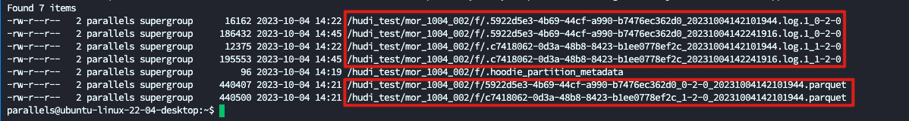
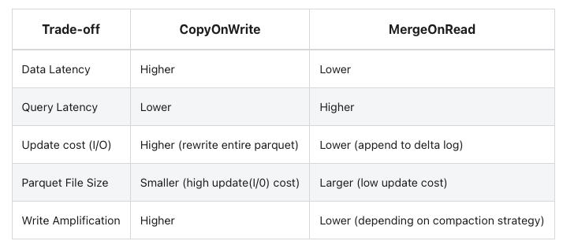
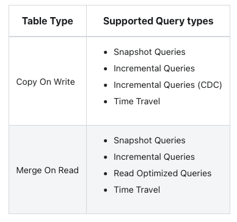

# 前言

官方介绍 https://hudi.apache.org/cn/docs/next/table_types

Hudi 有两种表 MOR 表和 COW 表.两种表对数据处理方式不同,

先说下几个概念,如果想了解更多,可以看文件布局那一块的介绍: 

- 基础文件(base file):  parquet 文件
- 

# 概念

## COW

COW 表全名为(Copy-On-Write), 字面上意思就是 写时复制. 仅使用列式文件存储格式（例如parquet）存储数据。通过在写入期间执行同步合并来重写之前的文件。(Stores data using exclusively columnar file formats (e.g parquet). Updates simply version & rewrite the files by performing a synchronous merge during write.) 

从上面的定义我们提取几个关建词

1. 仅只有列式存储文件(如 parquet)
2. 写入时合并文件

## MOR

全名为(Merge-On-Read), 即 读时合并. 使用列存储（如 parquet）+ 行存储（如avro格式的 log 文件）的文件格式组合存储数据。更新记录到增量文件，以同步或异步的方式压缩，生成新版本的parquet 文件。(Stores data using a combination of columnar (e.g parquet) + row based (e.g avro) file formats. Updates are logged to delta files & later compacted to produce new versions of columnar files synchronously or asynchronously.)

从上面的描述提取关建词

1. 列式存储+行式存储(parquet+avro)
2. 更新信息记录在增量文件(avro)
3. 执行压缩生成新的 parquet

从上面的比较我们应该就能看出二者的区别

1. 文件类型区别
2. 更新数据,合并基础文件方式

**请记住上面两个区别,因为后面所有的特性都是基于这两个特点产生的**

# 文件类型

COW表仅只有 Parquet 文件(基础文件,列存储格式)

MOR 表有 Parquet+log文件(增量文件,avro 行存储格式)

在 hdfs 上体现为这样, 这个就是一张 MOR表,有 parquet 和 log 文件组成

log 文件定期做了 compaction 之后就会合并为 parquet 文件

# 应用场景

先看由于上面的写入方式导致的区别

1. 数据延时: COW 高,MOR 低. 因为 COW 表写入每次都需要重写 parquet 文件,耗时很长,完成之后才会对外可见. MOR 只追加写入增量的 log文件,写入速度非常快,一旦写入,即可查询到
2. 查询延时:COW 低, MOR 高. 因为COW查询只查询 parquet 就行,MOR 查询需要合并 log 中的数据和 parquet 的数据,多个log 中的数据也要进行合并.这个需要耗费时间,所以才叫读时合并
3. 更新开销: COW高, MOR 低. 原因跟数据延时一样
4. parquet 文件大小. COW小,MOR大. 因为COW 每次都需要重写整个 parquet,所以 parquet 一般来说并不能设置的很大,不然开销会骤增,但是 MOR 就可以更大一点
5. 写放大. COW 高,MOR低. 写放大的定义是,**实际写入的物理数据量是写入数据量的多倍**, COW 每次都要重写整个 parquet 文件,假设 parquet 有 1000 条数据,我数据只更新一条数据,但我实际 IO 写入了 1001 条数据. MOR表取决于 compaction 策略,更准确是取决于 compaction 频率.频率高,写放大就严重
6. 读放大. COW 低.MOR高. 虽然上面没说读放大的问题, 但是是存在的,MOR 表需要读取并且合并所有 log 文件,如果更新频率高, 主键为 1 的数据, 写了 20 个文件里面, 读取这条数据那就需要读取1 个parquet+20 个 log 文件.COW 只需要读取 1 个 parquet.但是这个开销相比之前的很小,因为 log 相比 parquet 很小

所以根据上面的特性

一般只有 要求查询速度快的场景才需要 COW,但是这种场景 MOR 有也可以做到,只要 compaction 频率高点就行.**所以我司基本都是使用 MOR 表**

# 查询方式

从上面看 总共有 4 种查询方式

1. SnapshotQuery. 快照查询,即完整的数据.
2. IncrementQuery: 增量查询, 只查询新写入的数据
3. ReadOptimizedQuery: 读优化查询(这个是 MOR 特有的).因为 MOR 是 parquet+log 组成, parquet 是 compaction 优化之后的数据,所以读优化是只读取 parquet 文件,log 部分不读取.如果是一天做一次 compaction, 那么跟以前 T+1 的离线同步一样了
4. TimeTravel: 时间旅行. 支持回溯数据的状态.假如一条数据, T1--> 1, T2 --> 2, T3 --> 3. 现在正常查询出来是 3, 但是我想要知道 T2 是啥样的, 只要设置参数参数后就可以 读取到 T2 时刻的值. 这个就是 TimeTravel(具体用法以及详细介绍可以看我的 TimeTravel 相关文章)

如果什么都不设置,直接查询,默认就是**SnapshotQuery**