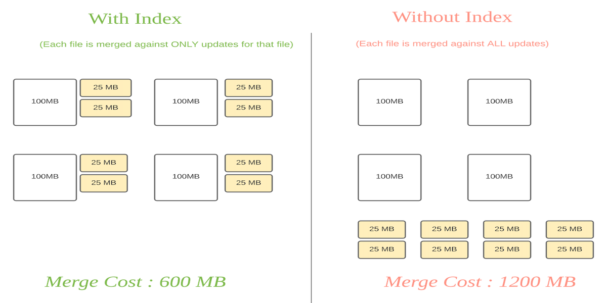
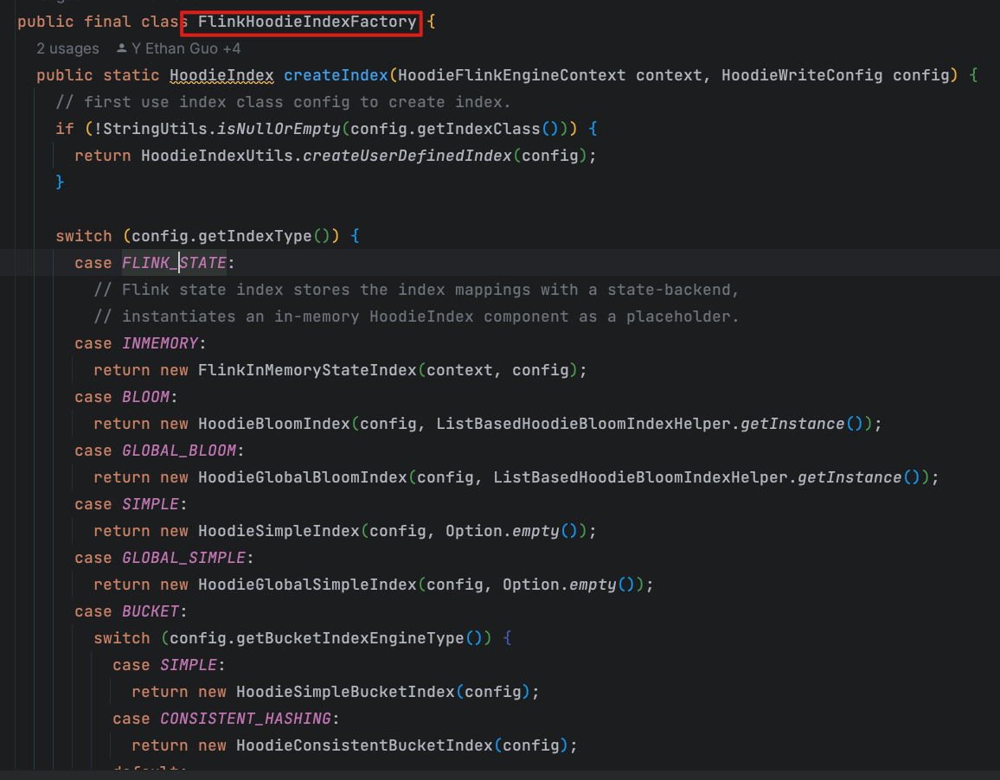
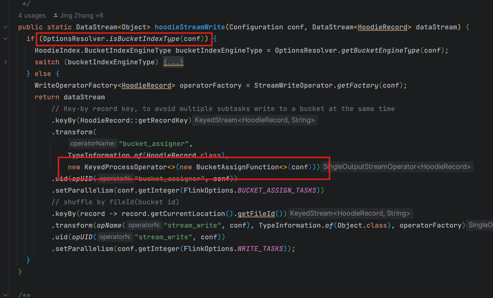

# 前言

Hudi 系列文章在这个这里查看 https://github.com/leosanqing/big-data-study

索引(Index)是 Hudi 最重要的特性之一,也是区别于之前传统数仓 Hive 的重要特点, 是实现 Time Travel, Update/Delete,事务 等重要特性的基础

Hudi provides efficient upserts, by mapping a given hoodie key (record key + partition path) consistently to a file id, via an indexing mechanism

Hudi 通过索引机制提供了高效的 upsert, 索引机制是通过映射 HoodieKey( recordKey+partition) 与 File Id 实现. 如果是非全局索引就不包括 partition

# 问题

1. 什么是索引
2. 索引作用
3. 有哪些索引
4. 全局索引与非全局索引区别
5. Flink 支持哪些索引

# 作用

1. **减小开销**(也是实现数据更新的前提)
2. **Update/Delete 等数据变更的基础**: Hudi的索引允许它知道在哪里可以找到给定的记录，因此在执行upsert或delete操作时，它可以直接访问和修改正确的数据文件，从而大大加速了这些操作。
3. **事务支持**：为了实现原子性的upsert和delete操作，Hudi维护了一个内部的事务日志。索引确保在操作期间正确、有效地识别和处理数据。
4. **增量查询**：除了提供对整个数据集的全量查询外，Hudi还支持增量查询，这使得用户只查看自上次查询以来对数据集所做的更改。索引在此功能中也起到关键作用，因为它帮助追踪哪些文件包含了新的或更改的记录。
5. **时间旅行和数据快照**：Hudi支持数据的多个版本，允许用户“回溯”到数据的早期状态。这对于数据审计、错误恢复或分析数据的历史变化非常有用。索引确保了数据版本之间的快速、高效的转换。
6. **合并小文件**(Clustering)：在大数据生态系统中，小文件问题是一个众所周知的问题。Hudi利用其索引能力合并小文件以优化存储和查询性能。

## 减少开销怎么理解

从上面官网的图可以看出来,没有索引和有索引的开销

如果没有索引, 因为我并不知道我要更新的数据在哪些文件中,  我每次的要实现更新需要访问所有的基础文件, 需要这么多 IO 的开销**(100+25) * 8 = 1200MB** 

如果有索引, 我知道这些数据应该更新到哪些基础文件, 我只要找特定的文件就行, 所以开销为 **(100+25*2) * 4 = 600MB**

hive因为没有索引,所以他不支持变更操作(update/Delete),一次写入不能变更. 因为哪怕变更一条数据, 我都需要访问hdfs 上所有的文件(如果没有分区,有分区的话访问特定的分区下的所有文件),挨个比较主键, 然后重写之后上传到 hdfs

## 数据变更基础

因为我变更的时候知道了我这个数据应该去哪个文件找, 重写的成本就能接受了. 并且 Upsert 的时候我也能根据索引判断, 我这条写进来的数据应该是 Insert 还是应该 Update

以 COW 表,upsert 写入为例(当然上述步骤会根据索引类型和计算引擎有不同的实现和步骤,但是大体为上面的步骤)

数据进来 --> 计算主键 --> 根据主键查询索引判断是 Insert 还是 Update -->  根据 Insert 还是 Update 标记写入文件 -- >写入时, 写到标记的文件,更新的更新,插入的插入--> 更新索引

# 类型

重要的索引类型具体会放在**源码分析**中详细分析,这里只简单讲个概念

- **BLOOM：** 采用根据RecordKey构建的布隆过滤器，还可以选择使用RecordKey范围修剪候选文件。在分区内强制执行键唯一性。
- **GLOBAL_BLOOM：** 采用根据RecordKey构建的布隆过滤器，还可以选择使用RecordKey范围修剪候选文件。表中的所有分区都强制执行键唯一性。
- **SIMPLE（Spark 引擎的默认值）：** Spark 引擎的默认索引类型。根据从存储上的表中提取的键对传入记录执行lean join。分区内强制执行键唯一性。
- **GLOBAL_SIMPLE：** 根据从存储上的表中提取的键对传入记录执行lean join。表中的所有分区都强制执行键唯一性。
- **HBASE：** 管理外部 Apache HBase 表中的索引映射,是全局索引。
- **INMEMORY（Flink 和 Java 的默认值）：** 使用 Spark 和 Java 引擎中的内存中 hashmap 以及 Flink 中的 Flink 内存中状态进行索引。
- **BUCKET**：使用桶哈希来定位包含记录的文件组。尤其是在大规模的情况下是有利的。使用`hoodie.index.bucket.engine`选择bucket引擎类型，即如何生成bucket；
  - `SIMPLE（默认）`：为每个分区的文件组使用固定数量的存储桶，无法缩小或扩展。这适用于 COW 和 MOR 表。由于存储桶的数量无法更改，并且存储桶和文件组之间采用一对一映射的设计，因此该索引可能不太适合高度倾斜的分区。
  - `CONSISTENT_HASHING`：支持动态数量的存储桶，并调整存储桶的大小以正确调整每个存储桶的大小。这解决了潜在的数据倾斜问题，即可以动态调整具有大量数据的分区的大小以具有合理大小的多个存储桶，这与 SIMPLE 存储桶引擎类型中每个分区的固定数量的存储桶不同。这仅适用于 MOR 表。
- **RECORD_INDEX：** 将RecordKey保存到 HUDI 元数据表中的位置映射的索引。记录索引是全局索引，强制表中所有分区的键唯一性。支持分片以实现非常大的规模。
- **自定义索引：** 你可以扩展这个[publicAPI](https://github.com/apache/hudi/blob/master/hudi-client/hudi-client-common/src/main/java /org/apache/hudi/index/HoodieIndex.java) 来实现自定义索引。

## 全局索引

从上面类型看,有个GLOBAL 开头的就是全局索引,还包括 HBase 索引

全局索引的意思是, 一个recordKey, 不管你在不在同一个分区,有且只能有一个;非全局是只要我分区不相同,那我就是可以同时存在多个相同的 recordKey

比如 我是一个分区表, 我有两条数据 {id:1, county:China}, {id:1, country: Janpan},顺序写入. 分区为 country, recordKey 是id. 

如果是全局索引,那我最后只会有一条数据 {id:1, country: Janpan}

如果是非全局索引,这两个数据都hui存在

## Flink

Flink 只有**三种索引**: InMemory(FlinkState) 和 Bucket(SIMPLE, CONSISTENT_HASHING)

有时候我们看代码会感到疑惑,为啥源码里面,flink 列出了这么多索引,你却说只有三种,具体可以看这个 PR 中的 Comment https://github.com/apache/hudi/pull/6406

虽然有个 类上面写了这么多,根本没有用, 最终只有 pipeline 初始化才有用.这里只有两种方式(官方说这个以后会报错,如果填写其他类型,flink 会报错)

真正的逻辑在这里 pipelines 类,所以看 flink web UI 的时候才会出现这样的情况:

桶索引没有 bucketAssigner,有 bucketWrite 算子

如果是 Flink State index 的任务 是 stream_write, 和 bucketAssigner算子

## Spark

spark 除了 InMemory 其他都支持

# 总结

1. 什么是索引: 索引是通过HoodieKey(recordKey+partition) 与FileId 映射,从而加快查询/更新/删除等操作的一种机制
2. 索引作用:
   1. 减小开销
   2. upsert/delete 的基础
   3. 加快其他特性. TimeTravel, 事务,Clustering,Compaction等的基础.如果没有索引,这些特性的开销是不可接受的
3. 有哪些索引
   1. **Bloom**
   2. **InMemory(Java, Flink State)**
   3. **Bucket**
   4. Hbase
   5. Simple
   6. Record
4. 全局索引与非全局索引区别: 全局索引 相同的RecordKey 全局仅会有一个,全局唯一;非全局索引,由于分区,可以存在多个 相同的RecordKey,全局不唯一
5. Flink 支持哪些索引: 目前仅有三种: FlinkState, Bucket(Simple, consistent_hash)~~