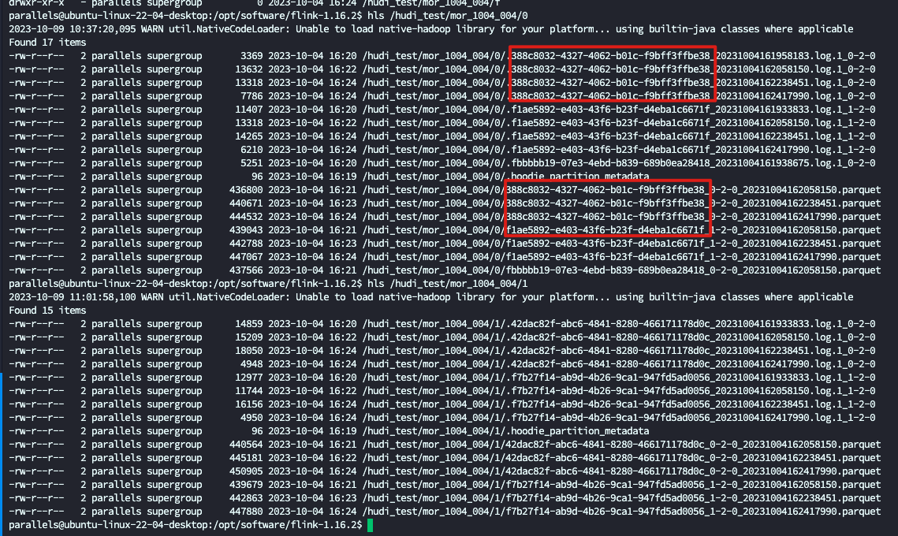
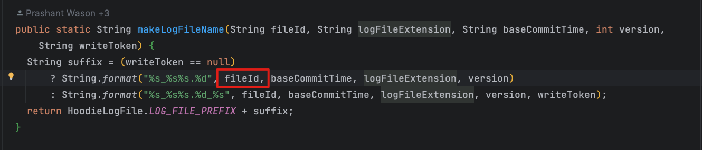

# 前言

Hudi 系列文章在这个这里查看 https://github.com/leosanqing/big-data-study

Hudi 文件布局这里主要将几个概念

1. 文件组 FileGroup
2. 文件片 FileSlice
3. FileId
4. 基础文件(parquet/orc)和 log 文件

# 官方介绍

官方介绍在这里 https://hudi.apache.org/docs/next/file_layouts

The following describes the general file layout structure for Apache Hudi. Please refer the **[tech spec](https://hudi.apache.org/tech-specs#file-layout-hierarchy)** for a more detailed description of the file layouts.

- Hudi organizes data tables into a directory structure under a base path on a distributed file system
- Tables are broken up into partitions
- Within each partition, files are organized into file groups, uniquely identified by a file ID
- Each file group contains several file slices 
- Each slice contains a base file (*.parquet/*.orc) (defined by the config - [hoodie.table.base.file.format](https://hudi.apache.org/docs/next/configurations/#hoodietablebasefileformat) ) produced at a certain commit/compaction instant time, along with set of log files (*.log.*) that contain inserts/updates to the base file since the base file was produced. 

直译过来就是

下面描述了 Apache Hudi 的一般文件布局结构。请参阅 **[技术规范](https://hudi.apache.org/tech-specs#file-layout-hierarchy)** 以获取有关文件布局的更详细说明。

- Hudi 将数据表组织成分布式文件系统上基本路径下的目录结构
- 表被分成多个分区(partition)
- 在每个分区内，文件被组织成文件组(FileGroup)，由文件 ID (FileId) 唯一标识
- 每个文件组(FileGroup)包含多个文件切片(FileSlice)
- 每个切片包含一个基本文件（*.parquet/*.orc）（由配置定义 - [hoodie.table.base.file.format](https://hudi.apache.org/docs/next/configurations/#hoodietablebasefileformat) ) 在某个提交/压缩即时时间(Instant time)生成，以及一组日志文件 (*.log.*)，其中包含自生成基本文件以来对基本文件的插入/更新。

# 如何理解

上面的描述太抽象了,我们根据 hdfs 上的文件来说明,这个是 `mor_1004_004` 表的文件布局

- Hudi 将数据表组织成分布式文件系统上基本路径下的目录结构(即 `/hudi_test/mor_1004_004`)
- 表被分成多个分区(partition) (分区 0,1,2.....,不是分区表则没有分区)
- 在每个分区内，文件被组织成文件组(FileGroup)，由文件 ID (FileId) 唯一标识.. (FileId 就是被我框出来的那些, 可以看到不同分区下的FIleId 是不同的,所以这句话的最开始就是 "每个分区内". )
- 每个文件组(FileGroup)包含多个文件切片(FileSlice). (上面 `42dac82f-abc6-4841-8280-466171178d0c` 包含 4 个 FlieSlice, `bbbbb19-07e3-4ebd-b839-689b0ea28418_20231004161938675.log`包含 1 个 FileSlice  )
- 每个切片包含一个基本文件（*.parquet/*.orc）（由配置定义 - [hoodie.table.base.file.format](https://hudi.apache.org/docs/next/configurations/#hoodietablebasefileformat) ) 在某个提交/压缩即时时间(Instant time)生成，以及一组日志文件 (*.log.*)，其中包含自生成基本文件以来对基本文件的插入/更新。(上面就是一个 baseFile + 一个 log,因为我数据量小, ckp 间隔短,20s, 所以达不到 log 文件滚动的大小,所以每次只有一个log文件)

## 文件组 

文件组是具有相同"文件id"的一组文件的集合。这些文件共同代表数据集中的一个唯一键的所有版本（或数据记录）。每次执行upsert或insert操作时，Hudi都会根据这个文件id更新或创建文件组。

简而言之，一个文件组是一个逻辑组织，它包含一个或多个版本的相同数据记录。

## 文件片

文件片是文件组中的一个子集，代表数据集在一个特定的即时时间（instant time）下的状态。即时时间是一个时间戳，它标记了数据集的一个特定版本。每个文件片包含一个或多个数据文件，这些数据文件存储了该时间点下的实际数据。这些数据文件可以是基本文件（Base File，例如Parquet）或增量日志文件（Delta Log Files）。

文件片使得Hudi能够支持增量查询和时间旅行，因为它们允许Hudi追踪数据的版本和状态。

# Bucket

BucketIndex 的文件布局和其他索引的不太一样,包括文件命名和 FileGroup 等

等讲到 BucketIndex 的时候再回来写这个素材

