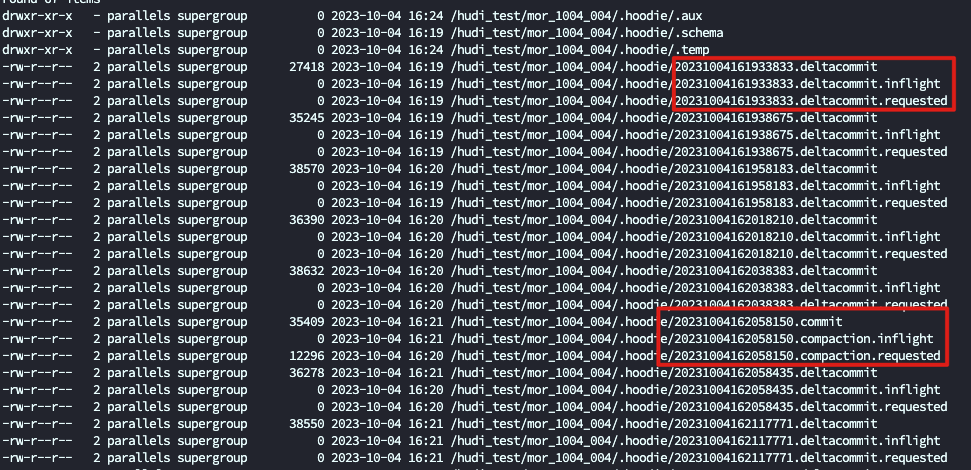
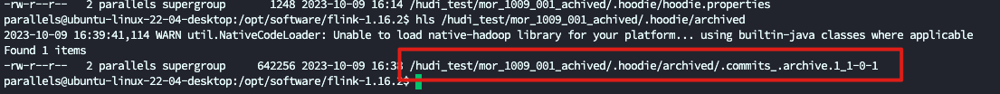

# 前言

Hudi 系列文章在这个这里查看 https://github.com/leosanqing/big-data-study

Hudi 官网的介绍 https://hudi.apache.org/docs/next/timeline

Timeline 是 Hudi 的一个核心概念和功能,他让用户能回溯 Hudi 表发生过什么, 也是实现事务的一个保障手段


# 定义

在其核心，Hudi维护一个时间线，这是在不同时间段在表上执行的所有操作的日志，有助于提供表的即时视图(instant View)，同时有效地支持按到达顺序检索数据。Hudi瞬间由以下组件组成 

- `Instant action` : 操作表的动作类型(Type of action performed on the table)
- `Instant time` : InstantTime 是一个单调递增的时间戳(Instant time is typically a timestamp (e.g: 20190117010349), which monotonically increases in the order of action's begin time.)
- `state` : Instant 状态(current state of the instant)

HDFS 上体现为



# action

- **COMMITS** - 表示将一批记录写入表中。
- **CLEANS** - 删除表中不再需要的旧版本文件的后台活动。
- **DELTA_COMMIT** - 增量提交是指将一批记录写入MergeOnRead类型表的原子，其中部分/所有数据只能写入增量日志。
- **COMPACTION** - 协调Hudi内差异数据结构的后台活动，例如：将更新从基于行的log文件(log)移动到列式存储格式(parquet)。在内部，压缩(compaction)表现为timeline 上的特殊提交(commit)
- **ROLLBACK** - 表示commit/delta_commit 失败&回滚，删除此类写入期间产生的任何部分文件
- **SAVEPOINT** - 将某些文件组标记为“已保存”，以便清理器(cleaner)不会删除它们。在发生异常/数据恢复场景时，它有助于将table恢复到timeline上的某个时刻。

比如我上面的截图就有三种, deltacommit, compaction, commit 但是 compaction 完成的动作标记成了 commit.


# State

任何Timeline 上的 Instant 的状态都只能是以下三种中的一种

- **REQUESTED**-表示已安排行动，但尚未启动

- **INFLIGHT** - 表示当前正在执行的操作

- **COMPLETED**-表示在时间线上完成一个操作(complete 是没有后缀的,所以截图上面我们没有看到 Completed 结尾的 Instant)


# Active and Archived timeline

**Hudi将整个时间线划分为活跃(active)的和已归档(archived)的时间线。**

顾名思义，一直访问活动时间线，以在有效数据文件上提供元数据，并确保随着时间线的增长，时间线上的读取不会产生不必要的延迟，active timeline需要限制在它可以服务的元数据(metadata)（timeline instant）上。

为了确保这一点，在某些阈值之后，存档启动，将较旧的时间线事件移动到存档的时间线。一般来说，对于表的常规操作，从不访问已归档的时间线，而只是用于标记和调试目的。在“.hoodie”目录下看到的任何Instant都指向 active 时间线，那些存档的瞬间进入“.hoodie/archived”文件夹。



Hudi 默认保留 40 个 commit 信息

```properties
archive.max_commits=50
archive.min_commits=40
```

