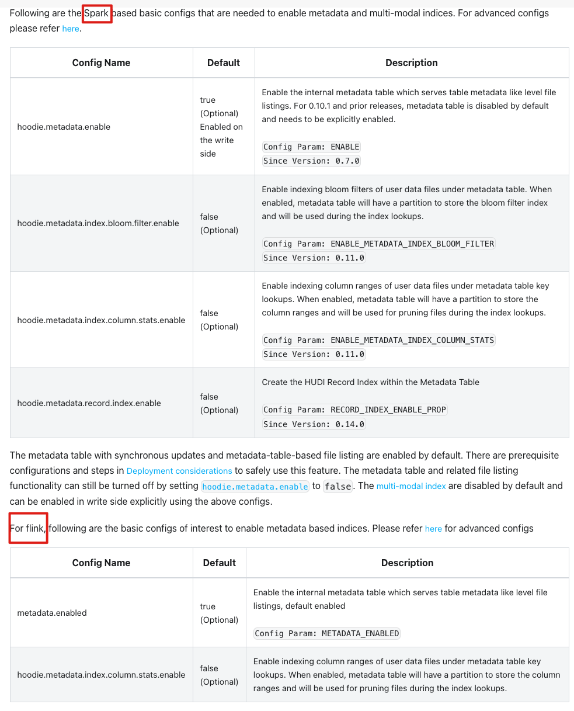

# 前言

Hudi 系列文章在这个这里查看 https://github.com/leosanqing/big-data-study

Hudi 官网的介绍 https://hudi.apache.org/cn/docs/next/metadata/

元数据表是 Hudi 一个特殊的 MOR 格式的表, 目的用来加速 Hudi 写入/读取

# 问题

1. 元数据表是什么
2. 元数据表能够解决什么问题
3. Flink 能够使用哪些元数据表的索引
4. Spark 能使用哪些元数据表的索引
5. 以 Spark 的布隆索引为例, 使用了元数据表的哪些索引

# 概念

**元数据表**(MetaTable)

数据库索引包含辅助数据结构，以快速定位所需的记录，而不必从存储中读取不必要的数据。考虑到Hudi的设计已经为处理可变更流进行了重度优化，并具有不同的写入模式，Hudi认为索引是其设计的一个不可或缺的部分，并从一开始就提供了独特的索引功能，以加速在Data Lakehouse上的upserts。尽管Hudi的索引为快速的upserts和删除提供了帮助，但Hudi的元数据表旨在为Reader/Writer更普遍地利用这些优势。

**元数据表作为一个单独的内部Hudi Merge-On-Read表实施，承载不同类型的包含表元数据的索引，并设计为无服务器的，与计算和查询引擎无关。这类似于数据库中的常见做法，其中元数据被存储为内部视图。**

元数据表旨在通过解决以下关键挑战，显著提高查询的读/写性能：

- **消除File Listing操作的要求**：读写数据时，执行文件列表(File Listing)操作以获取文件系统的当前视图。当数据集很大时，列出所有文件可能是一个性能瓶颈，但更重要的是，在像AWS S3这样的云存储系统中，由于某些请求限制，大量的文件列表请求有时会导致限流。元数据表将主动维护文件列表，并消除了递归文件列表操作的需要。
- **通过索引暴露列统计数据以进行更好的查询计划和Reader的快速查找**：查询引擎依赖于分区和文件剪切等技术，以减少查询计划和执行时扫描的不相关数据量。在查询计划阶段，所有数据文件都为进一步基于查询谓词和可用范围信息剪切数据文件而读取元数据的列范围信息。这种方法的代价高昂，如果需要扫描的分区和数据文件数量众多，它就不具备扩展性。除了存储优化，例如自动文件大小调整、聚类等，有助于以查询优化的方式组织数据外，Hudi的元数据表还通过支持多种类型的索引来进一步改进查询计划，这些索引有助于根据相关查询谓词有效地查找数据文件，而不是从每个单独的数据文件读取列统计数据，然后进行剪切。

# 在Hudi中支持多模态索引

多模态索引在0.11.0的Hudi发布中引入，是对数据湖的通用索引子系统应该是什么样子的重新构想。通过增强Hudi的元数据表，实施了多模态索引，这使得在新的分区中有了扩展到新的索引类型的灵活性，同时还有一个异步的索引构建机制。它基于以下核心原则：

- **可伸缩的元数据**：表元数据，即关于表的辅助数据，必须可以扩展到非常大的大小，例如，太字节(TB)。应该容易地集成不同类型的索引，以支持各种用例，而不必担心管理同样的索引。为实现这一点，Hudi的元数据表中的所有索引都存储为单个内部MOR表的分区。MOR表布局通过避免数据的同步合并，实现了闪电般的写入速度，从而减少了写放大。对于大型数据集，这一点非常重要，因为元数据表的更新大小可能会变得无法管理。这帮助Hudi将元数据扩展到TBs的大小。为多模态索引构建的基础框架，旨在根据需要启用和禁用新的索引。异步索引支持索引构建与常规写入者并行，而不影响写入延迟。
- **ACID事务更新**：索引和表元数据必须始终与数据表保持最新并同步。这是通过Hudi中的多表事务设计的，并确保了写操作的原子性和对失败的韧性，以使数据或元数据表的部分写入从不暴露给其他读或写事务。元数据表被设计为自我管理，所以用户不需要在任何表服务上花费操作周期，包括压缩和清理。
- **快速查找**：针对大数据集，索引大小可能为TBs，那么“大海捞针”类型的查找必须快速且有效，而不必扫描整个索引。由于大多数对元数据表的访问都是点和范围查找，所以选择HFile格式作为内部元数据表的基文件格式。由于元数据表存储了在分区级别（文件索引）或文件级别（column_stats索引）的辅助数据，因此基于单个分区路径和文件组的查找将非常有效，使用HFile格式。Hudi的元数据表中的基文件和日志文件都使用HFile格式，并经过精心设计，以减少云存储上的远程GET调用。此外，这些元数据表索引通过一个集中的时间线服务器提供，该服务器缓存了元数据，从而进一步减少了从执行器的查找延迟。

**元数据表索引**

以下是当前在元数据表下可用的不同索引:

1. **文件索引（files index）**：存储为元数据表中的文件分区。它包含每个数据表分区的文件信息，如文件名、大小和活动状态。通过避免直接的文件系统调用（如exists、listStatus和listFiles）在数据表上，来提高文件列表的性能。
2. **列统计索引（column_stats index）**：存储为元数据表中的column_stats分区。它包含所有数据文件的感兴趣列的统计信息，如最小和最大值、总值、空值计数、大小等，并在与数据跳过一起使用时，用于为与感兴趣列匹配的谓词提供查询。这个索引通过数个数量级来加速查询。
3. **布隆过滤器索引（bloom_filter index）**：存储为元数据表中的bloom_filter分区。此索引使用基于记录键的最小和最大值的范围剪切和基于布隆过滤器的查找来标记传入的记录。对于大型表，这涉及到为布隆过滤器读取所有匹配数据文件的页脚，如果整个数据集随机更新，这可能在开销上是昂贵的。此索引将所有数据文件的布隆过滤器集中存储，以避免直接从所有数据文件扫描页脚。
4. **记录索引（record_index）**：存储为元数据表中的record_index分区。它包含记录键到位置的映射。记录索引是一个全局索引，在表的所有分区中强制键的唯一性。这个索引最近在0.14.0的Hudi版本中添加，它帮助比其他现有索引更快地定位记录，并且在大型部署中，索引查找主导写延迟时，它可以提供一个速度上的数个数量级的提升。

总的来说，Hudi的元数据表是一个强大的工具，它通过为读写者提供更快的查找和数据管理来优化查询的性能。通过持续地增加和优化索引，Hudi确保它能为用户提供更高效、更可扩展的数据处理能力。

# 元数据表参数

从上面的官方介绍的图可以看出来,Spark 支持的较为全面,上述提到的索引他都支持

但是 Flink 只支持列统计索引

# 元数据的应用

在这里我们以 Spark 的 Bloom Index索引为例,看下他是怎么应用 元数据中的 列统计索引和 Bloom 过滤器索引的

详细的步骤可以查看 **源码章节的关于布隆过滤器索引**的介绍,这里仅拿出步骤分析

Bloom Index 会把 Bloom 过滤器的 BitMap 存放在 Parquet 的 页脚(Footer), 

1. 批量写入的时候, 会遍历(符合的分区)的所有文件(File Listing), 放入内存的 HashMap 中
2. 然后读取 BitMap.
3. 再用Bloom过滤器确定符合的文件

所以如果开启了元数据, 

1. 我们不需要`File Listing`遍历分区下所有文件,拿到文件名放到内存(直接读取元数据表)
2. 不需要从 Parquet 文件中读取 BitMap,需要消耗大量 IO, 直接从元数据表的`bloom_filter_index` 获取
3. Bloom过滤器 存在假阳性问题, 还需要计算 K 次RecordKey确定 记录是否符合, 如果从`column_stat index` 读取,我直接修剪了不在范围里的数据, 不需要计算了,符合的再去计算
4. 实际上开启了 column 最大值最小值, 我也可以使用树形去查找, 而不是用链表(但是这个不是元数据表的作用)

所以 假如我使用了元数据表, 并开启了相关配置, 上述的每个关键步骤我都能做大量优化

# 遗憾

虽然 元数据表可以做到很多优化,但是却也出现了不少问题, 所以最近的版本又把这个配置默认关闭了

我们生产使用的时候就出现了问题,关闭之后就没出现了

# 总结

1. 元数据表是什么
   1. 元数据表是 Hudi 一个特殊的 MOR 格式的表,用来加速 Hudi 写入读取
2. 元数据表能够解决什么问题
   1. 减少 FileListing 开销. 如果是 HDFS 相对来水开销可接受,但如果使用对象存储(如 S3 等),File Listing 开销就非常昂贵了
   2. 加快 Read/Write 
3. Flink 能够使用哪些元数据表的索引
   1. Flink 只能使用 `column_stats`
4. Spark 能使用哪些元数据表的索引(全部)
   1. `column_stats`
   2. `bloom_filter`
   3. `record_index`(since 0.14)
5. 以 Spark 的布隆索引为例, 使用了元数据表的哪些索引
   1. `column_stats`
   2. `bloom_filter`