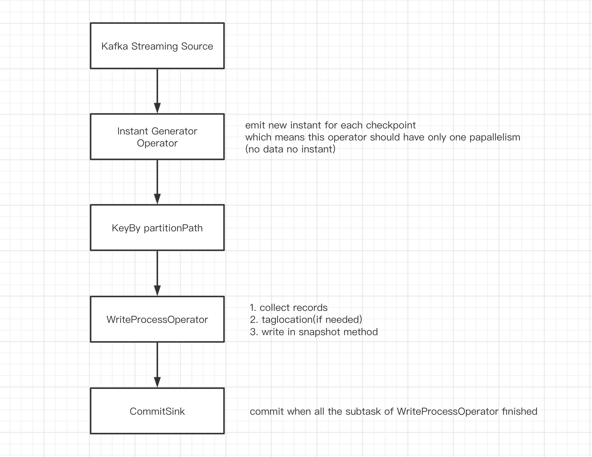
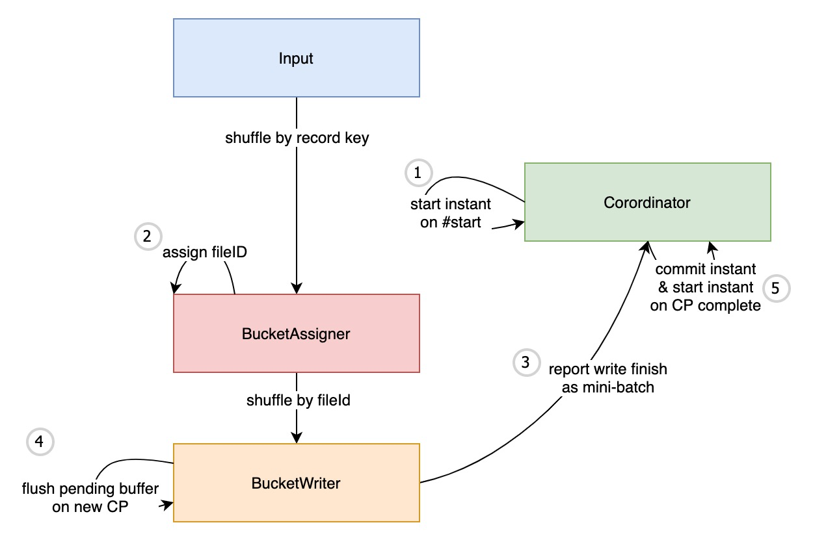
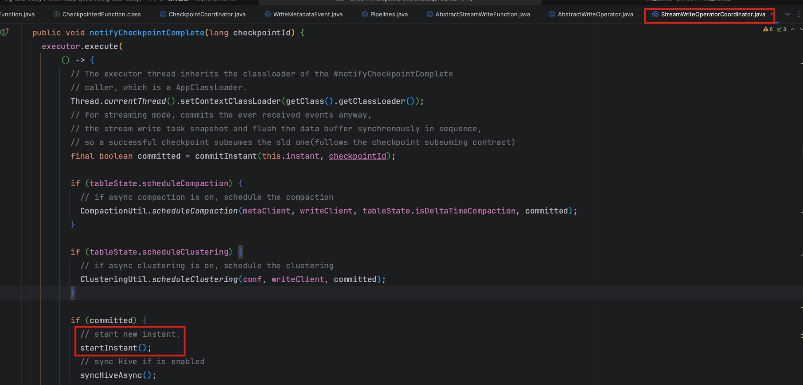
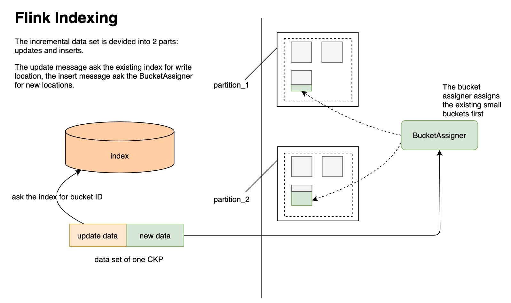

# 前言
Hudi 系列文章在这个这里查看 https://github.com/leosanqing/big-data-study

[官方 RFC-13 链接](https://cwiki.apache.org/confluence/pages/viewpage.action?pageId=141724520)

[官方 RFC-24 链接](https://cwiki.apache.org/confluence/display/HUDI/RFC-24%3A+Hoodie+Flink+Writer+Proposal)

此篇文章主要针对官方 RFC-24 进行分析, RFC-24 主要针对当时Hudi 整合 Flink 存在的 4 个瓶颈提出的一些解决思路, 这个思路决定了后续 Flink 写 Hudi 的基本框架,所以是想了解 Flink 写 Hudi 最重要的一个 RFC

# 问题

从官方 RFC 的设计中,我们能找到以下几个问题的答案

1. 之前的四个瓶颈

2. 针对上面的瓶颈做了哪些工作

3. 协调器作用与概念

4. CKP 相关

   1. 为啥 Hudi 要依赖 CKP
   2. 为啥一般只有做了 CKP,才能查到数据
   3. 为啥没做 CKP,我也能查到数据
   4. 使用 CKP 触发 instant 有什么弊端
   5. 如果没有 ckp,instant 会有哪些状态

5. 为啥启动之后会有 BucketAssigner 算子

6. 为啥启动之后,有的是 StreamWrite,有的是 BucketWrite

   


# 背景



通过看官方 RFC 可以知道,一开始设计的 Flink 集成(RFC-13)有四个瓶颈

- `InstantGeneratorOperator` (https://github.com/apache/hudi/pull/2430)
  - 由于一批只有一个 CKP,所以这个生成就只能单线程,这就导致成了高吞吐的瓶颈 并且网络IO 的压力也会增加
  - The InstantGeneratorOperator is parallelism 1, which is a limit for high-throughput consumption; because all the split inputs drain to a single thread, the network IO would gains pressure too
- The WriteProcessOperator handles inputs by partition, that means, within each partition write process, the BUCKETs are written one by one, the FILE IO is limit to adapter to high-throughput inputs(https://github.com/apache/hudi/pull/2506)
  - 写入算子,是分区级别,写入只能一个桶一个桶来,文件 IO 就成了瓶颈
- Currently we buffer the data by checkpoints, which is too hard to be robust for production, the checkpoint function is blocking and should not have IO operations.(当前缓存数据的策略是存在 ckp 中,这对生产来说不够健壮, ckp 会被阻塞,并且不应该因此产生 IO 操作) https://github.com/apache/hudi/pull/2553
- The FlinkHoodieIndex is only valid for a per-job scope, it does not work for existing bootstrap data or for different Flink jobs.(当前的索引只能 用于 per-job 模式,并不能适用于不同任务间共享以及已经存在 bootstrap 数据的任务) https://github.com/apache/hudi/pull/2581 

而 RFC-24 就是针对这四个瓶颈进行重新设计


重新设计之后 的流程如下:




从上面看就有几个重点了

1. instant 由Flink coordinator 生成
2. 拆分 WriteProcessOperator 算子,分为分桶和写入(为什么,主要解决并发写的时候效率问题,即第二个瓶颈)
3. BucketWriter 是批次写入, 不再是实时写入


# 瓶颈与解决方案

下面我们详细看下针对每个瓶颈到底怎么解决的

## 瓶颈一

### 解决方法

Firstly, we can avoid the singleton task operator InstantGeneratorOperator by implementing an operator coordinator for the write operator, the coordinator always starts the checkpoint first, it starts a new commit on a new checkpointing

- 通过为写算子实现一个协调器，避免使用单一的InstantGeneratorOperator。协调器始终首先启动ckp，在新的检查点上开始新的提交。

### **工作流程**：

- 写算子首先将数据缓冲为一批HoodieRecords。

- 当Flink检查点开始时，它刷新(写入)记录批次。成功写入一批后，算子通知其协调器`StreamWriteOperatorCoordinator`标记为成功写入。


### **精准一次语义**

这个任务通过在检查点之间缓冲数据实现精确一次语义。Operator Coordinator在检查点开始时会启动一个新的瞬时操作，确保在算子启动检查点之前，已经有一个"REQUESTED"的HoodieInstant存在。数据缓冲会被阻塞，直到检查点线程开始刷新现有的数据缓冲。成功写入数据后，处理线程会解除阻塞并开始为下一个检查点缓冲数据。任何检查点的失败都会触发数据回滚，从而实现精确一次语义。

### 容灾

算子协调器在开始新的instant操作时，检查最后一个instant操作的有效性。如果发生任何错误，算子会回滚已写的数据并抛出异常。这意味着任何ckp或任务失败都会触发故障转移。在提交写状态时，算子协调器会尝试多次操作。

**注意**：函数任务要求输入流按照分区字段进行分区，以避免不同的写任务写入相同的文件组，从而造成冲突。分区路径的常见场景是一个日期字段，因此接收器任务很可能会遇到IO瓶颈。更灵活的解决方案是按文件组ID（在#step2中修复）对数据进行混洗(shuffle)。

### Coordinator

Flink的协调器（在新版本中称为Operator Coordinator）是用于管理操作的生命周期、维护操作状态和协调操作之间的交互的组件。特别是，在Flink中进行状态管理和故障恢复时，协调器扮演着至关重要的角色。

协调器在以下方面发挥作用：

1. **维护操作状态**：协调器可以保存和恢复操作的状态，这对于有状态操作的正确性和容错性至关重要。
2. **任务间的交互**：协调器允许不同的操作之间进行通信，从而使得在需要多步骤协作的复杂任务中，操作可以在整个流处理过程中进行正确的交互。
3. **操作生命周期管理**：协调器管理操作的启动、停止和重新启动，确保操作按照预期的方式运行。
4. **辅助检查点**：在Flink的检查点过程中，协调器确保操作的状态正确地保存和恢复。

#### Checkpoint如何配合使用

Flink的检查点是一个用于容错的机制，通过在指定的时间间隔内保存应用程序的状态，以便在发生故障时可以从这些检查点恢复。

1. **触发检查点**：在配置了检查点的Flink流处理应用程序中，源操作（如Kafka消费者）会定期触发检查点。这通常是通过预定的时间间隔实现的。
2. **状态保存**：当触发检查点时，每个操作都会保存其当前状态。这包括内存中的数据、操作的内部状态等。
3. **协调器的作用**：协调器确保在整个流处理应用程序中所有的操作都完成了检查点操作，从而确保应用程序的状态是一致的。如果某个操作由于某种原因不能完成检查点操作，协调器可以决定放弃这个检查点，并稍后重新尝试。
4. **故障恢复**：如果发生故障，例如某个任务管理器失效，Flink可以使用最近的成功的检查点来恢复应用程序的状态。协调器在此过程中确保正确的状态恢复和任务的重新启动。

总之，Flink的协调器和检查点机制共同工作，确保流处理应用程序的容错性和正确性。


以下是该接口的主要方法及其功能说明：

1. **`start()`**:
   - 这个方法在创建协调器后被调用，通常用于执行初始化工作。
2. **`handleEventFromOperator(int subtask, OperatorEvent event)`**:
   - 当并行算子的一个实例发送一个事件给协调器时，此方法被调用。
   - 这允许算子实例与协调器进行交互和通信。
3. **`subtaskFailed(int subtask)`**:
   - 当一个子任务失败时，这个方法被调用。
   - 这允许协调器响应子任务的故障，例如决定是否应该触发整个作业的失败。
4. **`checkpointCoordinator(long checkpointId, CompletableFuture<byte[]> result)`**:
   - 当作业触发一个检查点时，此方法被调用。
   - 协调器可以使用此方法保存其状态。结果是一个异步的完成期，它在检查点完成时或失败时完成。
5. **`notifyCheckpointComplete(long checkpointId)`**:
   - 当一个检查点成功完成时，此方法被调用。
   - 这允许协调器知道其状态已经被成功地保存。
6. **`notifyCheckpointAborted(long checkpointId)`**:
   - 如果一个检查点被中止或放弃，这个方法被调用。
   - 这通常发生在一个更近的检查点已经完成时，或者当检查点保存超时时。
7. **`close()`**:
   - 在协调器关闭前调用此方法，通常用于清理资源和停止任何后台线程。
8. **`resetToCheckpoint(byte[] checkpointData)`**:
   - 这个方法被调用来从一个检查点恢复协调器的状态。
   - 协调器应该使用提供的字节数据恢复其状态。

这些方法提供了协调器需要与 Flink 运行时交互的所有功能，使其能够与并行算子实例交互，响应故障，并参与到 Flink 的检查点机制中。


#### StreamWriteOperatorCoordinator

这个协调器启动一个新的 instant 当 ckp 启动的时候. 当所有的任务把一个 ckp 内的缓存数据写入到磁盘之后, 提交这个 instant(This coordinator starts a new instant when a new checkpoint starts. It commits the instant when all the operator tasks write the buffer successfully for a round of checkpoint. )

写入算子协调器,作用:

1. 初始化instant,并且每当开启一个新的 ckp,创建一个新的 instant
2. 当一个ckp 周期内的所有算子的缓存之后,提交这个 instant
3. 提交完成之后,compaction,syncHive.

我们来看下 `StreamWriteOperatorCoordinator` 是如何实现上面的主要接口的, 就能明白当做 ckp 前中后, Hudi 都做了什么工作

```java

// 初始化完成之后协调器调用, 初始化Hudi 相关操作,比如 Metadata, client, hiveSync
  @Override
  public void start() throws Exception {
    // setup classloader for APIs that use reflection without taking ClassLoader param
    // reference: https://stackoverflow.com/questions/1771679/difference-between-threads-context-class-loader-and-normal-classloader
    Thread.currentThread().setContextClassLoader(getClass().getClassLoader());
    // initialize event buffer
    reset();
    this.gateways = new SubtaskGateway[this.parallelism];
    // init table, create if not exists.
    this.metaClient = initTableIfNotExists(this.conf);
    this.ckpMetadata = initCkpMetadata(this.metaClient);
    // the write client must create after the table creation
    this.writeClient = FlinkWriteClients.createWriteClient(conf);
    initMetadataTable(this.writeClient);
    this.tableState = TableState.create(conf);
    // start the executor
    this.executor = NonThrownExecutor.builder(LOG)
        .exceptionHook((errMsg, t) -> this.context.failJob(new HoodieException(errMsg, t)))
        .waitForTasksFinish(true).build();
    // start the executor if required
    if (tableState.syncHive) {
      initHiveSync();
    }
  }


	// 每次做 ckp 的时候调用
  @Override
  public void checkpointCoordinator(long checkpointId, CompletableFuture<byte[]> result) {
    executor.execute(
        () -> {
          try {
            result.complete(new byte[0]);
          } catch (Throwable throwable) {
            // when a checkpoint fails, throws directly.
            result.completeExceptionally(
                new CompletionException(
                    String.format("Failed to checkpoint Instant %s for source %s",
                        this.instant, this.getClass().getSimpleName()), throwable));
          }
        }, "taking checkpoint %d", checkpointId
    );
  }


	// 当 ckp 完成之后调用, 主要做数据写入, compaction,clustering, 生成新的 Instant, 同步 Hive 数据
  @Override
  public void notifyCheckpointComplete(long checkpointId) {
    executor.execute(
        () -> {
          // The executor thread inherits the classloader of the #notifyCheckpointComplete
          // caller, which is a AppClassLoader.
          Thread.currentThread().setContextClassLoader(getClass().getClassLoader());
          // for streaming mode, commits the ever received events anyway,
          // the stream write task snapshot and flush the data buffer synchronously in sequence,
          // so a successful checkpoint subsumes the old one(follows the checkpoint subsuming contract)
          final boolean committed = commitInstant(this.instant, checkpointId);

          if (tableState.scheduleCompaction) {
            // if async compaction is on, schedule the compaction
            CompactionUtil.scheduleCompaction(metaClient, writeClient, tableState.isDeltaTimeCompaction, committed);
          }

          if (tableState.scheduleClustering) {
            // if async clustering is on, schedule the clustering
            ClusteringUtil.scheduleClustering(conf, writeClient, committed);
          }

          if (committed) {
            // start new instant.
            startInstant();
            // sync Hive if is enabled
            syncHiveAsync();
          }
        }, "commits the instant %s", this.instant
    );
  }


	// 处理每个算子的事件 
	@Override
  public void handleEventFromOperator(int i, OperatorEvent operatorEvent) {
    ValidationUtils.checkState(operatorEvent instanceof WriteMetadataEvent,
        "The coordinator can only handle WriteMetaEvent");
    WriteMetadataEvent event = (WriteMetadataEvent) operatorEvent;

    if (event.isEndInput()) {
      // handle end input event synchronously
      // wrap handleEndInputEvent in executeSync to preserve the order of events
      executor.executeSync(() -> handleEndInputEvent(event), "handle end input event for instant %s", this.instant);
    } else {
      executor.execute(
          () -> {
            if (event.isBootstrap()) {
              handleBootstrapEvent(event);
            } else {
              handleWriteMetaEvent(event);
            }
          }, "handle write metadata event for instant %s", this.instant
      );
    }
  }


```

### CheckpointedFunction

CKPFunction 定义了两个接口方法, 用来描述做 CKP 时应该做什么,

```java
public interface CheckpointedFunction {

    // ckp 运行时调用
    void snapshotState(FunctionSnapshotContext context) throws Exception;

		// 初始化或者恢复的时候调用
    void initializeState(FunctionInitializationContext context) throws Exception;
}
```


### StreamWriteFunction

`StreamWriteFunction` 实现了`CheckpointedFunction`的接口,并重写了上面两个方法

```java
// 初始化算子或者恢复 ckp 的时候会调用,创建需要的对象,以及恢复上次异常的数据
@Override
public void initializeState(FunctionInitializationContext context) throws Exception {
  this.taskID = getRuntimeContext().getIndexOfThisSubtask();
  this.metaClient = StreamerUtil.createMetaClient(this.config);
  this.writeClient = FlinkWriteClients.createWriteClient(this.config, getRuntimeContext());
  this.writeStatuses = new ArrayList<>();
  this.writeMetadataState = context.getOperatorStateStore().getListState(
      new ListStateDescriptor<>(
          "write-metadata-state",
          TypeInformation.of(WriteMetadataEvent.class)
      ));

  this.ckpMetadata = CkpMetadata.getInstance(this.metaClient.getFs(), this.metaClient.getBasePath());
  this.currentInstant = lastPendingInstant();
  if (context.isRestored()) {
    restoreWriteMetadata();
  } else {
    sendBootstrapEvent();
  }
  // blocks flushing until the coordinator starts a new instant
  this.confirming = true;
}

// snapshotState 会真正调用flushRemaining()方法,刷写数据到磁盘
@Override
public void snapshotState(FunctionSnapshotContext functionSnapshotContext) throws Exception {
  if (inputEnded) {
    return;
  }
  snapshotState();
  // Reload the snapshot state as the current state.
  reloadWriteMetaState();
}

// 1. 真正调用 FlinkWriteClient.upsert()等方法,刷写到磁盘上
// 2. 写完之后发送 Event 到 CheckpointCoordinator
private void flushRemaining(boolean endInput) {
    this.currentInstant = instantToWrite(hasData());
    if (this.currentInstant == null) {
      // in case there are empty checkpoints that has no input data
      throw new HoodieException("No inflight instant when flushing data!");
    }
    final List<WriteStatus> writeStatus;
    if (buckets.size() > 0) {
      writeStatus = new ArrayList<>();
      this.buckets.values()
          // The records are partitioned by the bucket ID and each batch sent to
          // the writer belongs to one bucket.
          .forEach(bucket -> {
            List<HoodieRecord> records = bucket.writeBuffer();
            if (records.size() > 0) {
              if (config.getBoolean(FlinkOptions.PRE_COMBINE)) {
                records = (List<HoodieRecord>) FlinkWriteHelper.newInstance()
                    .deduplicateRecords(records, null, -1, this.writeClient.getConfig().getSchema(), this.writeClient.getConfig().getProps(), recordMerger);
              }
              bucket.preWrite(records);
              writeStatus.addAll(writeFunction.apply(records, currentInstant));
              records.clear();
              bucket.reset();
            }
          });
    } else {
      LOG.info("No data to write in subtask [{}] for instant [{}]", taskID, currentInstant);
      writeStatus = Collections.emptyList();
    }
    final WriteMetadataEvent event = WriteMetadataEvent.builder()
        .taskID(taskID)
        .instantTime(currentInstant)
        .writeStatus(writeStatus)
        .lastBatch(true)
        .endInput(endInput)
        .build();

    this.eventGateway.sendEventToCoordinator(event);
    this.buckets.clear();
    this.tracer.reset();
    this.writeClient.cleanHandles();
    this.writeStatuses.addAll(writeStatus);
    // blocks flushing until the coordinator starts a new instant
    this.confirming = true;
  }
```

### Instant 提前生成问题

如果一个ckp周期内没有数据流入,就重用这个 instant,重用的代码,这就会导致一个问题,产险生产就遇到了.很长一段时间没有流入,数据就跨天了

`org.apache.hudi.sink.StreamWriteOperatorCoordinator#sendCommitAckEvents`

这个方法上面说的比较清楚

生产就遇到这个问题,数据 5 个小时没有流入(22:00-3:00) ,后面数据流入之后,就写到了前一天的 Instant, 查询第二天的数据,就会导致一部分数据丢失

## 瓶颈二 

### 问题

对于每个分区，WriteProcessOperator的写客户端处理所有的索引/分桶/数据写逻辑：

1. 对INSERT/UPDATE的记录进行索引
2. 使用PARTITIONER进行分桶，以决定每条记录的桶(fileId)
3. 将桶中的数据按桶一个接一个写入磁盘

### 解决方案

#step3是由单个读取处理的，不可能横向消费大数据集。 为了解决瓶颈2，我们建议将StreamWriteOperator拆分为两个操作符：**BucketAssigner和BucketWriter**(注意,这个 BucketWriter 就是现在的 StreamWrite算子)

#### BucketAssigner 

FileIdAssigner对一个记录执行两个操作：

1. 有一个BucketAssigner，它为每个记录构建一个检查点分区写入概要(Profile)，它是为桶ID分配核心角色(分区路径+fileID)
2. 查找索引以查看记录是否是UPDATE，如果记录是UPDATE，使用现有的fileID匹配；如果记录是INSERT，根据配置的桶大小为其分配一个新的(或已分配的)fileID。
3. 发送带有fileIds的记录。 桶的分配是单个record进行的，我们只有在没有冲突的情况下才能并行分配桶：两个任务写入一个桶(一些简单的哈希算法解决了这个问题)。

BucketAssigner输出的记录然后按fileIds 混洗(shuffle)并发送给BucketWriter。

#### BucketWriter

 BucketWriter BucketWriter采用一批带有fileID的HoodieRecord，并逐个写入分配的桶。 

通常，#step2需要为Flink客户端进行重构，特别是HoodieFlinkWriteClient，当前的代码基础抽象为HoodieFlinkWriteClient处理#step2中的所有任务，这对于Spark是合适的，但对于Flink则不然，我们应该将索引/分桶工作从客户端中抽象出来，使其更加轻量级，只基于记录的桶ID写入数据。


### 重点

1. 拆分 StreamWriteOperator 成 BucketAssigner 和 StreamWriter
2. 由原本的分区级别桶 改成 record 级别,以此提高并发写速度. (原本是分区级别,一个TM 负责一个分区, 因为没有做shuffle, 不能保证并发写没问题,只能这样子,但是经过 BucketAssigner 之后, 一个线程只负责一个桶,不可能存在并发写问题,所以可以横向拓展,即增加并行度即可提高写效率)


### 改掉分区级别写有没有问题

上面的情况针对大部分场景没有问题, 但是对于桶索引, 如果分区多,但是数据量不大,导致每个分区只有一两个桶,这样就会导致问题

设置了 10 个线程, 10 个分区,但是每个分区只有2个桶,就会导致同时实际上只有 2 个线程工作

我们需要再改成分区级别的写入,这样才能充分利用设置的线程数

## 瓶颈三

### 问题

当前缓存数据的策略是存在 ckp 中,这对生产来说不够健壮, ckp 会被阻塞,并且不应该因此产生 IO 操作

### 解决方法

1. 当Coordinator开始时(而不是从#step1和#step2开始新的ckp)，我们开始一个新的瞬时(Instant)操作
2. 当新的检查点开始时，BucketWriter阻塞并刷新挂起的缓冲数据，它有一个异步线程来消费缓冲(对于第一版，我们只是在#processElement中刷新数据)并基于缓冲数据大小进行批量写入
3.  在协调器中，如果一个ckp内的数据写入成功(收到一个检查点成功通知)，检查并提交inflight Instant并开始一个新的瞬时操作。

这意味着，如果一个检查点成功但我们没有收到成功事件，inflight instant将跨越两个(或更多)ckp。 

### 工作流 

函数首先将数据缓冲为一批{@link HoodieRecord}s，当桶大小超过配置的阈值{@link FlinkOptions#WRITE_BUCKET_SIZE} 或整个数据缓冲大小超过配置的阈值{@link FlinkOptions#WRITE_BUFFER_SIZE} 或一个Flink检查点开始时，它刷新(写入)记录桶。成功写入一批后， 函数通知其operator coordinator{@link StreamWriteOperatorCoordinator}标记成功写入。 

### 语义 

通过在检查点之间缓存数据，任务实现了精确一次语义。当一个检查点触发时，操作协调器在时间线上开始一个新的 instant，协调器的ckp始终在其操作之前开始，所以当这个函数开始一个ckp时，一个 REQUESTED 的 instant 已经存在。

为了提高吞吐量，函数处理线程在检查点线程开始刷新现有数据缓冲区后不会阻塞数据缓冲。因此，下一个检查点批次可能会写入当前检查点。当一个检查点失败触发写回滚时，可能会有一些重复的记录 （例如，连续大量的写批次），使用 UPSERT 操作，语义仍然是正确的。

### 容错

 当一个检查点成功完成时，操作协调器检查并提交上一个 instant，然后开始一个新的。当发生任何错误时, operator 会回滚写入的数据并抛出异常以触发故障转移。这意味着一个 Hoodie instant 可能跨越一个或多个ckp（可能会跳过一些检查点通知）。如果一个检查点超时，下一个检查点会帮助重写剩余的缓冲数据（在 #flushBuffer 方法的最后一步清除缓冲）。

操作协调器在提交写状态时会尝试几次。

注意：函数任务(Function task)要求输入流按文件 ID 进行shuffle。


我们从之前的代码片段中应该已经能看到这里提到的几点

1. Coordinator 一初始化完成,调用 start 的时候就会创建一个 ckp

2. 并不会实时写入, 先写入桶中,然后达到条件再刷写到hdfs

3. 写入成功之后,开启一个新的 instant

   


## 瓶颈四

### 问题

当前的索引只能 用于 per-job 模式,并不能适用于不同任务间共享以及已经存在 bootstrap 数据的任务

### 解决方式

新的索引基于BloomFilter索引，其中状态被用作底层文件索引的缓存：

-  检查该状态以判断一条记录是否为UPDATE，如果是，则不进行任何操作 

- 如果这条记录是一个INSERT，使用BloomFilter索引找到候选文件，查找这些文件并将所有索引放入状态中 当所有文件都被检查后，将索引标记为纯状态模式，然后我们可以仅检查后续进来的记录的状态

对于现有的/历史数据集，新的索引无需引导，它也适用于不同的Flink Job写入。

上面的这部分有点难理解, 解释一下, 新的State 索引基于 Bloom 索引实现,(不清楚的可以看下 源码7.2.1.1 Bloom 索引的介绍), 相当于他维护了一个类似 HashMap的东西在 Flink State 里面, 当我一个数据进来,我根据 recordKey查一下 state, 查到就是 update, 不然就是 insert ,如果是 insert, 我就用 Bloom 过滤器查询 hdfs 上的文件,然后找到候选文件,找到之后,把这个文件里面的所有索引都存放到 state 里面.(相当于懒加载,只有真正查到这个文件才加载这个文件的索引信息). 因为这样有可能我 state 里面没有,但是文件里面有,就可能还把他标记成 update

当所有的文件都被加载过了,那我就把索引标记成 **纯状态模式**,意思是,以后所有的查询索引都只查询状态,查到就是 update,没有就是 insert, insert 也不会再去查询文件里面的索引了.因为再查询就没有意义了

最终, 数据会被分成两种, update 和 new data(insert), 

update 就直接问 state 确定更新的文件

insert 就找 bucketAssigner 询问他应该把这个新的数据插入到哪个文件(优先插入hdfs 上已经存在的小文件)





**具体的源码分析以及这个索引的优劣点, 可以查看 7.2.1.2 FlinkState 这篇文章**


# 总结

1. 之前的四个瓶颈
   1. 发起新的 instant 只有一个线程工作, 效率不高.引入协调器,规避上面的问题
   2. 写级别是分区级别, 效率不高.
   3. 之前的数据是存在状态中,导致产生大量 IO
   4. 索引无法多任务共享, 并且不适用于已经存在 bootstrap 数据的任务

2. 针对上面的瓶颈做了哪些工作
   1. 引入 Operator Coordinator, 用来管理 Instant 生成以及 ckp
   2. 写入桶级别改成文件级别. 通过shuffle, 将同一文件中的数据分在一个桶中, 避免了并发写时的问题.从而实现了高效写入
   3. 改成批写入.先缓存在内存的桶中,只有达到写入阈值或者做 ckp 的时候才会真正刷写数据到hdfs
   4. 引入新的 Flink State 索引.不同 Flink 任务之间可共享索引

3. 协调器作用与概念
   1. 概念: 是用于管理操作的生命周期、维护操作状态和协调操作之间的交互的组件。特别是，在Flink中进行状态管理和故障恢复时，协调器扮演着至关重要的角色。
   2. 作用
      1. 管理操作状态
      2. 维护任务间通信
      3. 辅助 ckp
      4. 管理操作的生命周期

4. CKP 相关
   1. 为啥 Hudi 要依赖 CKP
      1. 利用 ckp 实现精准一次和容灾
      2. ckp 规定了任务何时刷写到磁盘
   2. 为啥一般只有做了 CKP,才能查到数据
      1. Hudi与 Flink 整合时, 重写了 协调器的部分逻辑, 当做 ckp 的时候,才会真正触发写入数据的逻辑
   3. 为啥没做 CKP,我也能查到数据
      1. 当超过规定的阈值时, 可以在 ckp 还没有触发时就将内存的数据刷写到磁盘,从而避免 OOM 问题
      2. `FlinkOptions#WRITE_BATCH_SIZE`  `FlinkOptions#WRITE_TASK_MAX_SIZE`
   4. 使用 CKP 触发 instant 有什么弊端
      1. 如果任务长时间没有数据流入, 比如过了10.30- 22:00, 几个小时之后(10.31-03:00)才有数据写入,并且数据还是跨天数据,如果指定查询commitTime>=10.31 00:00 的数据, 无法查询到上面的数据,因为他被任务是 10.30 号的数据
      2. 社区为了解决上面的问题, 提了一个允许空的 ckp 提交的 [patch](https://github.com/apache/hudi/pull/5360/files)
   5. 如果没有 ckp,instant 会有哪些状态
      1. 如果没有做 ckp, 提交就不会出现 complete 状态的 instant,只会有 requested 和 inflight
      2. 可以提交流任务, 然后不设置 ckp 看下hdfs 上的文件
5. 为啥启动之后会有 BucketAssigner 算子
   1. BucketAssigner 是这次提交之后新增的算子, 主要是解决新数据具体写在哪一个文件中(再通过 shuffle 决定写到哪个桶中,所以叫 bucketAssigner, 桶分配者)
   2. 如果 Flink 使用 State 索引才会有,如果使用桶索引(Bucket Index)则不会有这个算子

6. 为啥启动之后,有的是 StreamWrite,有的是 BucketWrite
   1. StreamWrite 是 Flink 写入 Hudi 的算子, 定义了写入的方法,FlinkState Index 的任务会进入这个算子
   2. BucketWrite 算子继承了 StreaWrite 算子, 但是修改了分桶逻辑, 目前只有 BucketIndex 的任务进入这个算子

