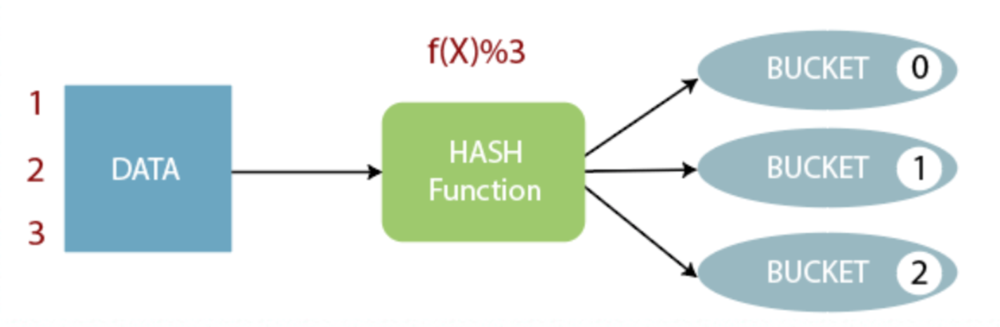
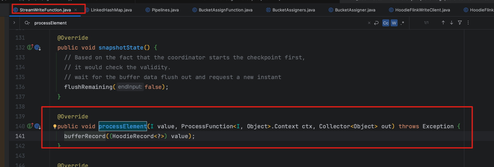
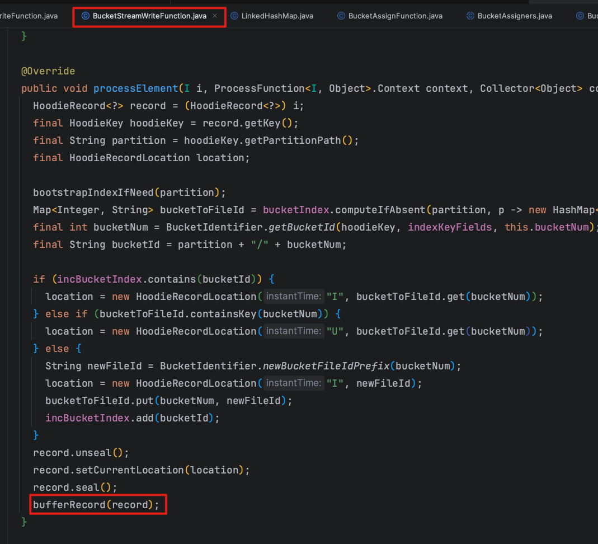
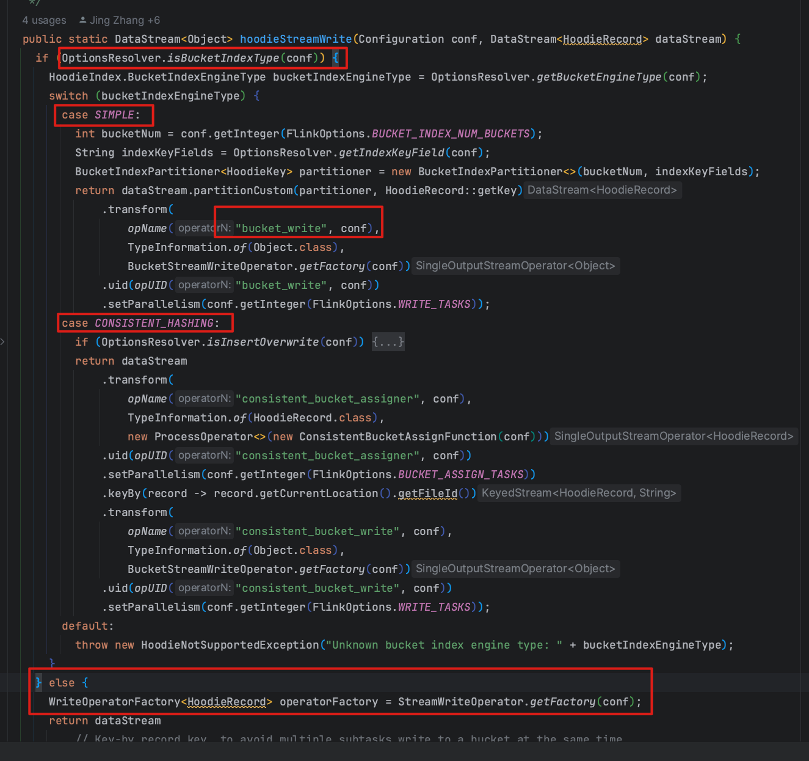
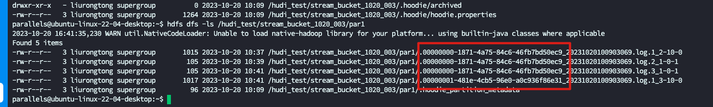
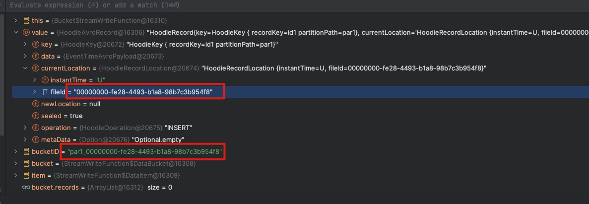
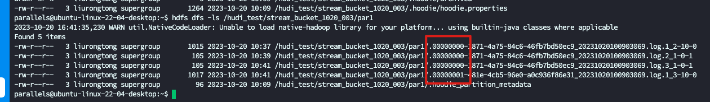
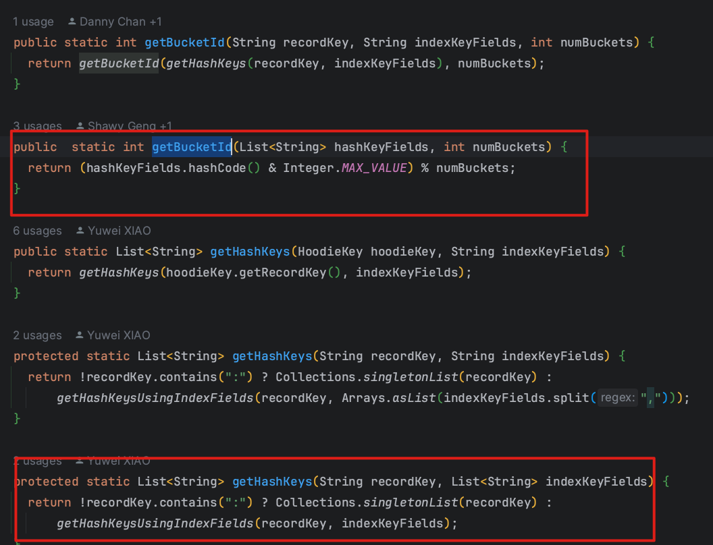

# 前言

Hudi 系列文章在这个这里查看 [https://github.com/leosanqing/big-data-study](https://github.com/leosanqing/big-data-study)

Bucket Index,即桶索引是 Flink 引擎唯二的索引之一, 不需要进行额外空间存储索引. 桶索引有两种,一种是 SIMPLE, 另一种是 CONSISTENT_HASH, 本文讲的是 SIMPLE

桶索引的背景 以及设计思路可以参考官方 [RFC-29 Hash Index](https://cwiki.apache.org/confluence/display/HUDI/RFC+-+29%3A+Hash+Index) 

# 问题

1. 桶索引原理
2. 提出的背景
3. 优缺点
4. 桶索引与 FlinkState 算子层面区别

# 背景

桶索引是头条贡献的,由于 Flink State 会导致状态无限膨胀并且数据量大之后查询索引效率降低,无法使用 spark 补数

# 原理

不需要额外存储索引信息, 索引通过recordKey hash 与桶数取余, 算出来




# 优缺点

## 优点

1. 不需要存索引储信息
2. 不存在小文件问题
3. 可跨引擎使用

## 缺点

1. 无法控制文件大小,只能通过预估来计算每个桶的大小,存在大文件问题(动态缩扩参考 CONSISTENT_HASH BUCKET索引)
2. 写入与查询几乎需要涉及全部的桶, 耗费资源
3. 无法设置全局索引
4. 无法对数据进行分区变更

第二点和第三点可以说是桶索引的致命问题, 第一点可以通过 0.13 之后的CONSISTENT_HASH 实现动态桶缩扩


# 源码

## Upsert 流程

1. **数据进入BucketStreamWriteFunction: 判断是新增还是更新, 写入哪个文件,并且把数据缓存到内存的桶中**
2. 当执行 CKP 或者批任务结束, 发送消息给 StreamWriteFunction 终止信号`endInput`, 或者调用 ckp 方法,这个时候就会开始写入数据`flushRemaining`
3. `flushRemaining` 会调用 writeClient 的相应方法, 是 upsert 还是 insert...
4. 数据预合并(Precombine)
5. `org.apache.hudi.client.HoodieFlinkWriteClient#upsert` 后面就是常规的写入了,这个参考 Upsert 的写入过程分析文章


从上面看,桶索引和 FlinkState 的写入,只有在第一步那里进行了区分,一个是`BucketStreamWriteFunction` 的方法,一个是`StreamWriteFunction`方法

但其实 `BucketStreamWriteFunction` 做了`StreamWriteFunction` + `BucketAssignFunction` 两个算子的工作,所以他不需要 `BucketAssignFunction`,而

`StreamWriteFunction` 的 `processElement()` 方法也不需要再对数据做处理了,因为`BucketAssignFunction`已经做了工作







所以这里只讨论第一步的区别,其他四个步骤, 参考 Upsert 分析的文章


## BucketWrite

那么上面提到的 `BucketStreamWriteFunction` 从哪里来的

bucketWrite 算子生成的逻辑在 pipelines类 里面



我们从上面的 bucketWrite 算子分析,就知道了

流程为如下:

1. 获取任务 config 中的 index type
2. 如果是 BucketIndex 就获取配置的桶数, 获取分桶字段
3. 生成分区器
4. 生成 BucketWrite 算子(`BucketStreamWriteFunction`)

```java
public static DataStream<Object> hoodieStreamWrite(Configuration conf, DataStream<HoodieRecord> dataStream) {
  // 1. 获取任务 config 中的 index type  
  if (OptionsResolver.isBucketIndexType(conf)) {
      HoodieIndex.BucketIndexEngineType bucketIndexEngineType = OptionsResolver.getBucketEngineType(conf);
    // 确定是哪种, SIMPLE 或者 CONSISTENT_HASHING
      switch (bucketIndexEngineType) {
        case SIMPLE:
          // 2. 如果是 BucketIndex 就获取配置的桶数, 获取分桶字段
          int bucketNum = conf.getInteger(FlinkOptions.BUCKET_INDEX_NUM_BUCKETS);
          String indexKeyFields = OptionsResolver.getIndexKeyField(conf);
          BucketIndexPartitioner<HoodieKey> partitioner = new BucketIndexPartitioner<>(bucketNum, indexKeyFields);
          return dataStream.partitionCustom(partitioner, HoodieRecord::getKey)
              .transform(
                  opName("bucket_write", conf),
                  TypeInformation.of(Object.class),
                  BucketStreamWriteOperator.getFactory(conf))
              .uid(opUID("bucket_write", conf))
              .setParallelism(conf.getInteger(FlinkOptions.WRITE_TASKS));
        case CONSISTENT_HASHING:
        // 动态桶索引
        default:
          throw new HoodieNotSupportedException("Unknown bucket index engine type: " + bucketIndexEngineType);
      }
    } else {
      // Flink State 逻辑
    }
```

### 功能

1. 数据根据 HashField 确定写入的文件(索引的工作)
2. 根据 RecordKey 确定数据是 I 还是 U,以此来确定后期写入的分桶,加快写入
3. 按桶写入

### processElement

算子生成之后, 数据流入时,处理逻辑就在下面这里

当真正调用通用写入方法, FlinkWriteCLient.upsert 流程, 我们能看到 instant 是 I 或者 U,以此来判断到底是新增还是更新的桶, 还有具体分到哪个桶里面,这个怎么来的

```java
// org.apache.hudi.sink.bucket.BucketStreamWriteFunction#processElement
  public void processElement(I i, ProcessFunction<I, Object>.Context context, Collector<Object> collector) throws Exception {
    HoodieRecord<?> record = (HoodieRecord<?>) i;
    final HoodieKey hoodieKey = record.getKey();
    final String partition = hoodieKey.getPartitionPath();
    final HoodieRecordLocation location;

    bootstrapIndexIfNeed(partition);
    Map<Integer, String> bucketToFileId = bucketIndex.computeIfAbsent(partition, p -> new HashMap<>());
    final int bucketNum = BucketIdentifier.getBucketId(hoodieKey, indexKeyFields, this.bucketNum);
    final String bucketId = partition + "/" + bucketNum;

    // 三种情况
    // 1. 本次提交新增的桶,本批次提交内已经创建了(不需要新建)
    // 2. hdfs 上已经存在的桶
    // 3. 上述两种情况都不满足的,即要新建一个桶
    
    // 比如我们 设置了总共要写入 5 个桶
    // hdfs 上存在 1,2,4
    // 现在 来了一批数据 1,2,3,4,5,6,7,8,9,10,假设处理顺序按照这个
    // 进入条件 1 的就是 8,10
    // 进入条件 2 的就是 1,2,4,6,7,9
    // 进入条件 3 的就是 3,5
    if (incBucketIndex.contains(bucketId)) {
      location = new HoodieRecordLocation("I", bucketToFileId.get(bucketNum));
    } else if (bucketToFileId.containsKey(bucketNum)) {
      location = new HoodieRecordLocation("U", bucketToFileId.get(bucketNum));
    } else {
      String newFileId = BucketIdentifier.newBucketFileIdPrefix(bucketNum);
      location = new HoodieRecordLocation("I", newFileId);
      bucketToFileId.put(bucketNum, newFileId);
      incBucketIndex.add(bucketId);
    }
    record.unseal();
    record.setCurrentLocation(location);
    record.seal();
    bufferRecord(record);
  }
 
```

### BufferRecord

上面的数据处理完之后,我们会把数据缓存到桶中,最后按批次写入(Flink 和 Hudi **集成实际是微批写入,不是真正的流式写入**,这个我源码分析的 RFC24 那篇文章就知道了)

至于缓存多少,看下面参数就知道了

1. write.batch.size 一批次一个桶最多写入多少数据,默认256M
2. write.task.max.size: 每个写入线程最多缓存多少,默认 1G

所以并不是只有 ckp 完成了才能看到数据, ckp 没完成,也会在 hdfs 上写出一个文件

```java
 /**
   * Buffers the given record.
   *
   * <p>Flush the data bucket first if the bucket records size is greater than
   * the configured value {@link FlinkOptions#WRITE_BATCH_SIZE}.
   *
   * <p>Flush the max size data bucket if the total buffer size exceeds the configured
   * threshold {@link FlinkOptions#WRITE_TASK_MAX_SIZE}.
   * 
   * @param value HoodieRecord
   */
  protected void bufferRecord(HoodieRecord<?> value) {
    final String bucketID = getBucketID(value);

    DataBucket bucket = this.buckets.computeIfAbsent(bucketID,
        k -> new DataBucket(this.config.getDouble(FlinkOptions.WRITE_BATCH_SIZE), value));
    final DataItem item = DataItem.fromHoodieRecord(value);

    bucket.records.add(item);

    boolean flushBucket = bucket.detector.detect(item);
    boolean flushBuffer = this.tracer.trace(bucket.detector.lastRecordSize);
    if (flushBucket) {
      if (flushBucket(bucket)) {
        this.tracer.countDown(bucket.detector.totalSize);
        bucket.reset();
      }
    } else if (flushBuffer) {
      // find the max size bucket and flush it out
      DataBucket bucketToFlush = this.buckets.values().stream()
          .max(Comparator.comparingLong(b -> b.detector.totalSize))
          .orElseThrow(NoSuchElementException::new);
      if (flushBucket(bucketToFlush)) {
        this.tracer.countDown(bucketToFlush.detector.totalSize);
        bucketToFlush.reset();
      } else {
        LOG.warn("The buffer size hits the threshold {}, but still flush the max size data bucket failed!", this.tracer.maxBufferSize);
      }
    }
  }
```

### endIput

当批任务写完,或者 要做 ckp,就会将上面缓存的数据刷写到磁盘上

```java
/**
 * End input action for batch source.
 */
public void endInput() {
  super.endInput();
  flushRemaining(true);
  this.writeClient.cleanHandles();
  this.writeStatuses.clear();
}
```

```java
@Override
public void snapshotState() {
  // Based on the fact that the coordinator starts the checkpoint first,
  // it would check the validity.
  // wait for the buffer data flush out and request a new instant
  flushRemaining(false);
}
```


### flushRemaining

这个方法已经不是 `BucketStreamWriteFunction`而是`StreamWriteFunction` 这个方法我们关心的主要是下面三个:

1. 查找 inflight 算子
2. 数据预合并
3. 调用 upsert 方法,真正写入磁盘

```java
// org.apache.hudi.sink.StreamWriteFunction#flushRemaining
private void flushRemaining(boolean endInput) {
  // 1. 查找 infight 的 instant, 以此来确定写入哪个 instant
  this.currentInstant = instantToWrite(hasData());
  if (this.currentInstant == null) {
    // in case there are empty checkpoints that has no input data
    throw new HoodieException("No inflight instant when flushing data!");
  }
  final List<WriteStatus> writeStatus;
  if (buckets.size() > 0) {
    writeStatus = new ArrayList<>();
    this.buckets.values()
        // The records are partitioned by the bucket ID and each batch sent to
        // the writer belongs to one bucket.
        .forEach(bucket -> {
          List<HoodieRecord> records = bucket.writeBuffer();
          if (records.size() > 0) {
            // 2. 数据预合并
            if (config.getBoolean(FlinkOptions.PRE_COMBINE)) {
              records = (List<HoodieRecord>) FlinkWriteHelper.newInstance()
                  .deduplicateRecords(records, null, -1, this.writeClient.getConfig().getSchema(), this.writeClient.getConfig().getProps(), recordMerger);
            }
            bucket.preWrite(records);
            // 3. 调用 FlinkWriteClinet.upsert()
            writeStatus.addAll(writeFunction.apply(records, currentInstant));
            records.clear();
            bucket.reset();
          }
        });
  } else {
    LOG.info("No data to write in subtask [{}] for instant [{}]", taskID, currentInstant);
    writeStatus = Collections.emptyList();
  }
  final WriteMetadataEvent event = WriteMetadataEvent.builder()
      .taskID(taskID)
      .instantTime(currentInstant)
      .writeStatus(writeStatus)
      .lastBatch(true)
      .endInput(endInput)
      .build();

  this.eventGateway.sendEventToCoordinator(event);
  this.buckets.clear();
  this.tracer.reset();
  this.writeClient.cleanHandles();
  this.writeStatuses.addAll(writeStatus);
  // blocks flushing until the coordinator starts a new instant
  this.confirming = true;
}
```

### client写入

Client 的写入都是通用的方法, 具体支持的写入操作可以参考这个

```java
// org.apache.hudi.sink.StreamWriteFunction#initWriteFunction
private void initWriteFunction() {
  final String writeOperation = this.config.get(FlinkOptions.OPERATION);
  switch (WriteOperationType.fromValue(writeOperation)) {
    case INSERT:
      this.writeFunction = (records, instantTime) -> this.writeClient.insert(records, instantTime);
      break;
    case UPSERT:
      this.writeFunction = (records, instantTime) -> this.writeClient.upsert(records, instantTime);
      break;
    case INSERT_OVERWRITE:
      this.writeFunction = (records, instantTime) -> this.writeClient.insertOverwrite(records, instantTime);
      break;
    case INSERT_OVERWRITE_TABLE:
      this.writeFunction = (records, instantTime) -> this.writeClient.insertOverwriteTable(records, instantTime);
      break;
    default:
      throw new RuntimeException("Unsupported write operation : " + writeOperation);
  }
}
```

拿 Flink upsert 举例

```java
@Override
public List<WriteStatus> upsert(List<HoodieRecord<T>> records, String instantTime) {
  HoodieTable<T, List<HoodieRecord<T>>, List<HoodieKey>, List<WriteStatus>> table =
      initTable(WriteOperationType.UPSERT, Option.ofNullable(instantTime));
  table.validateUpsertSchema();
  preWrite(instantTime, WriteOperationType.UPSERT, table.getMetaClient());
  HoodieWriteMetadata<List<WriteStatus>> result;
  try (AutoCloseableWriteHandle closeableHandle = new AutoCloseableWriteHandle(records, instantTime, table)) {
    result = ((HoodieFlinkTable<T>) table).upsert(context, closeableHandle.getWriteHandle(), instantTime, records);
  }
  if (result.getIndexLookupDuration().isPresent()) {
    metrics.updateIndexMetrics(LOOKUP_STR, result.getIndexLookupDuration().get().toMillis());
  }
  return postWrite(result, instantTime, table);
}
```


后续的处理 Flink 是完全通用的, 写入可以参考我的关于 Upsert 写入流程分析这篇文章

## TagLocation

Hudi 确定数据是更新还是Insert的 打标操作(TagLocation) 是所有索引的核心方法,他决定了数据应该写到哪里

1. tagLocation
2. getRecordLocation
   1. 根据 RecordKey 计算 bucketId(这一步会进入到 `BucketIdentifier` 类,这个类中包含了所有桶索引相关的静态方法,比如获取桶 Id, FileId, 根据分桶值计算 Hash 值等等)
   2. 根据加载好的Map 中,找到分区下所有的 文件 Id 和桶 Id 的映射 Map
   3. 再从2中的 Map根据 BucketId 找是否存在这个文件
3. 

```java
// org.apache.hudi.index.bucket.HoodieBucketIndex#tagLocation

@Override
public <R> HoodieData<HoodieRecord<R>> tagLocation(
    HoodieData<HoodieRecord<R>> records, HoodieEngineContext context,
    HoodieTable hoodieTable)
    throws HoodieIndexException {
  // Get bucket location mapper for the given partitions
  List<String> partitions = records.map(HoodieRecord::getPartitionPath).distinct().collectAsList();
  LOG.info("Get BucketIndexLocationMapper for partitions: " + partitions);
  BucketIndexLocationMapper mapper = getLocationMapper(hoodieTable, partitions);

  return records.mapPartitions(iterator ->
      new LazyIterableIterator<HoodieRecord<R>, HoodieRecord<R>>(iterator) {
        @Override
        protected HoodieRecord<R> computeNext() {
          // TODO maybe batch the operation to improve performance
          HoodieRecord record = inputItr.next();
          
          // 挨个获取数据位置
          Option<HoodieRecordLocation> loc = mapper.getRecordLocation(record.getKey());
          return tagAsNewRecordIfNeeded(record, loc);
        }
      },
      false
  );
}
```


```java
    @Override
    public Option<HoodieRecordLocation> getRecordLocation(HoodieKey key) {
      // 获取 BucketId
      int bucketId = getBucketID(key);
      Map<Integer, HoodieRecordLocation> bucketIdToFileIdMapping = partitionPathFileIDList.get(key.getPartitionPath());
      return Option.ofNullable(bucketIdToFileIdMapping.getOrDefault(bucketId, null));
    }


```

# 桶索引几个概念

## FileId

FileID: hdfs 上显示的名称前缀



## BucketId

BucketID = path + fileId



## BucketNum

桶号: 为你设置的参数 桶个数的范围值,[0 , hoodie.bucket.index.num.buckets-1], 体现在文件上就是 FileId 8 位前缀




 到底怎么算,怎么产生的上面的 Id

## BucketIdentifier

BucketIdentifier 这个类里面包含了大部分桶索引的静态方法, 如何获取桶号,如何根据 HashKey 算桶号, 如何根据 FileId 获取桶号等等

`org.apache.hudi.index.bucket.BucketIdentifier` 





# 总结

1. 桶索引原理
   1. 使用 Hash 算法计算设置的 HashField,将数据分到特定的桶内, 这样就只需要计算,不需要存储索引信息
2. 提出的背景,针对 FlinkState 索引以下几个问题:
   1. 导致状态无限膨胀
   2. 数据量大之后查询索引效率降低
   3. 无法使用 spark 补数,无法跨引擎使用
3. 优缺点
   1. 优点
      1. 不需要存索引储信息
      2. 不存在小文件问题
      3. 可跨引擎使用
   2. 缺点
      1. 无法控制文件大小,只能通过预估来计算每个桶的大小,存在大文件问题(动态缩扩参考 CONSISTENT_HASH BUCKET索引)
      2. 写入与查询几乎需要涉及全部的桶, 耗费资源
      3. 无法设置全局索引
      4. 无法对数据进行分区变更
4. 桶索引与 FlinkState 算子层面区别
   1. 桶索引打标(查索引确定写入文件与分桶)与写入都是`BucketStreamWriteFunction` 
   2. FlinkState 打标是在`BucketAssignFunction,`,  写入是在`StreamWriteFunction`

