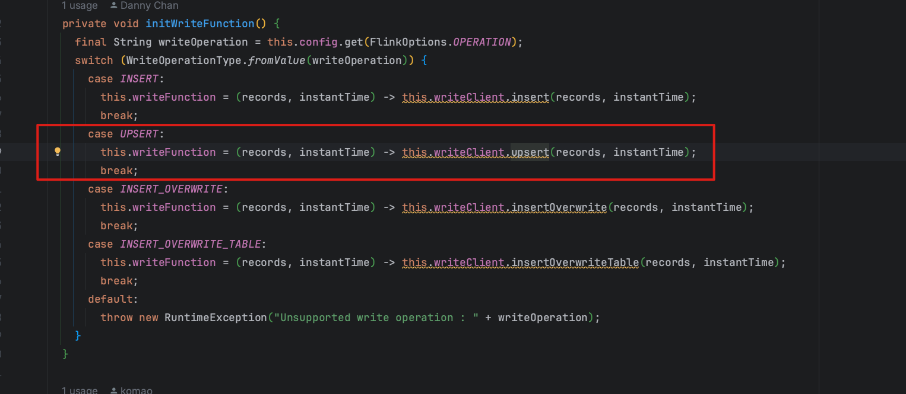
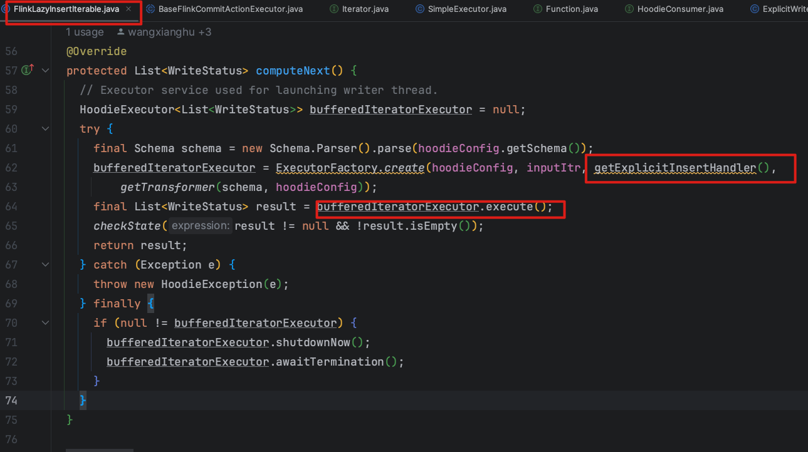
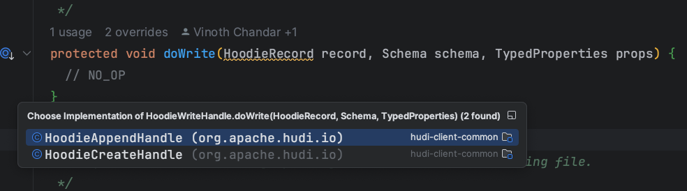
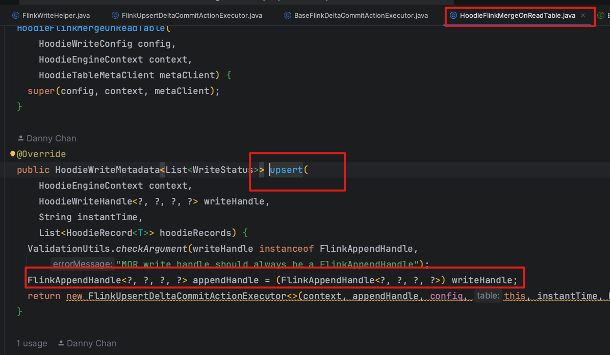
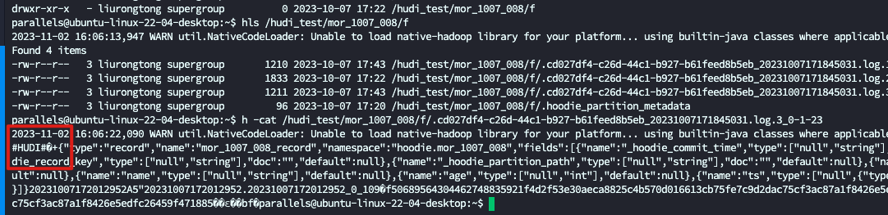

# 前言

Hudi 系列文章在这个这里查看 [https://github.com/leosanqing/big-data-study](https://github.com/leosanqing/big-data-study)

Upsert 是hudi 最重要的特性之一，根据主键查找，数据存在就更新，不存在就插入

通过之前的文章, 7.1.1.1 RFC-24 Flink 写入 Hudi 优化,  我们可以知道, 当数据经过StreamWriteFunction 或者 BucketWriteFunction 处理之后(打标,确定是U 还是 I, 以及写到哪个文件等), 被 shuffle 到各个桶内,然后再按照桶写入磁盘

这边主要就是讲数据已经被分到桶之后,调用 FlinkWriteClient 怎么写入到磁盘的过程.算是 upsert 流程的后半程




# 问题

1. upsert 中, 标识为 I 和 U 的桶处理有什么不同
2. hudi 如何提高写的速度
3. 缓存中的数据如何保证最终全部写入
4. log 文件命名规则

# 流程

Upsert 操作主要分为下面几个步骤

1. 初始化 Hudi表（initTable）
2. 表语法校验  table.validateUpsertSchema();
3. 写前操作(目前只做了 设置操作类型为 upsert)
4. 创建 writeHandle
5. 触发upsert操作（最重要）
6. 更新index指标 updateIndexMetrics
7. 写完成之后操作 postWrite


```java
// org.apache.hudi.client.HoodieFlinkWriteClient#upsert

@Override
public List<WriteStatus> upsert(List<HoodieRecord<T>> records, String instantTime) {
  // 1.初始化 Hudi表（initTable）
    HoodieTable<T, List<HoodieRecord<T>>, List<HoodieKey>, List<WriteStatus>> table =
      initTable(WriteOperationType.UPSERT, Option.ofNullable(instantTime));
  // 2. 校验表
  table.validateUpsertSchema();
  // 3. 写前操作(目前只做了 设置操作类型为 upsert)
  preWrite(instantTime, WriteOperationType.UPSERT, table.getMetaClient());
  HoodieWriteMetadata<List<WriteStatus>> result;
  // 4. 创建 writeHandle
  try (AutoCloseableWriteHandle closeableHandle = new AutoCloseableWriteHandle(records, instantTime, table)) {
    // 5. 触发upsert操作（最重要）
    result = ((HoodieFlinkTable<T>) table).upsert(context, closeableHandle.getWriteHandle(), instantTime, records);
  }
  if (result.getIndexLookupDuration().isPresent()) {
    metrics.updateIndexMetrics(LOOKUP_STR, result.getIndexLookupDuration().get().toMillis());
  }
  return postWrite(result, instantTime, table);
}
```

# upsert 动作

```java
// org.apache.hudi.table.HoodieFlinkMergeOnReadTable#upsert
// org.apache.hudi.table.action.commit.delta.FlinkUpsertDeltaCommitActionExecutor#execute
// org.apache.hudi.table.action.commit.FlinkWriteHelper#write
// org.apache.hudi.table.action.commit.BaseFlinkCommitActionExecutor#execute

	@Override
  public HoodieWriteMetadata<List<WriteStatus>> execute(List<HoodieRecord<T>> inputRecords) {
    HoodieWriteMetadata<List<WriteStatus>> result = new HoodieWriteMetadata<>();

    List<WriteStatus> writeStatuses = new LinkedList<>();
    final HoodieRecord<?> record = inputRecords.get(0);
    // 1. 通过第一条找到 存储的信息，比如分区地址，fileId bucketType等 
    // 为啥只找第一条就够了，我们通过之前的文章就知道,他实际已经把要写入同一个文件的数据分到同一个桶中, 所以我们只要取其中任意一个数据就知道了

    final String partitionPath = record.getPartitionPath();
    final String fileId = record.getCurrentLocation().getFileId();
    // 为啥 InstanTime 是 I 或者 U
    // 参考7.2.1.3 Bucket索引源码分析, 关于 processElement 那里有详细的说明
    // 简单说是只有完全新增的数据并且写入的文件是已经存在的就是 U, 其他是 I(也就是需要写入新文件)
    final BucketType bucketType = record.getCurrentLocation().getInstantTime().equals("I")
        ? BucketType.INSERT
        : BucketType.UPDATE;
    handleUpsertPartition(
        instantTime,
        partitionPath,
        fileId,
        bucketType,
        inputRecords.iterator())
        .forEachRemaining(writeStatuses::addAll);
    setUpWriteMetadata(writeStatuses, result);
    return result;
  }
```

```java
// 根据上面bucketType，决定是调用 insert 还是 update

protected Iterator<List<WriteStatus>> handleUpsertPartition(
    String instantTime,
    String partitionPath,
    String fileIdHint,
    BucketType bucketType,
    Iterator recordItr) {
  try {
    if (this.writeHandle instanceof HoodieCreateHandle) {
      // During one checkpoint interval, an insert record could also be updated,
      // for example, for an operation sequence of a record:
      //    I, U,   | U, U
      // - batch1 - | - batch2 -
      // the first batch(batch1) operation triggers an INSERT bucket,
      // the second batch batch2 tries to reuse the same bucket
      // and append instead of UPDATE.
      return handleInsert(fileIdHint, recordItr);
    } else if (this.writeHandle instanceof HoodieMergeHandle) {
      return handleUpdate(partitionPath, fileIdHint, recordItr);
    } else {
      switch (bucketType) {
        case INSERT:
          return handleInsert(fileIdHint, recordItr);
        case UPDATE:
          return handleUpdate(partitionPath, fileIdHint, recordItr);
        default:
          throw new AssertionError();
      }
    }
  } catch (Throwable t) {
    String msg = "Error upsetting bucketType " + bucketType + " for partition :" + partitionPath;
    LOG.error(msg, t);
    throw new HoodieUpsertException(msg, t);
  }
}

```

## Insert

Insert 和 Update 有些区别, Insert 是使用懒加载,当真正调用遍历的时候才去写入

```java
@Override
public Iterator<List<WriteStatus>> handleInsert(String idPfx, Iterator<HoodieRecord<T>> recordItr)
    throws Exception {
  // This is needed since sometimes some buckets are never picked in getPartition() and end up with 0 records
  if (!recordItr.hasNext()) {
    LOG.info("Empty partition");
    return Collections.singletonList((List<WriteStatus>) Collections.EMPTY_LIST).iterator();
  }
  // 看名字就能明白是懒加载,但是什么时候加载
  return new FlinkLazyInsertIterable<>(recordItr, true, config, instantTime, table, idPfx,
      taskContextSupplier, new ExplicitWriteHandleFactory<>(writeHandle));
}


// 什么时候调用, 调用这个方法的时候才会调用写入逻辑
// org.apache.hudi.execution.FlinkLazyInsertIterable#computeNext
  @Override
  protected List<WriteStatus> computeNext() {
    // Executor service used for launching writer thread.
    HoodieExecutor<List<WriteStatus>> bufferedIteratorExecutor = null;
    try {
      final Schema schema = new Schema.Parser().parse(hoodieConfig.getSchema());
      // 创建写入的处理类
      bufferedIteratorExecutor = ExecutorFactory.create(hoodieConfig, inputItr, getExplicitInsertHandler(),
          getTransformer(schema, hoodieConfig));
      //  执行写入
      final List<WriteStatus> result = bufferedIteratorExecutor.execute();
      checkState(result != null && !result.isEmpty());
      return result;
    } catch (Exception e) {
      throw new HoodieException(e);
    } finally {
      if (null != bufferedIteratorExecutor) {
        bufferedIteratorExecutor.shutdownNow();
        bufferedIteratorExecutor.awaitTermination();
      }
    }
  }

// 上面computeNext 在这个方法调用
// org.apache.hudi.client.utils.LazyIterableIterator#next
	@Override
  public O next() {
    try {
      // 这里
      return computeNext();
    } catch (Exception ex) {
      throw new RuntimeException(ex);
    }
  }

// 上面的那个方法,在这个的时候才会调用
    handleUpsertPartition(
        instantTime,
        partitionPath,
        fileId,
        bucketType,
        inputRecords.iterator())
      // 这里才真正调用
        .forEachRemaining(writeStatuses::addAll);


    default void forEachRemaining(Consumer<? super E> action) {
        Objects.requireNonNull(action);
        while (hasNext())
          // 这里会调用 next()方法
            action.accept(next());
    }

```

### LazyIterableIterator




```java
// 进入 org.apache.hudi.common.util.queue.SimpleExecutor#execute 
// 有两个 Executor, Flink 默认是进入这个类中
  /**
   * Consuming records from input iterator directly without any producers and inner message queue.
   */
  @Override
  public E execute() {
    try {
      LOG.info("Starting consumer, consuming records from the records iterator directly");
      while (itr.hasNext()) {
        O payload = transformFunction.apply(itr.next());
        consumer.consume(payload);
      }

      // 确保所有缓存的数据刷写到磁盘,并且关闭 文件流 等
      return consumer.finish();
    } catch (Exception e) {
      LOG.error("Failed consuming records", e);
      throw new HoodieException(e);
    }
  }

// 进入org.apache.hudi.execution.ExplicitWriteHandler#consume
  @Override
  public void consume(HoodieLazyInsertIterable.HoodieInsertValueGenResult<HoodieRecord> genResult) {
    final HoodieRecord insertPayload = genResult.getResult();
    // 这个 handle 有两个实现, 一个是 append ,一个是 create .前者 Insert 追加写入,后者新建文件写入的时候调用
    // MOR表初始化只能是 APPEND
    handle.write(insertPayload, genResult.schema, new TypedProperties(genResult.props));
  }

```



**注意!!!!!!!!!!!:MOR 表,只用HoodieAppendHandle, 因为他初始化的时候已经确定了**



### HoodieAppendHandle

已经有一个现有的文件，且该文件还有空间来接受新的记录时，Hudi 会使用此类。它主要负责：

- 向现有的文件追加新的数据。
- 对于 MOR 表，这通常意味着向增量日志文件中写入新记录。
- 如果一个文件已经有一个关联的增量日志，那么新的更改会被追加到这个日志中。

### doWrite

Insert 最终会走到 `org.apache.hudi.io.HoodieAppendHandle#doWrite` 方法

先缓存起来,之后等达到 block 大小,就写成一个 block

跟下面 doAppend 方法基本一样, 可以参考 Update 内容,

这里只多提一点, doAppend 会最后再调用一次 `appendDataAndDeleteBlocks` 确保数据全部刷完之后再统计,可以看到这里并没有调用

**那么,多的缓存中的没有刷写到磁盘的数据怎么再刷写到磁盘, 看之前`org.apache.hudi.common.util.queue.SimpleExecutor#execute ` 这里,他最后调用一下 finish 方法,这里会确保没刷写的数据刷写到磁盘**

```java
  @Override
  protected void doWrite(HoodieRecord record, Schema schema, TypedProperties props) {
    Option<Map<String, String>> recordMetadata = record.getMetadata();
    try {
      init(record);
      flushToDiskIfRequired(record, false);
      // 先缓存起来,之后等达到 block 大小,就写成一个 block
      writeToBuffer(record);
    } catch (Throwable t) {
      // Not throwing exception from here, since we don't want to fail the entire job
      // for a single record
      writeStatus.markFailure(record, t, recordMetadata);
      LOG.error("Error writing record " + record, t);
    }
  }

```


### HoodieCreateHandle

当没有可用的文件来接收新的插入或更新记录时，Hudi 会使用此类。它主要负责：

- 创建一个新的数据文件。
- 处理新记录的写入到这个新文件。
- 当文件达到配置的大小或其它限制时，关闭文件。

```java
/**
 * Perform the actual writing of the given record into the backing file.
 * 真正写入文件的逻辑
 */
@Override
protected void doWrite(HoodieRecord record, Schema schema, TypedProperties props) {
  Option<Map<String, String>> recordMetadata = record.getMetadata();
  try {
    if (!HoodieOperation.isDelete(record.getOperation()) && !record.isDelete(schema, config.getProps())) {
      if (record.shouldIgnore(schema, config.getProps())) {
        return;
      }

      MetadataValues metadataValues = new MetadataValues().setFileName(path.getName());
      HoodieRecord populatedRecord =
          record.prependMetaFields(schema, writeSchemaWithMetaFields, metadataValues, config.getProps());

      // 这里通过
      if (preserveMetadata) {
        fileWriter.write(record.getRecordKey(), populatedRecord, writeSchemaWithMetaFields);
      } else {
        fileWriter.writeWithMetadata(record.getKey(), populatedRecord, writeSchemaWithMetaFields);
      }

      // Update the new location of record, so we know where to find it next
      record.unseal();
      record.setNewLocation(new HoodieRecordLocation(instantTime, writeStatus.getFileId()));
      record.seal();

      recordsWritten++;
      insertRecordsWritten++;
    } else {
      recordsDeleted++;
    }
    writeStatus.markSuccess(record, recordMetadata);
    // deflate record payload after recording success. This will help users access payload as a
    // part of marking
    // record successful.
    record.deflate();
  } catch (Throwable t) {
    // Not throwing exception from here, since we don't want to fail the entire job
    // for a single record
    writeStatus.markFailure(record, t, recordMetadata);
    LOG.error("Error writing record " + record, t);
  }
}
```

## Update

Update 最终调用到 `org.apache.hudi.io.HoodieAppendHandle#doAppend` 方法执行追加写操作

```java
// org.apache.hudi.table.action.commit.delta.BaseFlinkDeltaCommitActionExecutor#handleUpdate
@Override
public Iterator<List<WriteStatus>> handleUpdate(String partitionPath, String fileId, Iterator<HoodieRecord<T>> recordItr) {
  FlinkAppendHandle appendHandle = (FlinkAppendHandle) writeHandle;
  appendHandle.doAppend();
  List<WriteStatus> writeStatuses = appendHandle.close();
  return Collections.singletonList(writeStatuses).iterator();
}


// org.apache.hudi.io.HoodieAppendHandle#doAppend
public void doAppend() {
  while (recordItr.hasNext()) {
    HoodieRecord record = recordItr.next();
    // 初始化一些必要信息，只根据第一个记录初始化一次
    init(record);
    // 数据刷入磁盘，如果有必要,即当缓存的达到阈值
    flushToDiskIfRequired(record, false);
    // 如果没有,就写入缓存
    writeToBuffer(record);
  }
  // 最后再写一次,因为有可能缓存里面还有数据
  appendDataAndDeleteBlocks(header, true);
  estimatedNumberOfBytesWritten += averageRecordSize * numberOfRecords;
}


  /**
   * Checks if the number of records have reached the set threshold and then flushes the records to disk.
   */
  private void flushToDiskIfRequired(HoodieRecord record, boolean appendDeleteBlocks) {
    if (numberOfRecords >= (int) (maxBlockSize / averageRecordSize)
        || numberOfRecords % NUMBER_OF_RECORDS_TO_ESTIMATE_RECORD_SIZE == 0) {
      averageRecordSize = (long) (averageRecordSize * 0.8 + sizeEstimator.sizeEstimate(record) * 0.2);
    }

    // 如果达到了阈值，将数据写入磁盘
    if (numberOfRecords >= (int) (maxBlockSize / averageRecordSize)) {
      // Recompute averageRecordSize before writing a new block and update existing value with
      // avg of new and old
      LOG.info("Flush log block to disk, the current avgRecordSize => " + averageRecordSize);
      // Delete blocks will be appended after appending all the data blocks.
      appendDataAndDeleteBlocks(header, appendDeleteBlocks);
      estimatedNumberOfBytesWritten += averageRecordSize * numberOfRecords;
      numberOfRecords = 0;
    }
  }
```


### appendDataAndDeleteBlocks

这里会把能够写一个块的数据组装成一个块,写到 log 中

```java
// org.apache.hudi.io.HoodieAppendHandle#appendDataAndDeleteBlocks
protected void appendDataAndDeleteBlocks(Map<HeaderMetadataType, String> header, boolean appendDeleteBlocks) {
    try {
      header.put(HoodieLogBlock.HeaderMetadataType.INSTANT_TIME, instantTime);
      header.put(HoodieLogBlock.HeaderMetadataType.SCHEMA, writeSchemaWithMetaFields.toString());

      List<HoodieLogBlock> blocks = new ArrayList<>(2);
      if (recordList.size() > 0) {
        String keyField = config.populateMetaFields()
            ? HoodieRecord.RECORD_KEY_METADATA_FIELD
            : hoodieTable.getMetaClient().getTableConfig().getRecordKeyFieldProp();

        // MOR 最终会组装成 avro 类型的, HoodieAvroDataBlock(records, header, keyField);
        blocks.add(getBlock(config, pickLogDataBlockFormat(), recordList, header, keyField));
      }
			// Delete 类型的 Block
      if (appendDeleteBlocks && recordsToDelete.size() > 0) {
        blocks.add(new HoodieDeleteBlock(recordsToDelete.toArray(new DeleteRecord[0]), header));
      }

      // 写完之后重置,并且更新结果
      if (blocks.size() > 0) {
        // 真正写入磁盘逻辑
        AppendResult appendResult = writer.appendBlocks(blocks);
        processAppendResult(appendResult, recordList);
        recordList.clear();
        if (appendDeleteBlocks) {
          recordsToDelete.clear();
        }
      }
    } catch (Exception e) {
      throw new HoodieAppendException("Failed while appending records to " + writer.getLogFile().getPath(), e);
    }
  }
```


### AppendBlocks

当达到写入磁盘的块的大小之后,就把数据刷写到 log 文件中

下面的逻辑就是真正写 log 文件的逻辑,我们可以看到下面 会写入 MAGIC, header content, Footer 等等, MAGIC 就是我们打开 log 文件能看到的 `#HUDI#`字样,看到几个就知道写了几个块



```java
// org.apache.hudi.common.table.log.HoodieLogFormatWriter#appendBlocks
@Override
public AppendResult appendBlocks(List<HoodieLogBlock> blocks) throws IOException, InterruptedException {
  // Find current version
  HoodieLogFormat.LogFormatVersion currentLogFormatVersion =
      new HoodieLogFormatVersion(HoodieLogFormat.CURRENT_VERSION);

  FSDataOutputStream originalOutputStream = getOutputStream();
  long startPos = originalOutputStream.getPos();
  long sizeWritten = 0;
  // HUDI-2655. here we wrap originalOutputStream to ensure huge blocks can be correctly written
  FSDataOutputStream outputStream = new FSDataOutputStream(originalOutputStream, new FileSystem.Statistics(fs.getScheme()), startPos);
  for (HoodieLogBlock block: blocks) {
    long startSize = outputStream.size();

    // 1. Write the magic header for the start of the block
    outputStream.write(HoodieLogFormat.MAGIC);

    // bytes for header
    byte[] headerBytes = HoodieLogBlock.getLogMetadataBytes(block.getLogBlockHeader());
    // content bytes
    byte[] content = block.getContentBytes();
    // bytes for footer
    byte[] footerBytes = HoodieLogBlock.getLogMetadataBytes(block.getLogBlockFooter());

    // 2. Write the total size of the block (excluding Magic)
    outputStream.writeLong(getLogBlockLength(content.length, headerBytes.length, footerBytes.length));

    // 3. Write the version of this log block
    outputStream.writeInt(currentLogFormatVersion.getVersion());
    // 4. Write the block type
    outputStream.writeInt(block.getBlockType().ordinal());

    // 5. Write the headers for the log block
    outputStream.write(headerBytes);
    // 6. Write the size of the content block
    outputStream.writeLong(content.length);
    // 7. Write the contents of the data block
    outputStream.write(content);
    // 8. Write the footers for the log block
    outputStream.write(footerBytes);
    // 9. Write the total size of the log block (including magic) which is everything written
    // until now (for reverse pointer)
    // Update: this information is now used in determining if a block is corrupt by comparing to the
    //   block size in header. This change assumes that the block size will be the last data written
    //   to a block. Read will break if any data is written past this point for a block.
    outputStream.writeLong(outputStream.size() - startSize);

    // Fetch the size again, so it accounts also (9).

    // HUDI-2655. Check the size written to avoid log blocks whose size overflow.
    if (outputStream.size() == Integer.MAX_VALUE) {
      throw new HoodieIOException("Blocks appended may overflow. Please decrease log block size or log block amount");
    }
    sizeWritten +=  outputStream.size() - startSize;
  }
  // Flush all blocks to disk
  flush();

  AppendResult result = new AppendResult(logFile, startPos, sizeWritten);
  // 当写入的大小超过了规定的 log 大小,就写入新的 log 中
  // roll over if size is past the threshold
  rolloverIfNeeded();
  return result;
}
```


```java
// org.apache.hudi.io.HoodieAppendHandle#appendDataAndDeleteBlocks
protected void appendDataAndDeleteBlocks(Map<HeaderMetadataType, String> header, boolean appendDeleteBlocks) {
  try {
    header.put(HoodieLogBlock.HeaderMetadataType.INSTANT_TIME, instantTime);
    header.put(HoodieLogBlock.HeaderMetadataType.SCHEMA, writeSchemaWithMetaFields.toString());
    List<HoodieLogBlock> blocks = new ArrayList<>(2);
    // 如果有新数据，就新建一个 DataBlock
    if (recordList.size() > 0) {
      String keyField = config.populateMetaFields()
          ? HoodieRecord.RECORD_KEY_METADATA_FIELD
          : hoodieTable.getMetaClient().getTableConfig().getRecordKeyFieldProp();

      blocks.add(getBlock(config, pickLogDataBlockFormat(), recordList, header, keyField));
    }

    if (appendDeleteBlocks && recordsToDelete.size() > 0) {
      // 如果要删除数据并且有数据，就新建一个DeleteBlock
      blocks.add(new HoodieDeleteBlock(recordsToDelete.toArray(new DeleteRecord[0]), header));
    }

    if (blocks.size() > 0) {
      AppendResult appendResult = writer.appendBlocks(blocks);
      processAppendResult(appendResult, recordList);
      recordList.clear();
      if (appendDeleteBlocks) {
        recordsToDelete.clear();
      }
    }
  } catch (Exception e) {
    throw new HoodieAppendException("Failed while appending records to " + writer.getLogFile().getPath(), e);
  }
}
```

## AppendBlock

```java
@Override
public AppendResult appendBlocks(List<HoodieLogBlock> blocks) throws IOException, InterruptedException {
  // Find current version
  HoodieLogFormat.LogFormatVersion currentLogFormatVersion =
      new HoodieLogFormatVersion(HoodieLogFormat.CURRENT_VERSION)
  FSDataOutputStream originalOutputStream = getOutputStream();
  long startPos = originalOutputStream.getPos();
  long sizeWritten = 0;
  // HUDI-2655. here we wrap originalOutputStream to ensure huge blocks can be correctly written
  FSDataOutputStream outputStream = new FSDataOutputStream(originalOutputStream, new FileSystem.Statistics(fs.getScheme()), startPos);
  for (HoodieLogBlock block: blocks) {
  	XXXX
  }
  // Flush all blocks to disk
  flush();

  AppendResult result = new AppendResult(logFile, startPos, sizeWritten);
  // roll over if size is past the threshold
  // 如果出错了，或者文件大小超过了阈值，就要滚动创建一个新文件
  rolloverIfNeeded();
  return result;
}
```

# RollOver日志文件滚动创建

 当写入的文件大小超过了阈值，就要新建一个文件

计算下一个文件名的方法在这个类里面

```java
public HoodieLogFile rollOver(FileSystem fs, String logWriteToken) throws IOException {
  String fileId = getFileId();
  String baseCommitTime = getBaseCommitTime();
  Path path = getPath();
  String extension = "." + FSUtils.getFileExtensionFromLog(path);
  int newVersion = FSUtils.computeNextLogVersion(fs, path.getParent(), fileId, extension, baseCommitTime);
  return new HoodieLogFile(new Path(path.getParent(),
      FSUtils.makeLogFileName(fileId, extension, baseCommitTime, newVersion, logWriteToken)));
}
```

## 文件命名规则

我们如果是 FlinkState 索引 写入 MOR 表,会生成这样的 log 文件

`.cd027df4-c26d-44c1-b927-b61feed8b5eb_20231007171845031.log.3_0-1-23`

上面的文件命名规则是什么样的, 我们来分析一下

hudi 使用这个正则去匹配文件,并截取想要的信息, `^\.(.+)_(.*)\.(log|archive)\.(\d+)(_((\d+)-(\d+)-(\d+))(.cdc)?)?`

1. `^\.`: 匹配字符串的开始，然后匹配一个点`.`。

2. `(.+)`: 匹配并捕获任何字符序列，至少出现一次。这是第一个捕获组。

3. `_(.*)`: 匹配一个下划线`_`，然后匹配并捕获任何字符序列（可能为空）。这是第二个捕获组。

4. `\.(log|archive)`: 匹配一个点`.`，然后匹配`log`或`archive`。

5. `\.(\d+)`: 匹配一个点`.`，然后匹配并捕获一系列数字。这是第三个捕获组。

6. `(_((\d+)-(\d+)-(\d+))(.cdc)?)?`: 这是一个可选的部分（由于最外层的`?`），它匹配：
    - 一个下划线`_`
    - 三个由短横线`-`分隔的数字序列，这是第四、五和六捕获组。
    - 一个可选的部分，匹配`.cdc`。

现在，使用这个正则表达式去匹配给定的字符串 `.cd027df4-c26d-44c1-b927-b61feed8b5eb_20231007171845031.log.3_0-1-23`。

匹配结果：

- 第一个捕获组：`cd027df4-c26d-44c1-b927-b61feed8b5eb`
- 第二个捕获组：`20231007171845031`
- 第三个捕获组: `log`
- 第四个捕获组: `3`
- 第五个捕获组：`_0-1-23`
- 第六个捕获组：`0-1-23`
- 第七个捕获组：`0`
- 第八个捕获组：`1`
- 第九个捕获组:  `23`

所以，根据这个正则表达式，从给定的字符串中，你可以提取出上述的这些组的值。


而每个 group 中的数据都代表什么 ,我们从这个类中就能看出来, `org.apache.hudi.common.fs.FSUtils`

拿第一个 group 举例,  第一个 group 就是 fileId

```java
/**
 * Get the first part of the file name in the log file. That will be the fileId. Log file do not have instantTime in
 * the file name.
 */
public static String getFileIdFromLogPath(Path path) {
  Matcher matcher = LOG_FILE_PATTERN.matcher(path.getName());
  if (!matcher.find()) {
    throw new InvalidHoodiePathException(path, "LogFile");
  }
  return matcher.group(1);
}
```

以此类推, 最后是

1. cd027df4-c26d-44c1-b927-b61feed8b5eb fileId
2. 20231007171845031  instant
3. log  文件后缀
4. 3 logversion
5. `_0-1-23`
6. `0-1-23`  WriteToken
7. `0` TaskPartitionId
8. `1` StageId
9. `23` Task Attempt Id

# 总结

1. upsert 中, 标识为 I 和 U 的桶处理有什么不同
   1. I 的桶 ,创建的时候使用的懒加载模式,只有真正遍历的时候才会写入数据,并且一条一条处理
   2. U 的桶, 直接批量写入
   3. 两者区别因为 I 要进行 transform 运算
2. hudi 如何提高写的速度
   1. 写入 log 之前,先把数据缓存到内存中,当缓存到一个 block 大小左右的数据再写入
3. 缓存中的数据如何保证最终全部写入
   1. 不管是 I 还是 U,最终处理都会调用 close 方法, close 方法在关闭文件流的之前,会确保缓存中的所有数据都刷写进去
4. log 文件命名规则
   1. 分为 10 个组
   2. 包含了 fileId, instant, 还是 writeToken