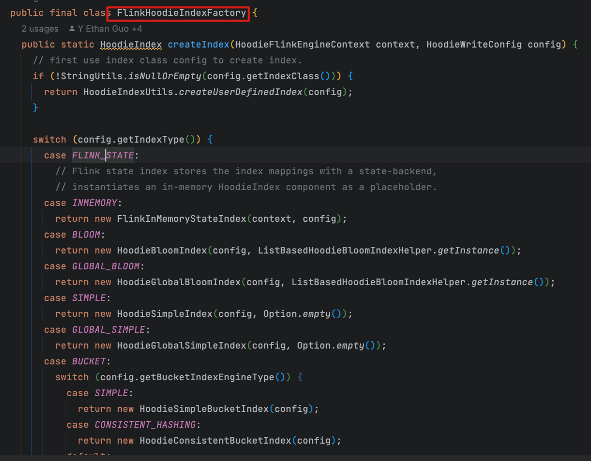
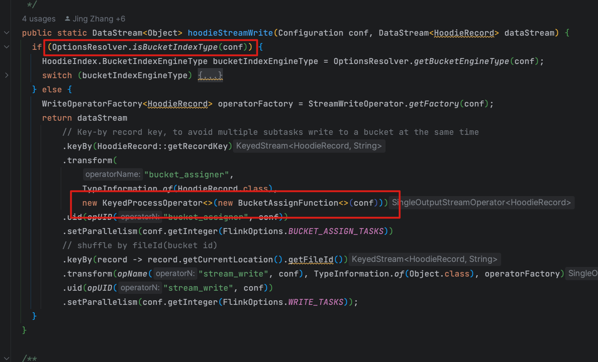
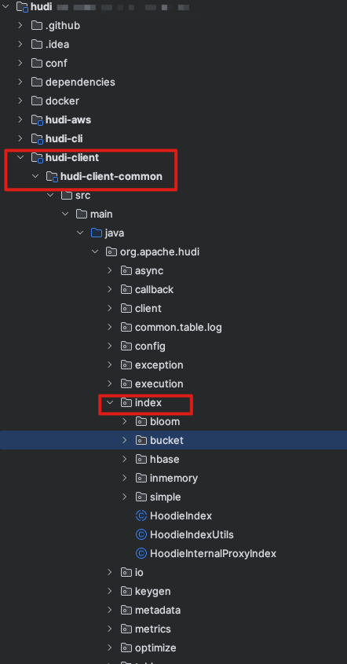
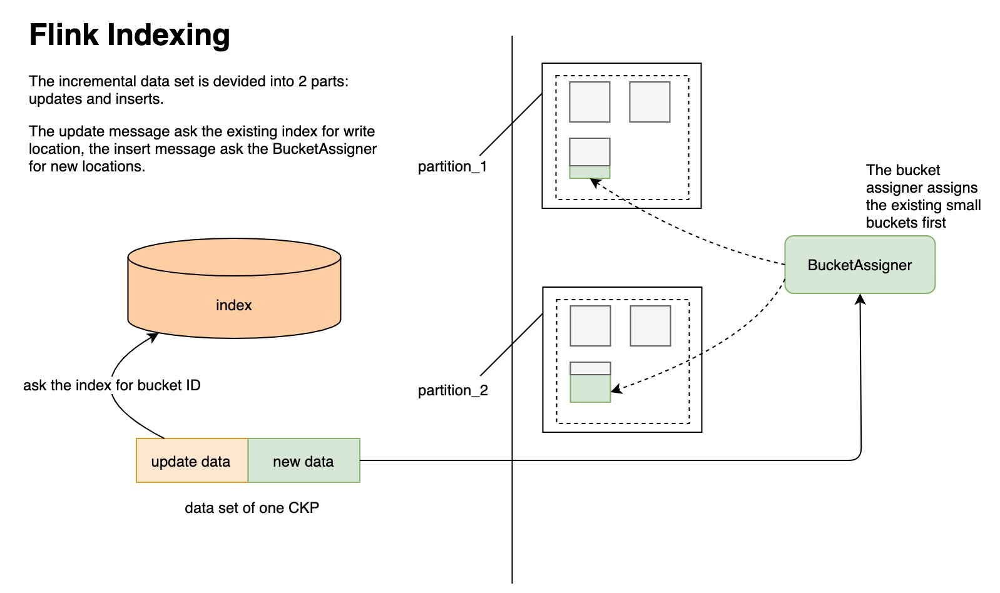

# 问题

1. 为什么需要索引 
2. 有哪些索引
3. Flink 能用哪些
   1. Flink State
   2. Bucket
4. Bloom 索引
   1. 原理
   2. 优化手段有哪些
   3. 优缺点
5. 桶索引
   1. 原理 
   2. 优缺点
   3. 为什么选择这个 
6. 如果有选择,桶索引和 Bloom 索引应该怎么选


# 为什么需要索引

1. 加快查询
2. 减小开销
3. 能实现 Hdfs 数据更新

都知道 HDFS 不支持更新,或者更新成本非常高,极端情况需要消耗整个数据大小 IO.因为没有索引,不知道数据存储在哪里,需要遍历所有数据文件,挨个比较数据

Hudi 引入索引机制,达成行级别更新

## 索引在 Hudi 中的作用

1. 读取.过滤数据,加快查询
2. 写入,主要是 upsert 模式下,加快给数据打标,这条数据追加到文件中应该是 Insert 还是 Update

# Flink 只支持两种

注意,Flink 目前只支持两种索引,Bucket 和 Flink State. 其他的索引都不支持,虽然你填写不报错,但是会转成 Flink State.

具体可以看这个 PR 中的 Comment https://github.com/apache/hudi/pull/6406

虽然有个 类上面写了这么多,根本没有用, 最终只有 pipeline 初始化才有用.这里只有两种方式(官方说这个以后会报错,如果填写其他类型,flink 会报错)




真正的逻辑在这里 pipelines 类,所以看 flink web UI 的时候才会出现这样的情况

桶索引没有 bucketAssigner,有 bucketWrite 算子

如果是 flink State index 的任务 是 stream_write, 和 bucketAssigner算子



# Bloom

Bloom 索引是 Hudi 默认的索引,特点

- 轻量级
- 索引信息存储在 parquet 的 footer 中
- 仅支持 Spark

# HBASE

- 重量级
- 索引存储在 HBase 中
- Flink/Spark 都支持

# Simple

# Bucket

- 轻量级
- 不需要存储索引,只需要计算
- Flink/Spark 都支持

# Flink State

- 轻量级
- 索引存储在 State 中
- 仅 Flink 能用,并且任务之间不共享


# Bloom

bloom 索引原理就是使用 bloom 过滤器.我们都知道存储数据的三种数据结构,链表,数组,hash 表(散列表).每种 数据结构对空间复杂度,查询,删除时间复杂度是不一样的.Bloom 本质是利用 Hash 表操作

关于 Bloom 过滤器的原理可以看这篇文章

[Bloom 过滤器](https://juejin.cn/post/6844904007790673933)

简单说就是用一个一定长度的BitMap,比如 M,然后准备 K 个 Hash 函数,然后一个值映分别进行 Hash 算法后得到 K 个值,这 k 个值映射到这个 BitMap 上,后续我判断这个数据存不存在,我只要再经过K个 hash 算法算一下,再查看这个 BitMap 就知道了.所以时间复杂度是O(K),空间复杂度是O(M)

但是所有散列表都会有一个问题,Hash 碰撞,HashMap上就通过链表或者红黑树存储这些值

在 Bloom 过滤器中,就没法解决这个问题,因为他本身不存储值,无法比较.所以会有假阳性问题,即如果 BitMap 不符合,那就一定不存在,但是 BitMap 符合,这个值不一定存在

## TagLocation流程

刚刚说了,Bloom 实际上是利用 Bloom 过滤器判断是否要读取 parquet 文件里面的数据,再比较

所以最原始的流程应该是:

1. 从 parquet 文件中的读取到 BitMap,判断是否在文件中
2. 如果没命中,那就是真的不在, insert
3. 如果命中 Bloom 索引,因为假阳性问题,还需要再判断是不是真的在文件里面

### 入口

所有索引的源码都在这个包下 `org.apache.hudi.index`



打标签的入口方法是这个`org.apache.hudi.index.bloom.HoodieBloomIndex#tagLocation`

在这个方法中,逻辑主要为这几步(重点是第三步)

1. 根据配置缓存输入记录JavaRDD，避免重复加载开销。
2. 提取 record 的关键信息,组成分区,主键键值对
3. 根据键值对,去查找索引，获取文件 Id 等信息
4. 缓存第三步结果。

5. 给数据打标LeftOuterJoin,即哪些是 Insert,那些是 Update 并返回。

```java
  
@Override
  public <R> HoodieData<HoodieRecord<R>> tagLocation(
      HoodieData<HoodieRecord<R>> records, HoodieEngineContext context,
      HoodieTable hoodieTable) {
    // Step 0: cache the input records if needed
    if (config.getBloomIndexUseCaching()) {
      records.persist(new HoodieConfig(config.getProps())
          .getString(HoodieIndexConfig.BLOOM_INDEX_INPUT_STORAGE_LEVEL_VALUE));
    }

    // Step 1: Extract out thinner pairs of (partitionPath, recordKey)
    HoodiePairData<String, String> partitionRecordKeyPairs = records.mapToPair(
        record -> new ImmutablePair<>(record.getPartitionPath(), record.getRecordKey()));

    // Step 2: Lookup indexes for all the partition/recordkey pair
    HoodiePairData<HoodieKey, HoodieRecordLocation> keyFilenamePairs =
        lookupIndex(partitionRecordKeyPairs, context, hoodieTable);

    // Cache the result, for subsequent stages.
    if (config.getBloomIndexUseCaching()) {
      keyFilenamePairs.persist(new HoodieConfig(config.getProps())
          .getString(HoodieIndexConfig.BLOOM_INDEX_INPUT_STORAGE_LEVEL_VALUE));
    }

    // Step 3: Tag the incoming records, as inserts or updates, by joining with existing record keys
    HoodieData<HoodieRecord<R>> taggedRecords = tagLocationBacktoRecords(keyFilenamePairs, records, hoodieTable);

    if (config.getBloomIndexUseCaching()) {
      records.unpersist();
      keyFilenamePairs.unpersist();
    }

    return taggedRecords;
  }
```

### LookupIndex

步骤为:(最重要的是第三步,即怎么 根据主键确定数据存不存在)

1. 将传入的 records,根据分区进行分组,并统计每个分区下record的数量

2. 去每个分区下面找到相应的parquet文件(主要是符合 InstantTime的 parquet),`getBloomIndexFileInfoForPartitions`方法

3. 过滤掉文件中没有的数据(即新增的数据)返回(step3 和findMatchingFilesForRecordKeys)

   

```java
 /**
   * Lookup the location for each record key and return the pair<record_key,location> for all record keys already
   * present and drop the record keys if not present.
   */
  private HoodiePairData<HoodieKey, HoodieRecordLocation> lookupIndex(
      HoodiePairData<String, String> partitionRecordKeyPairs, final HoodieEngineContext context,
      final HoodieTable hoodieTable) {
    // Step 1: Obtain records per partition, in the incoming records
    Map<String, Long> recordsPerPartition = partitionRecordKeyPairs.countByKey();
    List<String> affectedPartitionPathList = new ArrayList<>(recordsPerPartition.keySet());

    // Step 2: Load all involved files as <Partition, filename> pairs
    List<Pair<String, BloomIndexFileInfo>> fileInfoList = getBloomIndexFileInfoForPartitions(context, hoodieTable, affectedPartitionPathList);
    final Map<String, List<BloomIndexFileInfo>> partitionToFileInfo =
        fileInfoList.stream().collect(groupingBy(Pair::getLeft, mapping(Pair::getRight, toList())));

    // Step 3: Obtain a HoodieData, for each incoming record, that already exists, with the file id,
    // that contains it.
    HoodiePairData<HoodieFileGroupId, String> fileComparisonPairs =
        explodeRecordsWithFileComparisons(partitionToFileInfo, partitionRecordKeyPairs);

    return bloomIndexHelper.findMatchingFilesForRecordKeys(config, context, hoodieTable,
        partitionRecordKeyPairs, fileComparisonPairs, partitionToFileInfo, recordsPerPartition);
  }


	/**    重点是这个方法 getFileInfoForLatestBaseFiles, 其他都是优化 */
  private List<Pair<String, BloomIndexFileInfo>> getBloomIndexFileInfoForPartitions(HoodieEngineContext context,
                                                                                    HoodieTable hoodieTable,
                                                                                    List<String> affectedPartitionPathList) {
    List<Pair<String, BloomIndexFileInfo>> fileInfoList = new ArrayList<>();
		...
      fileInfoList = getFileInfoForLatestBaseFiles(affectedPartitionPathList, context, hoodieTable);
		...
    return fileInfoList;
  }
```


### findMatchingFilesForRecordKeys

主要做几件事情(重点是第三和第四步)

1. 算查找索引的时候的并行度
2. 根据配置是否使用缓存
3. 读取 parquet 文件 Footer 数据,找出索引策略,反序列化出 BitMap `HoodieSparkBloomIndexCheckFunction`  `HoodieKeyLookupHandle`
4. 挨个比较parquet 文件中的数据


```java
/// 主要应该看这个方法,其他分支的都是优化手段      
keyLookupResultRDD = fileComparisonsRDD.sortByKey(true, targetParallelism)
          .mapPartitions(new HoodieSparkBloomIndexCheckFunction(hoodieTable, config), true);

// 重点应该关注这个类 HoodieSparkBloomIndexCheckFunction

// 根据主键查找索引这个方法在 org.apache.hudi.index.bloom.HoodieBloomIndexCheckFunction.LazyKeyCheckIterator#computeNext

```


### HoodieKeyLookupHandle

HoodieKeyLookupHandle 初始化这个类的时候,会真正去 Parquet 文件的 footer 中找到 bitMap

```java
  public HoodieKeyLookupHandle(HoodieWriteConfig config, HoodieTable<T, I, K, O> hoodieTable,
                               Pair<String, String> partitionPathFileIDPair) {
    super(config, hoodieTable, partitionPathFileIDPair);
    this.candidateRecordKeys = new ArrayList<>();
    this.totalKeysChecked = 0;
    // 初始化 BloomFilter
    this.bloomFilter = getBloomFilter();
  }


  private BloomFilter getBloomFilter() {
       try (HoodieFileReader reader = createNewFileReader()) {
         bloomFilter = reader.readBloomFilter();
       }
    return bloomFilter;
  }

  /**
   * Read the bloom filter from the metadata of the given data file.
   * @param configuration Configuration
   * @param filePath The data file path
   * @return a BloomFilter object
   */
  public BloomFilter readBloomFilterFromMetadata(Configuration configuration, Path filePath) {
    Map<String, String> footerVals =
        readFooter(configuration, false, filePath,
            HoodieAvroWriteSupport.HOODIE_AVRO_BLOOM_FILTER_METADATA_KEY,
            HoodieAvroWriteSupport.OLD_HOODIE_AVRO_BLOOM_FILTER_METADATA_KEY,
            HoodieBloomFilterWriteSupport.HOODIE_BLOOM_FILTER_TYPE_CODE);
    String footerVal = footerVals.get(HoodieAvroWriteSupport.HOODIE_AVRO_BLOOM_FILTER_METADATA_KEY);
    if (null == footerVal) {
      // We use old style key "com.uber.hoodie.bloomfilter"
      footerVal = footerVals.get(HoodieAvroWriteSupport.OLD_HOODIE_AVRO_BLOOM_FILTER_METADATA_KEY);
    }
    BloomFilter toReturn = null;
    if (footerVal != null) {
      if (footerVals.containsKey(HoodieBloomFilterWriteSupport.HOODIE_BLOOM_FILTER_TYPE_CODE)) {
        toReturn = BloomFilterFactory.fromString(footerVal,
            footerVals.get(HoodieBloomFilterWriteSupport.HOODIE_BLOOM_FILTER_TYPE_CODE));
      } else {
        toReturn = BloomFilterFactory.fromString(footerVal, BloomFilterTypeCode.SIMPLE.name());
      }
    }
    return toReturn;
  }


  public HoodieKeyLookupResult getLookupResult() {
    HoodieBaseFile baseFile = getLatestBaseFile();
    List<String> matchingKeys = HoodieIndexUtils.filterKeysFromFile(new Path(baseFile.getPath()), candidateRecordKeys,
        hoodieTable.getHadoopConf());
 
    return new HoodieKeyLookupResult(partitionPathFileIDPair.getRight(), partitionPathFileIDPair.getLeft(),
        baseFile.getCommitTime(), matchingKeys);
  }


  public static List<String> filterKeysFromFile(Path filePath, List<String> candidateRecordKeys,
                                                Configuration configuration) throws HoodieIndexException {
		...
    List<String> foundRecordKeys = new ArrayList<>();
    try (HoodieFileReader fileReader = HoodieFileReaderFactory.getReaderFactory(HoodieRecordType.AVRO)
        .getFileReader(configuration, filePath)) {
      // Load all rowKeys from the file, to double-confirm
        Set<String> fileRowKeys = fileReader.filterRowKeys(new TreeSet<>(candidateRecordKeys));
        foundRecordKeys.addAll(fileRowKeys);
    return foundRecordKeys;
  }


	// 去 parquet 文件中,挨个查找 recordKey

  /**
   * Read the rowKey list matching the given filter, from the given parquet file. If the filter is empty, then this will
   * return all the rowkeys.
   *
   * @param filePath      The parquet file path.
   * @param configuration configuration to build fs object
   * @param filter        record keys filter
   * @param readSchema    schema of columns to be read
   * @return Set Set of row keys matching candidateRecordKeys
   */
  private static Set<String> filterParquetRowKeys(Configuration configuration, Path filePath, Set<String> filter,
                                                  Schema readSchema) {
    Set<String> rowKeys = new HashSet<>();
    try (ParquetReader reader = AvroParquetReader.builder(filePath).withConf(conf).build()) {
      Object obj = reader.read();
      while (obj != null) {
        if (obj instanceof GenericRecord) {
          String recordKey = ((GenericRecord) obj).get(HoodieRecord.RECORD_KEY_METADATA_FIELD).toString();
          // 挨个比较数据
          if (!filterFunction.isPresent() || filterFunction.get().apply(recordKey)) {
            rowKeys.add(recordKey);
          }
        }
        obj = reader.read();
      }

    return rowKeys;
  }

```


## 如何优化

### 问题一  如何避免大量 IO

我们看到Bloom 索引的原理看上去非常简单,但是执行起来会非常繁琐

BloomFilter 的 BitMap 存在 Parquet Footer 中, 光遍历 BitMap,放到 Map 中都需要大量 IO 操作,如何避免大量 IO 操作

把数据缓存起来

假如我把这些数据放到 MetaData 中,从这里获取,这样就不用涉及大量 IO 操作了

来看看 Hudi 怎么做的,还记得我们之前的这步`findMatchingFilesForRecordKeys`,提到其他都是优化手段,主分支逻辑就是最后的 else,其中一个优化手段就是把 BloomFilter 缓存起来,减少真正去读取 Parquet 的 IO 操作

```java
// org.apache.hudi.index.bloom.SparkHoodieBloomIndexHelper#findMatchingFilesForRecordKeys
// 参数为  hoodie.bloom.index.use.metadata = true
  if (config.getBloomIndexUseMetadata()
        && hoodieTable.getMetaClient().getTableConfig().getMetadataPartitions()
        .contains(BLOOM_FILTERS.getPartitionPath())) {
			XXXX
  } else {
    keyLookupResultRDD = fileComparisonsRDD.sortByKey(true, targetParallelism)
          .mapPartitions(new HoodieSparkBloomIndexCheckFunction(hoodieTable, config), true);
  }

```

### 问题二 如何减少计算 Hash

虽然我们缓存了 BloomFilter 的 BitMap,但是我们还是要挨个算一下,需要消耗 O(K),那能不能减少这步的操作.

当然可以,我们只需要在记录一下这个文件的 RowKey 的最大值,最小值,就可以根据比较这两个值来过滤,不用再计算了

这个就在LookupIndex 的第二步,之前提到的主要逻辑都是 else 中的,if 中的就是优化手段

从下面代码可以看出来,这个方式和上面的缓存方式是解耦的,如果没缓存,就从 parquet 文件 Footer 中获取

```java

// 参数为 hoodie.bloom.index.prune.by.ranges
if (config.getBloomIndexPruneByRanges()) {
    // load column ranges from metadata index if column stats index is enabled and column_stats metadata partition is available
    if (config.getBloomIndexUseMetadata()
        && hoodieTable.getMetaClient().getTableConfig().getMetadataPartitions().contains(COLUMN_STATS.getPartitionPath())) {
      fileInfoList = loadColumnRangesFromMetaIndex(affectedPartitionPathList, context, hoodieTable);
    }
    // fallback to loading column ranges from files
    if (isNullOrEmpty(fileInfoList)) {
      fileInfoList = loadColumnRangesFromFiles(affectedPartitionPathList, context, hoodieTable);
    }
  } else {
    fileInfoList = getFileInfoForLatestBaseFiles(affectedPartitionPathList, context, hoodieTable);
  }
```


### 问题三 使用什么结构优化比对结果

如果我们开启了rowKey 的裁剪(即最大值最小值),把所有parquet 的中的最大值,最小值也拿到了,那我应该用什么数据结构优化查询速度呢

1. 链表
2. 树

答案是用树,因为树的查询效率是 LogN,链表为O(N),但是树在一开始初始化的时候效率就没有链表高,O(LogN),链表为 O(1)

```java
/// org.apache.hudi.index.bloom.HoodieBloomIndex#explodeRecordsWithFileComparisons
// 参数为 hoodie.bloom.index.use.treebased.filter
  HoodiePairData<HoodieFileGroupId, String> explodeRecordsWithFileComparisons(
      final Map<String, List<BloomIndexFileInfo>> partitionToFileIndexInfo,
      HoodiePairData<String, String> partitionRecordKeyPairs) {
    IndexFileFilter indexFileFilter =
        config.useBloomIndexTreebasedFilter() ? new IntervalTreeBasedIndexFileFilter(partitionToFileIndexInfo)
            : new ListBasedIndexFileFilter(partitionToFileIndexInfo);

    return partitionRecordKeyPairs.map(partitionRecordKeyPair -> {
      String recordKey = partitionRecordKeyPair.getRight();
      String partitionPath = partitionRecordKeyPair.getLeft();

      return indexFileFilter.getMatchingFilesAndPartition(partitionPath, recordKey)
          .stream()
          .map(partitionFileIdPair ->
              new ImmutablePair<>(
                  new HoodieFileGroupId(partitionFileIdPair.getLeft(), partitionFileIdPair.getRight()), recordKey));
    })
        .flatMapToPair(Stream::iterator);
  }

// 如果没有开启 rowKey 修剪(最大/最小值),因为没法比较,所以两个都做了特殊处理
// 没开启,树就把他分区下的所有文件直接放到一个 Map 中,不是树了
if (partitionToFilesWithNoRanges.containsKey(partitionPath)) {
  partitionToFilesWithNoRanges.get(partitionPath).forEach(file ->
      toReturn.add(Pair.of(partitionPath, file)));
}

// 链表的话,也是直接把分区下的文件全部放进去
//  org.apache.hudi.index.bloom.ListBasedIndexFileFilter#shouldCompareWithFile
if (shouldCompareWithFile(indexInfo, recordKey)) {
  toReturn.add(Pair.of(partitionPath, indexInfo.getFileId()));
}
protected boolean shouldCompareWithFile(BloomIndexFileInfo indexInfo, String recordKey) {
  return !indexInfo.hasKeyRanges() || indexInfo.isKeyInRange(recordKey);
}

```

开启的话,链表就不说了,比较简单,他会挨个去遍历.这里重点说在树的情况下,怎么加快查询


#### 如何初始化树

```java
  IntervalTreeBasedIndexFileFilter(final Map<String, List<BloomIndexFileInfo>> partitionToFileIndexInfo) {
    partitionToFileIndexInfo.forEach((partition, bloomIndexFiles) -> {
      // Note that the interval tree implementation doesn't have auto-balancing to ensure logN search time.
      // So, we are shuffling the input here hoping the tree will not have any skewness. If not, the tree could be
      // skewed which could result in N search time instead of logN.
      // 上来先 shuffle,因为如果读到的文件是这样的,那就会严重倾斜,退化成链表了.原理等下讲构建步骤就知道了,其他也一样,所以随机打乱
      // file1[1,50], f2[2,51], f3[3,52], f4[4,53]
      Collections.shuffle(bloomIndexFiles);
      KeyRangeLookupTree lookUpTree = new KeyRangeLookupTree();
      bloomIndexFiles.forEach(indexFileInfo -> {
        if (indexFileInfo.hasKeyRanges()) {
          lookUpTree.insert(new KeyRangeNode(indexFileInfo.getMinRecordKey(), indexFileInfo.getMaxRecordKey(),
              indexFileInfo.getFileId()));
        } else {
         // 不用看了 这个是不开启修剪的,上面提过了
        }
      });
      partitionToFileIndexLookUpTree.put(partition, lookUpTree);
    });
  }


// 重点看 insert 方法
// 介绍 insert 前,先讲下如何比较的
public int compareTo(KeyRangeNode that) {
  // 如果当前节点的最小值,比要插入的小,就返回 负数
  // 最小值相等,就比较最大值.最大值比要插入的小,也返回负数
  // 最大值最小值相等,返回 0
  int compareValue = minRecordKey.compareTo(that.minRecordKey);
  if (compareValue == 0) {
    return maxRecordKey.compareTo(that.maxRecordKey);
  } else {
    return compareValue;
  }
}

// insert 比插入值小,插入值就放到右子树,否则放到左子树,相等就直接插入文件就好,用 List 维护
// 在插入的时候还会维护四个值, 左/右子树的最大/最小值.每比较一次就会更新一次
// 所以如果不做 shuffle,按照上面的写法,他就会一直往右子树插入,然后变成一个链表
private KeyRangeNode insert(KeyRangeNode root, KeyRangeNode newNode) {
  if (root == null) {
    root = newNode;
    return root;
  }

  if (root.compareTo(newNode) == 0) {
    root.addFiles(newNode.getFileNameList());
    return root;
  }

  if (root.compareTo(newNode) < 0) {
    if (root.getRight() == null) {
      root.setRightSubTreeMax(newNode.getMaxRecordKey());
      root.setRightSubTreeMin(newNode.getMinRecordKey());
      root.setRight(newNode);
    } else {
      if (root.getRightSubTreeMax().compareTo(newNode.getMaxRecordKey()) < 0) {
        root.setRightSubTreeMax(newNode.getMaxRecordKey());
      }
      if (root.getRightSubTreeMin().compareTo(newNode.getMinRecordKey()) > 0) {
        root.setRightSubTreeMin(newNode.getMinRecordKey());
      }
      insert(root.getRight(), newNode);
    }
  } else {
    if (root.getLeft() == null) {
      root.setLeftSubTreeMax(newNode.getMaxRecordKey());
      root.setLeftSubTreeMin(newNode.getMinRecordKey());
      root.setLeft(newNode);
    } else {
      if (root.getLeftSubTreeMax().compareTo(newNode.getMaxRecordKey()) < 0) {
        root.setLeftSubTreeMax(newNode.getMaxRecordKey());
      }
      if (root.getLeftSubTreeMin().compareTo(newNode.getMinRecordKey()) > 0) {
        root.setLeftSubTreeMin(newNode.getMinRecordKey());
      }
      insert(root.getLeft(), newNode);
    }
  }
  return root;
}

```

#### 查询

当一个 RowKey 进来,我只要在树上比较就行

在我这个节点最大值最小值范围里,就把这个节点上的所有文件列为待比较项

然后看在不在我左右子树的区间中,在就去相应子树,不在就返回添加的待比较项,本次遍历就完成了

```java
  /**
   * Fetches all the matching index files where the key could possibly be present.
   *
   * @param root refers to the current root of the look up tree
   * @param lookupKey the key to be searched for
   */
  private void getMatchingIndexFiles(KeyRangeNode root, String lookupKey, Set<String> matchingFileNameSet) {
    if (root == null) {
      return;
    }

    // 在我这个节点最大值最小值范围里,就把这个节点上的所有文件列为待比较项
    if (root.getMinRecordKey().compareTo(lookupKey) <= 0 && lookupKey.compareTo(root.getMaxRecordKey()) <= 0) {
      matchingFileNameSet.addAll(root.getFileNameList());
    }

    // 然后看在不在我左右子树的区间中,在就去相应子树,不在就返回添加的待比较项,本次遍历就完成了
    if (root.getLeftSubTreeMax() != null && root.getLeftSubTreeMin().compareTo(lookupKey) <= 0
        && lookupKey.compareTo(root.getLeftSubTreeMax()) <= 0) {
      getMatchingIndexFiles(root.getLeft(), lookupKey, matchingFileNameSet);
    }

    if (root.getRightSubTreeMax() != null && root.getRightSubTreeMin().compareTo(lookupKey) <= 0
        && lookupKey.compareTo(root.getRightSubTreeMax()) <= 0) {
      getMatchingIndexFiles(root.getRight(), lookupKey, matchingFileNameSet);
    }
  }
```


# Simple

从符合的分区拉取所有 parquet 的 RecordKey,然后 leftOuterJoin

# InMemory

在内存中存放一个 HashMap

每次 commit 都会把索引信息存到这个 Map 中

没看到初始化的情况,重启应该就丢失了,不能用于生产


# Fink State

## 背景

Flink State 是Danny Chan 优化 Flink 集成 Hudi 时引入的,因为当时 Flink有一个 索引,体验非常差, 不仅只能 FlinkPerJob 模式使用,其他任务不能共享,而且没法从存量任务上启动,详情看 [RFC-24: Hoodie Flink Writer Proposal](https://cwiki.apache.org/confluence/display/HUDI/RFC-24%3A+Hoodie+Flink+Writer+Proposal),里面提到当时 Flink 写入 Hudi 四个瓶颈.

而这个索引就是上面提到的FlinkHoodieIndex,优化之后就走 pipeline不走这里了,所以才说 Flink 只有两种索引

## 原理

还是通过 Bloom 索引过滤

To solve bottleneck 4.

The new Index is based on the BloomFilter index, a state is used as a cache of the underneath file based index:

- check the state to find whether a record is an UPDATE, if it is true, do nothing
- if the record is an INSERT, use the BloomFilter index to find the candidate files, look up these files and put all the index into the state

when all the files are checked, mark the index in pure state mode, we can then only check the state for the records that came in later.



查询 state 把数据分成两部分,Insert 和 Update

1. 根据 recordKey 查询 state
   1. state 有记录,判断分区是否相等
      1. 不相等,判断是否是开启了全局索引
         1. 开启了,发送一条删除的数据,再发送一条 Insert
         2. 没开启,直接 Insert
      2. 相等. Update
   2. 没记录,直接 Insert
2. 刷新 state

所以 使用 Flink State 必定会有 BucketAssigner 算子,桶索引就没有这个算子,因为不需要分配

## 优缺点

#### 优点

1. 不同任务间可共享
2. 支持分区全局去重
3. 文件大小可控

#### 缺点

1. 状态无限膨胀
2. 不支持跨引擎
3. 任务初始化速度非常慢,需要加载bootstrap

# Bucket

## 背景

桶索引是头条贡献的,由于 flink State 会导致状态无限膨胀并且数据量大之后查询索引效率降低,无法使用 spark 补数

## 原理

不需要额外存储索引信息, 索引通过recordKey hash 与桶数取余, 算出来

## 优缺点

### 优点

1. 不需要存索引储信息
2. 不存在小文件问题
3. 可跨引擎使用

### 缺点

1. 无法控制文件大小,只能通过预估来计算每个桶的大小,存在大文件问题
2. 写入与查询几乎需要涉及全部的桶

# 总结

1. 为什么需要索引 
   1. 加快查询
   2. 减少开销
2. 有哪些索引
   1. Simple
   2. Bloom
   3. Hbase
   4. Bucket
   5. Flink State
3. Flink 能用哪些
   1. Flink State
   2. Bucket
4. Bloom 索引
   1. 原理: 利用存在 parquet 文件 Footer 的Bloom 过滤器过滤,然后挨个遍历符合的文件
   2. 优化手段有哪些
      1. 缓存
      2. range 修剪
      3. 树化
   3. 优缺点
      1. 优点 
         1. 存储空间少 
         2. 简单
      2. 缺点
         1. 假阳性问题
         2. Flink 无法使用
         3. 小文件问题(不确定)
5. 桶索引
   1. 原理 RecordKey hash 与桶数取余
   2. 优缺点
      1. 优点
         1. 不需要存储索引信息
         2. 可跨引擎
         3. 不存在小文件问题
      2. 缺点
         1. 存在大文件问题,只能全部重新导入
         2. 写查需要涉及几乎全部文件
   3. 为什么选择这个没得选,Flink State 大状态问题更加无解,Bloom 无法使用
6. 如果有选择,桶索引和 Bloom 索引应该怎么选
   1. 如果 RecordKey 是有规律的,例如主键自增,可以选择 Bloom.
      1. 都会写入到最近几个,IO消耗少
      2. 后续用修剪效果也更好
   2. 如果随机,可以选桶索引,也可以桶索引
      1. 两者并没有太大区别
   3. 如果数据量非常大,选桶索引
      1. 布隆索引会出现高频假阳性问题,导致效率下降
   4. 如果跨引擎, 使用桶索引(如果Flink实现布隆索引, 实际也是支持跨引擎的)


# 参考文档

[Apache Hudi索引实现分析（一）之HoodieBloomIndex](https://www.modb.pro/db/54693)

[字节跳动数据湖索引演进](https://developer.volcengine.com/articles/7219208791907106873#heading3)

[一文聊透Apache Hudi的索引设计与应用](https://www.cnblogs.com/leesf456/p/16990811.html)

[17张图带你彻底理解Hudi Upsert原理](https://cloud.tencent.com/developer/article/1827930)