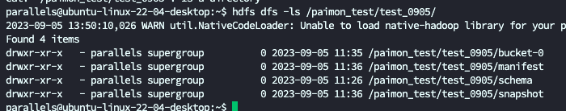
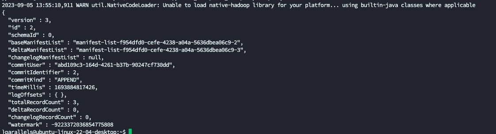
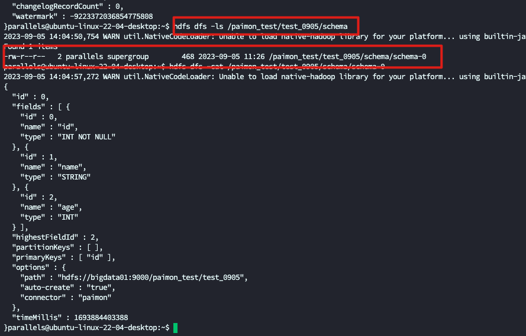
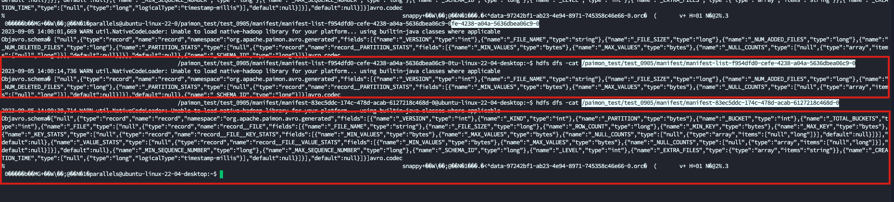
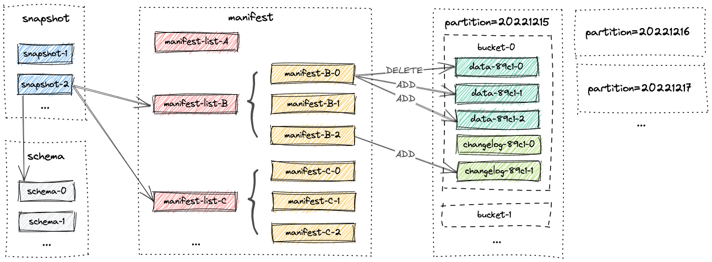
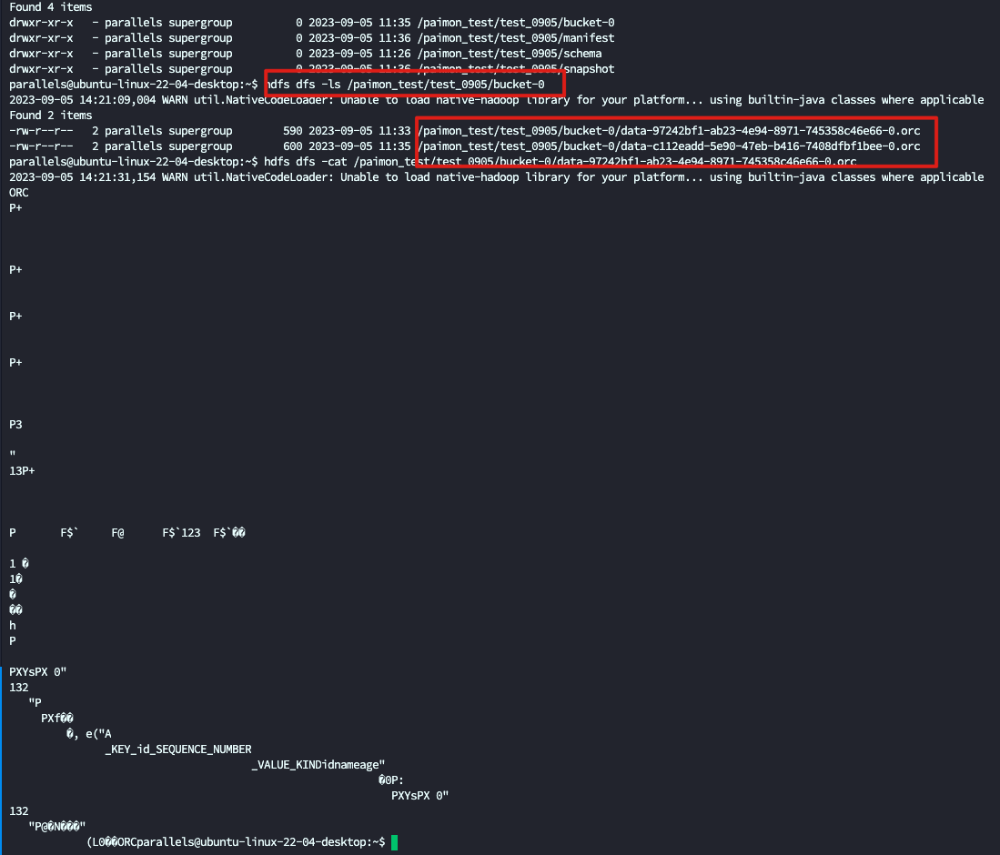

# 架构

## Layout

paimon 的文件布局参考 iceberg.有几个重要的概念

1. Snapshot
2. Schema
3. manifest-list
4. manifest
5. bucket
6. dataFile
7. changelog
8. LSMTree

## 目录结构

- snapshot:存放 snapshot 文件
- schema:存放表结构
- manifest:存放清单文件
- bucket:存放数据文件,根据主键分桶

## Snapshot

Snapshot 可以理解为 Hudi 的 Timeline 上的Instant,如果要使用 Time travel 功能,需要指定 snapshot

Snapshot 是 Json 结构

文件中存放了两个重要的信息

1. schema
2. manifest-list

## Schema

Schema 存放了当前这个 snapshot 所使用的表结构,数据文件会根据这个 schema 进行解析

记录了当前表的每个字段的位置,名称,类型.主键是哪些

还记录了 字段最大值,用来后续回溯使用

如果schema 做了变更, 会生成一个新的 schema 文件

## Manifest

manifest 分为两种类型,

- manifest-list: 记录 manifest 文件位置与 Id
- manifest:记录数据文件所在位置

LSM Tree

## Bucket

Bucket 在 paimon 中是写入读取的最小存储单位单位.

简单理解就是一个桶只能由一个线程写入和读取,所以桶的数量就严格限制了写入读取的性能

## LSM Tree(非常重要)

paimon 数据的存放结构 是类似 Hbase 的 LSM Tree,

# 重要的功能

## AlterTable

## CDC SchemaEvolution

## 字段补全

# 索引